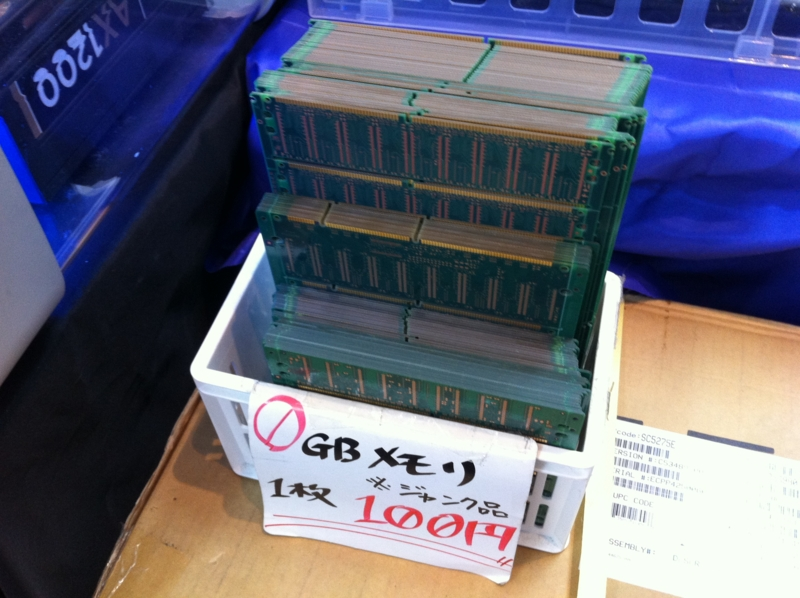

昨日は久しぶりに高校時代の友人3人で映画を観に行きました。『テルマエ・ロマエ』を……。

<a href="http://www.thermae-romae.jp">&#x5927;&#x30D2;&#x30C3;&#x30C8;&#x4E0A;&#x6620;&#x4E2D;&#xFF01; &#x6620;&#x753B;&#x300E;&#x30C6;&#x30EB;&#x30DE;&#x30A8;&#x30FB;&#x30ED;&#x30DE;&#x30A8;&#x300F;&#x516C;&#x5F0F;&#x30B5;&#x30A4;&#x30C8;</a>

こんなに劇場で笑ったのって、初めてかもしれない。原作のマンガを知っていることだし、最初はなるべく笑わないようにしていたのだけど、それでもウォシュレットのシーンでついに吹き出して、あとはもう止まりませんでした。止められませんでした。

内容自体はB級で、正直わざわざ劇場で観なくても、金曜ロードショー待ちで十分だと思う。でも、ああしてみんなで笑えるのは、それはそれでよいもの。満席だったし、笑いまくったしでか、少し場内が熱く、そのまま帰ってゆっくり湯に浸かりたいと思ったよ。

<a href="http://www.amazon.co.jp/exec/obidos/ASIN/4047261270/bestylesnet-22/">テルマエ・ロマエ I (BEAM COMIX)</a>
<ul><li>作者: <a class="keyword" href="http://d.hatena.ne.jp/keyword/%A5%E4%A5%DE%A5%B6%A5%AD%A5%DE%A5%EA">ヤマザキマリ</a></li><li>出版社/メーカー: <a class="keyword" href="http://d.hatena.ne.jp/keyword/%A5%A8%A5%F3%A5%BF%A1%BC%A5%D6%A5%EC%A5%A4%A5%F3">エンターブレイン</a></li><li>発売日: 2009/11/26</li><li>メディア: コミック</li><li>購入: 116人 クリック: 3,699回</li><li><a href="http://d.hatena.ne.jp/asin/4047261270/bestylesnet-22" target="_blank">この商品を含むブログ (733件) を見る</a></li></ul>

それにしても、映画のオチで原作マンガが出てくるのにもクスッとさせられた。映画全体がマンガのプロモーションみたい。これは『テルマエ・ロマエ』を読んでいなかった人でも、買って読みたくなるだろうな。

あとは、アキバ散歩したり……

牛タン食べたり……

夜飲んだり……<a href="#f1" name="fn1" title="お刺身とかイベリコ豚とか食べた気がする">*1</a>と、まったり過ごしますタ。

<a href="#fn1" name="f1" class="footnote-number">*1</a>:お刺身とかイベリコ豚とか食べた気がする

