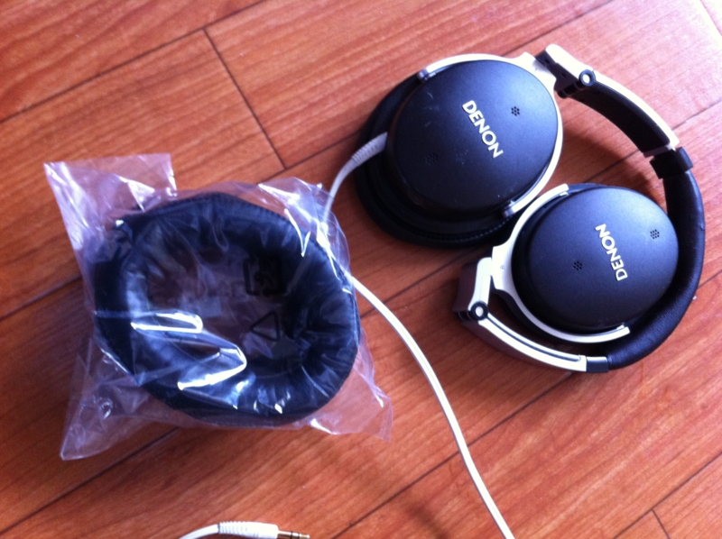

<blockquote cite="http://daruyanagi.hatenablog.com/entry/2012/05/02/083431">

愛用のノイズキャンセル・ヘッドフォンの耳をニコニコ超会議でなくしたので、これを購入したヨドバシ錦糸町までいって代替品の注文をしてきた。

<cite><a href="http://daruyanagi.hatenablog.com/entry/2012/05/02/083431">&#x9023;&#x4F11;4&#x65E5;&#x76EE;&#x3002;PC&#x3092;&#x81EA;&#x4F5C;&#x3057;&#x305F;&#x3002; - &#x3060;&#x308B;&#x308D;&#x3050;</a></cite>
</blockquote>

ヨドバシから電話がかかってきて、入荷したとの由。あいにくGWと重なったため、いつもより時間がかかったけれど、それは前もってわかっていたことなのでキニシナイ。片耳ではなく両耳セットでしか売ってくれなかったのもキニシナイ。もう1年半ほどほとんど毎日使っていて、それなりにへたってきていたし、これを機会に両方取り替えたいと思っていたところだった。ちなみにお値段は4,000円弱。

<a href="http://www.amazon.co.jp/exec/obidos/ASIN/B003V89W52/bestylesnet-22/">DENON ノイズキャンセリングヘッドホン ブラック AHNC800K</a>
<ul><li>出版社/メーカー: デノン</li><li>発売日: 2010/08/10</li><li>メディア: エレクトロニクス</li><li> クリック: 3回</li><li><a href="http://d.hatena.ne.jp/asin/B003V89W52/bestylesnet-22" target="_blank">この商品を含むブログを見る</a></li></ul>

買ったときは4万円弱だったかな。<a class="keyword" href="http://d.hatena.ne.jp/keyword/Twitter">Twitter</a>を掘り起こしたら、2010年の暮れに買ったらしい。ボーナスで衝動買いしたんだろうな。

<blockquote class="twitter-tweet" lang="ja">
ヤバい、Denonのノイズキャンセルヘッドフォン買ったまった…諭吉が4人も討ち死に… (@ <a class="keyword" href="http://d.hatena.ne.jp/keyword/%A5%E8%A5%C9%A5%D0%A5%B7%A5%AB%A5%E1%A5%E9">ヨドバシカメラ</a> マルチメディア錦糸町) <a href="http://4sq.com/8ZZvUc">http://4sq.com/8ZZvUc</a>
&mdash; だるやなぎさん (@daruyanagi) <a href="https://twitter.com/daruyanagi/status/11328347304886272" data-datetime="2010-12-05T07:57:43+00:00">12月 5, 2010</a></blockquote>

付け心地はすごく気に入っている。耳がすっぽりふわっとおおわれて、長時間かけててもどこかが痛くなることはない。僕は音痴なのでよくわからないけど、音にも不満はない。あと、ケーブルを引っ張っても本体との接続部分にダメージがないのがいい。ジャック＆プラグになっていて、引っ張ると抜ける。

ただ、ノイズ<a class="keyword" href="http://d.hatena.ne.jp/keyword/%A5%AD%A5%E3%A5%F3%A5%BB%A5%EB%B5%A1%C7%BD">キャンセル機能</a>はそれほどでもなくて、音量が少し大きくなり、周りの雑音が少し遠くなる感じ。電車の中でも雑音がシャットアウトされるわけではないけれど、気を付けていないと車掌の案内は聞き逃してしまうし、本を読むときの集中力は増すように感じる。あと、音量がほかのヘッドフォンより小さく感じる。ノイズ<a class="keyword" href="http://d.hatena.ne.jp/keyword/%A5%AD%A5%E3%A5%F3%A5%BB%A5%EB%B5%A1%C7%BD">キャンセル機能</a>をOFFにすると、さらに小さく感じる。

なにはともあれ、全体的にはとても気に入っている。これからも末永くよろしくお願いします！

