
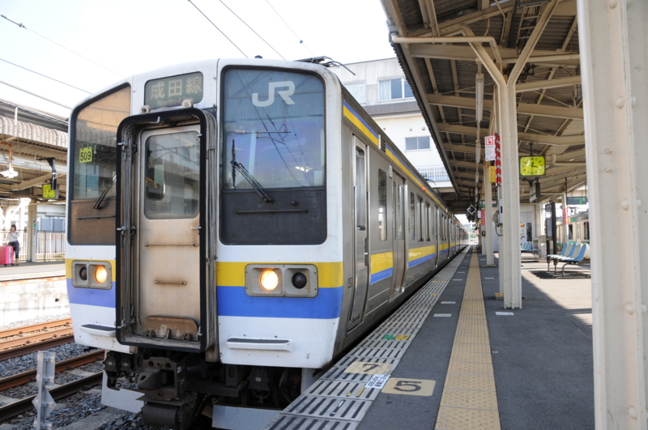

日本の果て・カシマまで、サッカーを観にいった。 @herata_jp さんと約束していた、<a class="keyword" href="http://d.hatena.ne.jp/keyword/J%A5%EA%A1%BC%A5%B0">Jリーグ</a>観戦の約束をやっと果たす。<a class="keyword" href="http://d.hatena.ne.jp/keyword/%C1%ED%C9%F0%CB%DC%C0%FE">総武本線</a>・成田線とひたすら電車を乗り継いでどんぶらこーどんぶらこー。3時間もあれば余裕だろうと思って2時には電車に乗ったのだけど……

結局、間に合わず。

成田で40分、佐原で1時間半の接続待ちで、5時のキックオフどころか、後半に間に合うかも怪しい。どうやら間違って土日祝日ダイヤではなく平日ダイヤを見ていたらしい……大誤算だ。

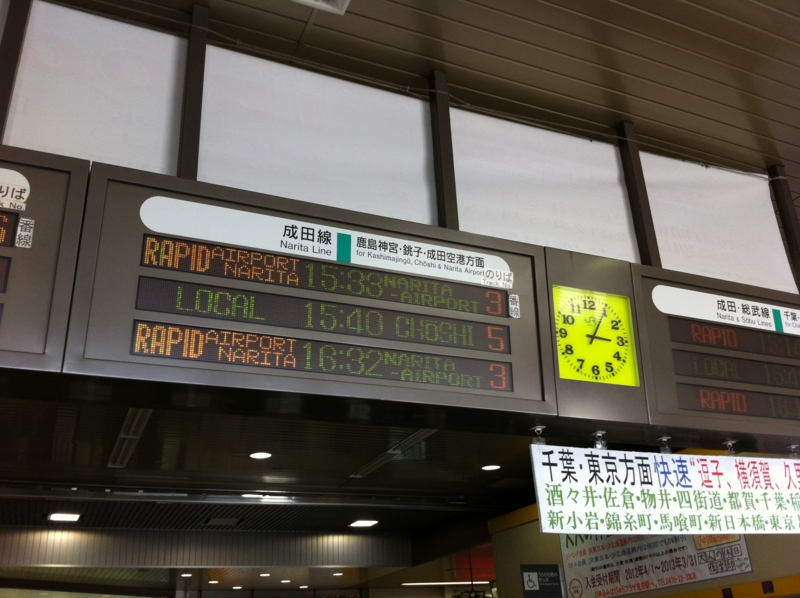

結局、佐原駅からタクシーを拾う羽目に。幸いタクシーの運転手さんが話の分かる人で、裏道を駆使して佐原の街を抜け、東関道経由でスタジアムまでぶっ飛ばしてくれた。しかも、タクシー代を少しまけてくれた（7,500円 → 7,000円）。料金の交渉はしたことあるけど、運転手さんのほうから負けてくれると言ってもらえたのは初めてでちょっと嬉しく、それまでの失敗など忘れて楽しく観戦に臨めた。

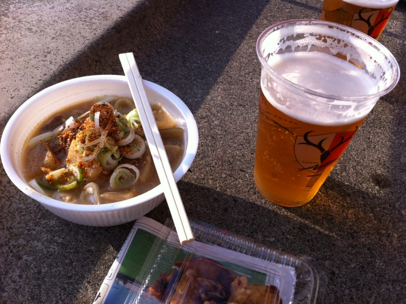

そんなこんなで、なんとかキックオフには間に合って、ビールとモツ煮込みで完全武装して観戦開始。ピッチから近い席だったので臨場感たっぷり。2012年<a class="keyword" href="http://d.hatena.ne.jp/keyword/J%A5%EA%A1%BC%A5%B0">Jリーグ</a>第12節、<a class="keyword" href="http://d.hatena.ne.jp/keyword/%BC%AF%C5%E7%A5%A2%A5%F3%A5%C8%A5%E9%A1%BC%A5%BA">鹿島アントラーズ</a>vs<a class="keyword" href="http://d.hatena.ne.jp/keyword/%A5%B3%A5%F3%A5%B5%A5%C9%A1%BC%A5%EC%BB%A5%CB%DA">コンサドーレ札幌</a>、始まり始まり！　今日は @herata_jp さんの都合でにわかコンサドーレファンだよ～♪

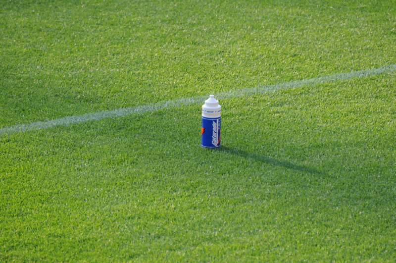

<a class="keyword" href="http://d.hatena.ne.jp/keyword/Nikon">Nikon</a> <a class="keyword" href="http://d.hatena.ne.jp/keyword/D300s">D300s</a>＋300mmの望遠レンズ（<a class="keyword" href="http://d.hatena.ne.jp/keyword/DX%A5%D5%A5%A9%A1%BC%A5%DE%A5%C3%A5%C8">DXフォーマット</a>だから450mmだべ！）ももってきていたので、ちょっと写真も撮ってみたり。

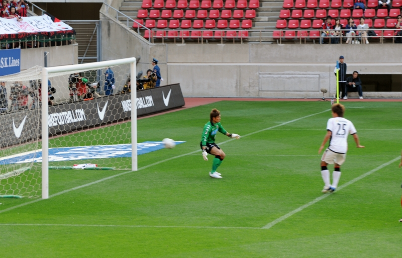

動いている選手をとらえるのはさすがに難しかったけど、それでも、何とも決定的な1点目のシーンがとれたよ……鹿島の選手が入っていない！　そのあとPKまでとられてコンサドーレのDF陣は完全崩壊。まったくチャンスがなかったわけじゃないけれどそれも決めきれず、気が付いてみたら……

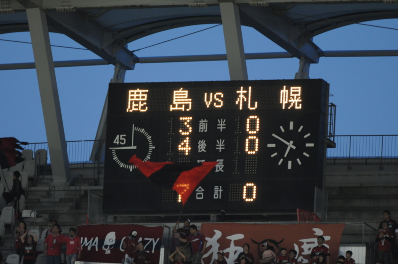

歴史的な完敗の瞬間に立ち会うことができたのでした ＼(^o^)／ｵﾜﾀ

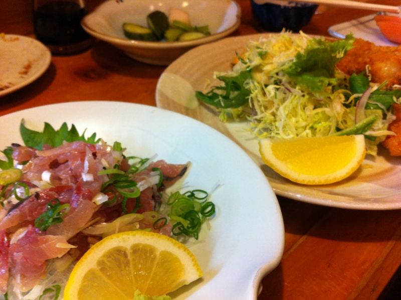

試合後は、大惨敗の悲しみを癒すべく、<a class="keyword" href="http://d.hatena.ne.jp/keyword/%BC%AF%C5%E7%BF%C0%B5%DC">鹿島神宮</a>駅の近くの居酒屋にしけこむ。まぁまぁ美味しかった。また近いうちにサッカー観にいきたいですなぁ。

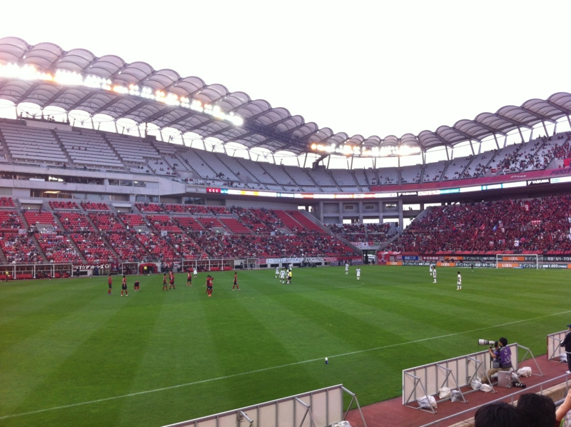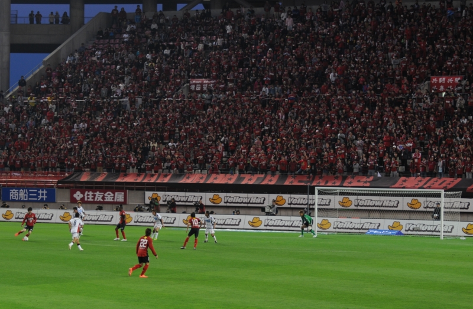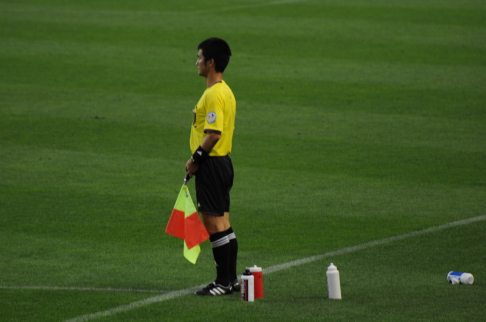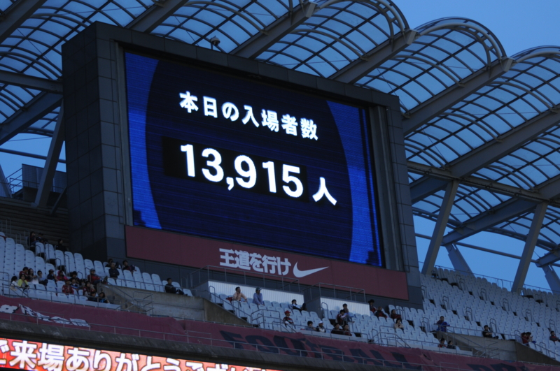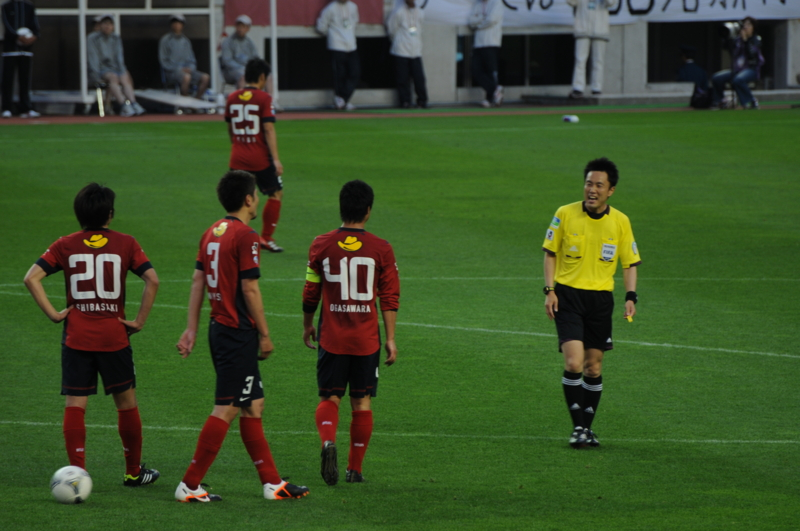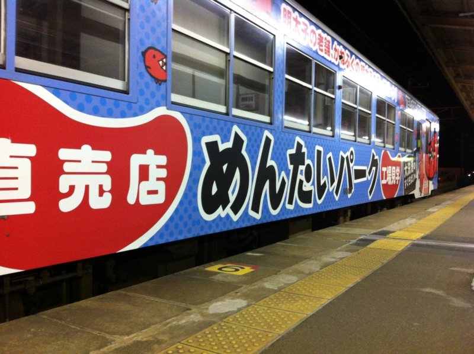

