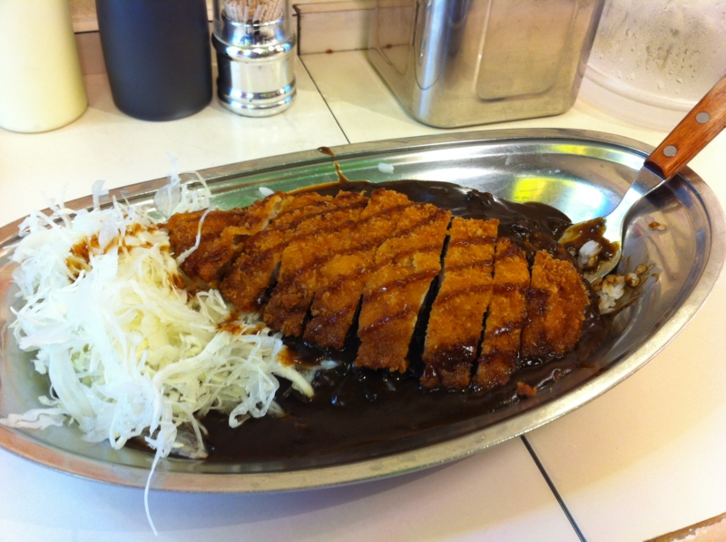

@shibayan とアキバで<a class="keyword" href="http://d.hatena.ne.jp/keyword/%A5%B4%A1%BC%A5%B4%A1%BC%A5%AB%A5%EC%A1%BC">ゴーゴーカレー</a>を食ってきた。

金沢のカレーなのらしいけど、本格派のインドカレーが好きで、最近日本風のカレーには少し距離を置いている僕でも、おいしく食べられた。カツにかけられたソースと絡むせいか、少し甘い。でも、変に辛くするより、このカレーはこれでいいのかもしれない。あと、フォークで食べるのがちょっと変わっているけど、上にトッピングされたカツを食うにはこっちのほうが便利だな。

