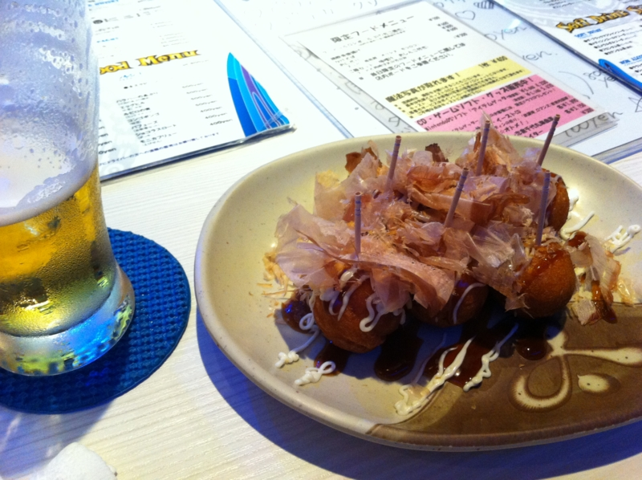
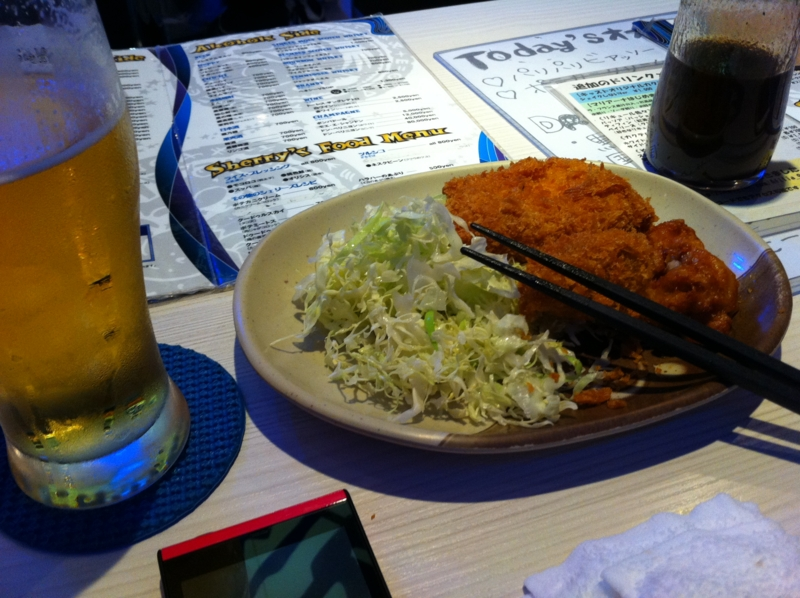

<blockquote cite="http://www.afilia.jp/sherrys/">

ここは女性冒険家のシェリー・<a class="keyword" href="http://d.hatena.ne.jp/keyword/%A5%B5%A5%F3%A5%B5%A1%BC%A5%E9">サンサーラ</a>が６年にも及ぶ大冒険の末に発見した黄金郷「ジャポネスク」から得た、珍しい食材やレシピから生まれた、様々な創作料理を中心としたオンリーカウンター形式の、ジャポネスク風レストランバーです。

<cite><a href="http://www.afilia.jp/sherrys/">&#x30A2;&#x30D5;&#x30A3;&#x30EA;&#x30A2;&#x30FB;&#x30B7;&#x30A7;&#x30EA;&#x30FC;&#x30BA; &ndash; Magical School Girls Bar &ndash;</a></cite>
</blockquote>

まぁ、要は“なりきりガールズバー”でした。

本拠地は池袋だか六本木にあるそうで、そこはかなり厳格な魔法学園、上野のこっちは学園外にあって生徒がバイトしに来ているという設定らしくて、曰く「比較的ユルい」のだそうだ。学園のほうは片膝ついて一人ずつ自己紹介してくれるらしいよ。

女の子はみんなかわいい。とくに制服がかわいい。写真で紹介できないのが残念だ。あと、みんな自己紹介してくれるしのだけど、名前が横文字なので覚えにくい（一応、短い愛称も教えてくれるけど）。一つ覚えたら一つ忘れてしまうのが悲しい。歳をとるっていやだなぁ……

@shibayan はひたすらオリカク（オリジナルカクテルの略らしい）をがぶがぶ、僕は900円のビールをがぶがぶ。オリカクを作るのは試験があるらしくて、それに合格しないと作らせてもらえないらしい。肉じゃがコロッケ（名前はポテミートス）が案外おいしかった。結構盛況で、ほとんどは常連のお客みたい。

楽しかったので今度は池袋のに行ってみようかと思う。

