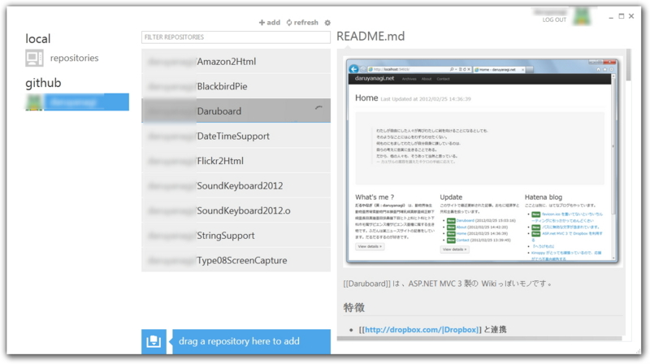

とある記事<a href="#f1" name="fn1" title="http://www.forest.impress.co.jp/docs/news/20120522_534423.html">*1</a>を書くついでに、10分ぐらいで新しい機能を付け足しました。設定が保存されないはずなので、今度ゆっくり改善します。ごめんなさい。

<a href="http://daruyanagi.net/08%E5%BC%8F%E6%9C%BA%E4%B8%8A%E6%92%AE%E5%BD%B1%E6%A9%9F">08&#x5F0F;&#x673A;&#x4E0A;&#x64AE;&#x5F71;&#x6A5F; - Daruboard</a>

<h3>1.1.0（2012/05/22）</h3>

<ul>
<li>通知のON/OFF機能追加</li>
<li>保存フォルダを開く機能追加</li>
<li>README.md を申し訳程度に追加</li>
</ul>

GitHub for Windows これはいいな！ ずっと <a class="keyword" href="http://d.hatena.ne.jp/keyword/Mac%20OS%20X">Mac OS X</a>版がうらやましかったのでうれしい。

<a href="#fn1" name="f1" class="footnote-number">*1</a>:http://www.forest.impress.co.jp/docs/news/20120522_534423.html

