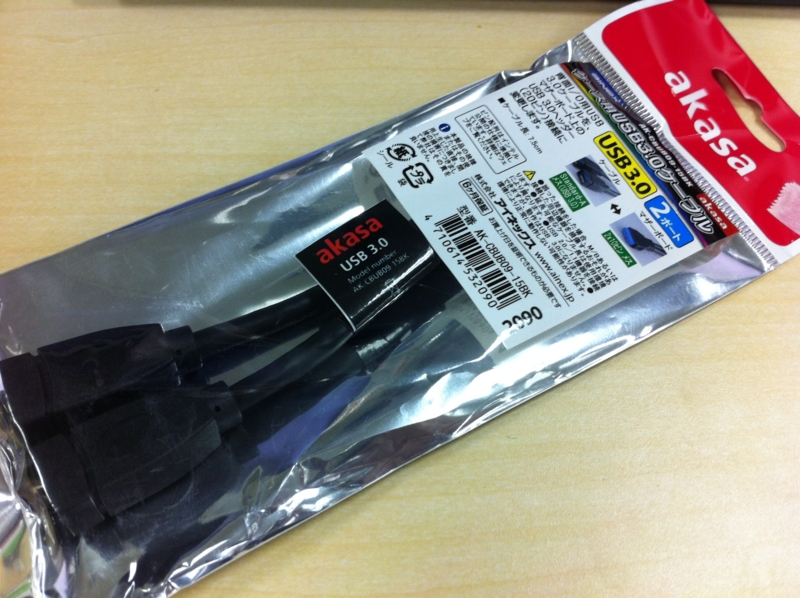
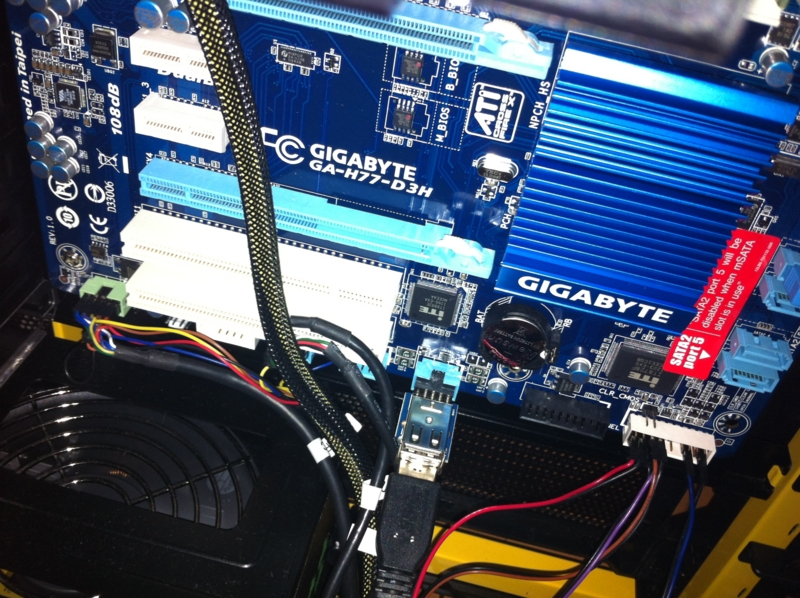
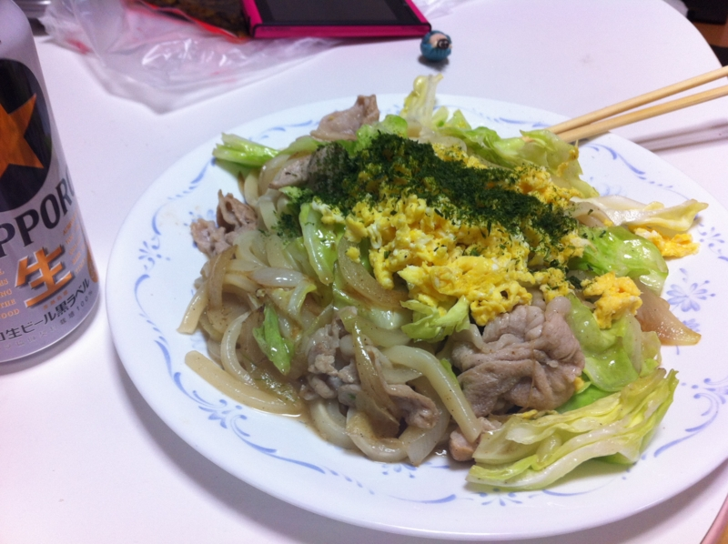

<a href="http://daruyanagi.hatenablog.com/entry/2012/05/16/204229">&#x98A8;&#x90AA;&#x3067;&#x6B7B;&#x306B;&#x304B;&#x3051;&#x305F;&#x306E;&#x3067; Amazon &#x3067;&#x4F53;&#x6E29;&#x8A08;&#x3092;&#x8CB7;&#x3063;&#x305F; - &#x3060;&#x308B;&#x308D;&#x3050;</a> で Amazon のお急ぎ便（“Amazon プライム”っていうのかな？）をお試ししているのだけど、そのせいで小物を細切れに注文するようになった。なんせ送料を気にしなくていいし。配送が速いことにはあまり魅力を感じないけれど、ほしいものをほしいときに頼めるのは精神的にとてもよろしい。ただ、お値段に見合うことなのかはまだ判断がつきかねるけど。

たとえば、今回は<a class="keyword" href="http://d.hatena.ne.jp/keyword/%A5%DE%A5%B6%A1%BC%A5%DC%A1%BC%A5%C9">マザーボード</a>のUSB 3.0ピンヘッダを<a class="keyword" href="http://d.hatena.ne.jp/keyword/%A5%E1%A5%B9%A5%B3%A5%CD%A5%AF%A5%BF">メスコネクタ</a>に変換するケーブルを買った。

<a href="http://www.amazon.co.jp/exec/obidos/ASIN/B005LDY0SO/bestylesnet-22/">AINEX ケース用USB3.0ケーブル AK-CBUB09-15BK</a>
<ul><li>出版社/メーカー: <a class="keyword" href="http://d.hatena.ne.jp/keyword/AINEX">AINEX</a></li><li>発売日: 2011/09/15</li><li>メディア: 付属品</li><li>購入: 1人 クリック: 5回</li><li><a href="http://d.hatena.ne.jp/asin/B005LDY0SO/bestylesnet-22" target="_blank">この商品を含むブログを見る</a></li></ul>

……が、買ってから<a class="keyword" href="http://d.hatena.ne.jp/keyword/%A5%DE%A5%B6%A1%BC%A5%DC%A1%BC%A5%C9">マザーボード</a>にはUSB 3.0のピンヘッダがないことに気が付いたので、USB 2.0の似たようなものを購入した。

<a href="http://www.amazon.co.jp/exec/obidos/ASIN/B001PP9R12/bestylesnet-22/">世田谷電器 USB9pinポート変換 奥沢一丁目 AR-UPIPO-A</a>
<ul><li>出版社/メーカー: エアリア</li><li>メディア: Personal Computers</li><li>購入: 6人 クリック: 38回</li><li><a href="http://d.hatena.ne.jp/asin/B001PP9R12/bestylesnet-22" target="_blank">この商品を含むブログ (1件) を見る</a></li></ul>

せいぜい500円の、しかも小さな基盤なのに、箱はやたらでかいので、部屋に段ボールがたまっていくのが困る。地球にも厳しいし、あんまり調子にのって使うのもよくないなぁーといった感じ。

まぁ、このおかげでPCケースの前面にあったUSBポートがすべて使えるようになったのでうれしい。間違って使えないポートに <a class="keyword" href="http://d.hatena.ne.jp/keyword/iPhone">iPhone</a> 刺していたがために充電ができていなかった、なんて事故も減るだろう。

昨日はそんなこんなで、あとは焼うどん作って日本代表のサッカー観て、すぐ寝た。あんまりいい試合でもなかったけど、やっぱり香川は上手いなー。俺の作った焼うどんより上手い。あと、酒井のクロスはいい武器になる。長友とフュージョンしてくれれば最強なのだけどなぁ。

