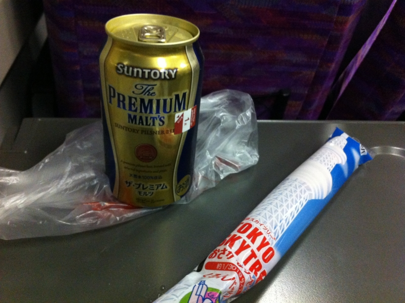
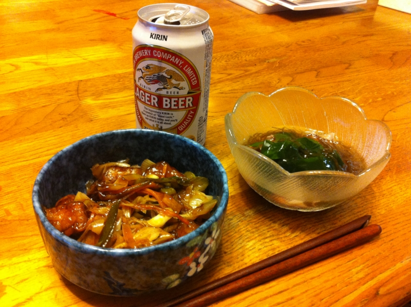
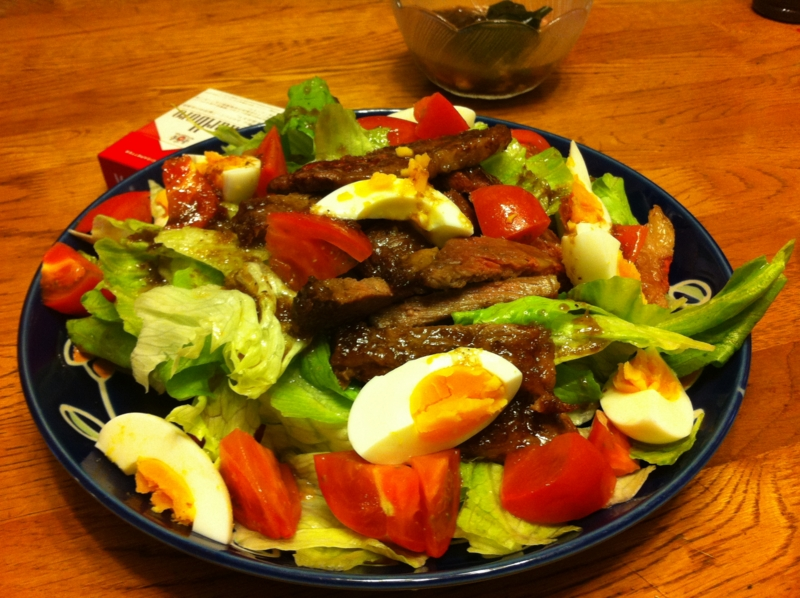
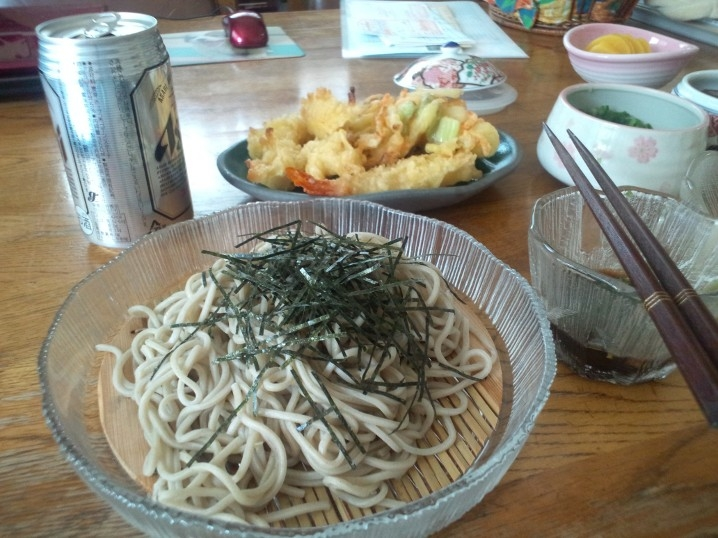

なんか電話から“帰ってきてほしいオーラ”が漂っていたので、金曜日は実家へ帰った。グリーン車で<a class="keyword" href="http://d.hatena.ne.jp/keyword/%C5%EC%B5%FE%A5%B9%A5%AB%A5%A4%A5%C4%A5%EA%A1%BC">東京スカイツリー</a>魚肉ソーセージとプレミアムモルツを楽しみながら、のんびり帰る。

母の日に何もしなかったので、外にでも飲みに連れて行ってあげようと思ったのだけど、すでに夕飯の準備をしていたらしくて、結局家で飲んだ。

居酒屋サチコはタダでビールとツキダシが出てきて、しかも上げ膳据え膳で快適だけど、これでは確実にダメ人間になる。だいたい、量がガキの頃のまんまなので全部食べ切れない。デブになる。けれど、これぐらい作らないと、作った気がしないのだそうだ。そんなもんなのだろうか。

ちなみに、居酒屋サチコでは昼食にもビールがつく。でも、ちゃんと事前に「1人前でいいよ」と伝えておかないと、二人前が出てくるので注意しないといけない。

