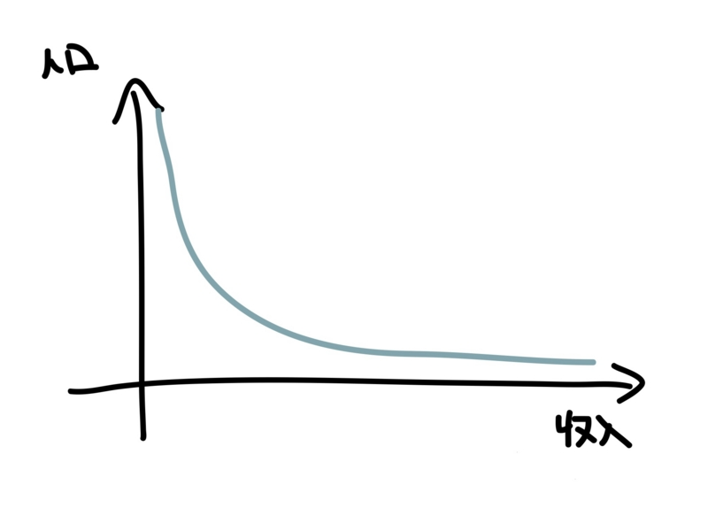

最近、<a class="keyword" href="http://d.hatena.ne.jp/keyword/%C0%B8%B3%E8%CA%DD%B8%EE">生活保護</a>が話題になっているので、便乗してみる。全然厳密な議論ではないけれど……

所得は、ほうっておけば（つまり自然状態<a href="#f1" name="fn1" title="そんなものあるの？">*1</a>であれば）<a class="keyword" href="http://d.hatena.ne.jp/keyword/%A4%D9%A4%AD%CA%AC%C9%DB">べき分布</a>をなす（<a href="http://daruyanagi.hatenablog.com/entry/2012/04/24/052658">&#x76F8;&#x4E92;&#x8D08;&#x4E0E;&#x3068;&#x7D4C;&#x6E08;&#x7684;&#x683C;&#x5DEE; - &#x3060;&#x308B;&#x308D;&#x3050;</a>）。けれど、実際にはそのようにはならない。さまざまな障害があるからだ。

たとえば、最低賃金制度やさまざまな税制、なんとなく社会全体で共有されている“労賃の相場”<a href="#f2" name="fn2" title="その多くは歴史的に決まったもので、なにか正当な理由があるわけではない">*2</a>などがあげられる。それらの要因は、所得分布をゆがめる。格差を是正するための分配政策が、かえって所得分布をゆがめているのは面白い。

ただ、これには理由がないわけではない。

戦後日本は「正規雇用に守られた一家の大黒柱が一族を養う」というモデルを採用してきた。“大黒柱”たる男性が稼ぐには正社員という安定的な立場を提供し、女性の労働参加をパートに限定しなければならない。むろん、そうじゃない家庭も多かった。でも、それはあくまでも例外であり、アドホックな保障しか与えられなかった。その好例が、今話題の<a class="keyword" href="http://d.hatena.ne.jp/keyword/%C0%B8%B3%E8%CA%DD%B8%EE">生活保護</a>制度といえると思う<a href="#f3" name="fn3" title="申請しなければもらえない！">*3</a>。

けれど、時代は変わった。

雇用機会は男女平等へ、拡大家族は核家族や単身世帯へ。<a class="keyword" href="http://d.hatena.ne.jp/keyword/%A5%B0%A5%ED%A1%BC%A5%D0%A5%EB%B2%BD">グローバル化</a>が進んで賃金も世界平均へと押し下げられていく。すると、これまで正社員が享受してきた賃金水準――所得分布のコブの部分――から漏れるひとが徐々に増える。これが、昨今言われている“格差社会”というものだと思うけど、何のことはない、格差なんてものはもとからあって、恵まれたコブの部分が減り、それをめぐる“椅子取りゲーム”がより過酷になっただけのことだ。

では、どんな<a class="keyword" href="http://d.hatena.ne.jp/keyword/%BC%D2%B2%F1%CA%DD%BE%E3">社会保障</a>制度であるべきか？　できるできないではなく、“あるべき”を列挙していけば以下のようになるだろう。

<ul>
<li><b>“個人”</b>のための保障：子どもは親や叔母まで養う義務を負うのだろうか？　兄弟が多い場合と一人っ子の場合では負担量に差が出ないだろうか。</li>
<li><b>“機械的”</b>な保障：要領のよい人だけが享受できて、まじめで我慢強いひとだけが割を食う保障制度はおかしくないだろうか<a href="#f4" name="fn4" title="スティグマの問題もある">*4</a>。担当者によって給付の基準が異なるのは公正といえるだろうか。</li>
<li><b>“平等”</b>な保障：正社員と派遣社員で差のある保障は正義にかなうだろうか。年代や職種によって保障の厚みが異なるのはなぜか。</li>
</ul>
そう考えれば、<a class="keyword" href="http://d.hatena.ne.jp/keyword/%A5%D9%A1%BC%A5%B7%A5%C3%A5%AF%A5%A4%A5%F3%A5%AB%A5%E0">ベーシックインカム</a>（または<a class="keyword" href="http://d.hatena.ne.jp/keyword/%C9%E9%A4%CE%BD%EA%C6%C0%C0%C7">負の所得税</a>）への流れは必然といえる。個人的には、<a class="keyword" href="http://d.hatena.ne.jp/keyword/%A5%D9%A1%BC%A5%B7%A5%C3%A5%AF%A5%A4%A5%F3%A5%AB%A5%E0">ベーシックインカム</a>は中小企業支援や過密・過疎対策になるばかりではなく、<a class="keyword" href="http://d.hatena.ne.jp/keyword/%BC%D2%B2%F1%CA%DD%BE%E3">社会保障</a>制度の簡素化にも有効で、移民政策との親和性も高いと思う。まぁ、その話はまた今度に。

<a href="#fn1" name="f1" class="footnote-number">*1</a>:そんなものあるの？

<a href="#fn2" name="f2" class="footnote-number">*2</a>:その多くは歴史的に決まったもので、なにか正当な理由があるわけではない

<a href="#fn3" name="f3" class="footnote-number">*3</a>:申請しなければもらえない！

<a href="#fn4" name="f4" class="footnote-number">*4</a>:<a class="keyword" href="http://d.hatena.ne.jp/keyword/%A5%B9%A5%C6%A5%A3%A5%B0%A5%DE">スティグマ</a>の問題もある

