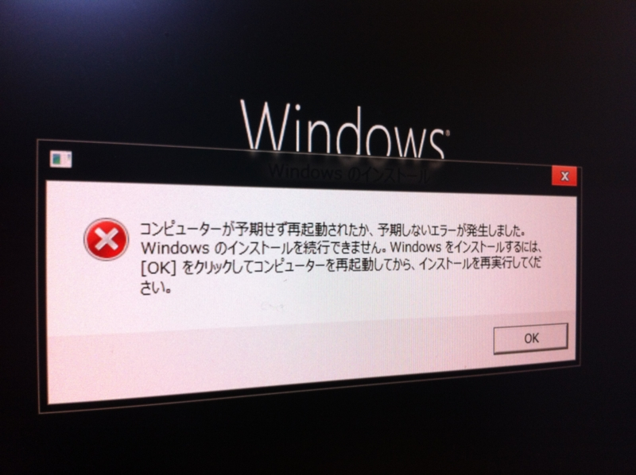

<a class="keyword" href="http://d.hatena.ne.jp/keyword/Windows%208">Windows 8</a> <b>Release Preview</b> とか <a class="keyword" href="http://d.hatena.ne.jp/keyword/Visual%20Studio">Visual Studio</a> <b>2012</b> とか、いろいろ一気にできました。徹夜でインストールや！

<ul>
<li><a href="http://www.forest.impress.co.jp/docs/news/20120601_536942.html">&#x7A93;&#x306E;&#x675C; - &#x3010;NEWS&#x3011;Microsoft&#x3001;&#x300C;Windows 8 Release Preview&#x300D;&#x306E;&#x4E00;&#x822C;&#x63D0;&#x4F9B;&#x3092;&#x958B;&#x59CB;</a></li>
<li><a href="http://www.forest.impress.co.jp/docs/news/20120601_536953.html">&#x7A93;&#x306E;&#x675C; - &#x3010;NEWS&#x3011;Microsoft&#x3001;&#x300C;Visual Studio 2012&#x300D;&#x304A;&#x3088;&#x3073;&#x300C;.NET Framework 4.5&#x300D;&#x306E;RC&#x7248;&#x3092;&#x516C;&#x958B;</a></li>
</ul>
けれど、うちの環境（Ivy Bridge世代<a class="keyword" href="http://d.hatena.ne.jp/keyword/Core%20i5">Core i5</a>＋内臓<a class="keyword" href="http://d.hatena.ne.jp/keyword/GPU">GPU</a>）ではいくつか不具合が。 <a class="keyword" href="http://d.hatena.ne.jp/keyword/Windows%208">Windows 8</a> Consumer Preview では問題なくインストールできていた環境なので、 Release Preview でコケとは思わなかった……。

 

<a class="keyword" href="http://d.hatena.ne.jp/keyword/%B2%BE%C1%DB%A5%DE%A5%B7%A5%F3">仮想マシン</a>で済ましてもよかったのだけど、やはり実機で体験したかったということもあり、結局、古いPC（<a class="keyword" href="http://d.hatena.ne.jp/keyword/Core%202%20Duo">Core 2 Duo</a>＋内臓<a class="keyword" href="http://d.hatena.ne.jp/keyword/GPU">GPU</a>）を引っ張り出してインストール。こっちはすんなり行きました。

お昼に力尽きて夕方まで寝て、起きてから少し原因を調べてみたのだけど、どうもドライバー、とくにグラフィックドライバーのせいなのかな、という気がする<a href="#f1" name="fn1" title="知らんけど。">*1</a>。 Consumer Preview のときも、たまにフリーズしていたし。あと、キーボードを<a class="keyword" href="http://d.hatena.ne.jp/keyword/%C6%FC%CB%DC%B8%EC%C7%DB%CE%F3">日本語配列</a>でインストールしたつもりが、なぜか<a class="keyword" href="http://d.hatena.ne.jp/keyword/%B1%D1%B8%EC%C7%DB%CE%F3">英語配列</a>になってる。まぁ、これは<a class="keyword" href="http://d.hatena.ne.jp/keyword/%B1%D1%B8%EC%A5%AD%A1%BC%A5%DC%A1%BC%A5%C9">英語キーボード</a>に差し替えて解決。もともと<a class="keyword" href="http://d.hatena.ne.jp/keyword/%B1%D1%B8%EC%C7%DB%CE%F3">英語配列</a>のキーボードのほうが好きでしたしね<a href="#f2" name="fn2" title="Mac Book Pro を買ったとき、間違って日本語配列を買ってしまったので、リモートでの利用に支障が出たのと、職場のPCが日本語配列なので、最近は日本語配列で使っていただけ">*2</a>。

まぁ、新しいソフトを試すときは、若干枯れた環境でやるとよい、という教訓を再確認。

<a href="#fn1" name="f1" class="footnote-number">*1</a>:知らんけど。

<a href="#fn2" name="f2" class="footnote-number">*2</a>:Mac Book Pro を買ったとき、間違って<a class="keyword" href="http://d.hatena.ne.jp/keyword/%C6%FC%CB%DC%B8%EC%C7%DB%CE%F3">日本語配列</a>を買ってしまったので、リモートでの利用に支障が出たのと、職場のPCが<a class="keyword" href="http://d.hatena.ne.jp/keyword/%C6%FC%CB%DC%B8%EC%C7%DB%CE%F3">日本語配列</a>なので、最近は<a class="keyword" href="http://d.hatena.ne.jp/keyword/%C6%FC%CB%DC%B8%EC%C7%DB%CE%F3">日本語配列</a>で使っていただけ

