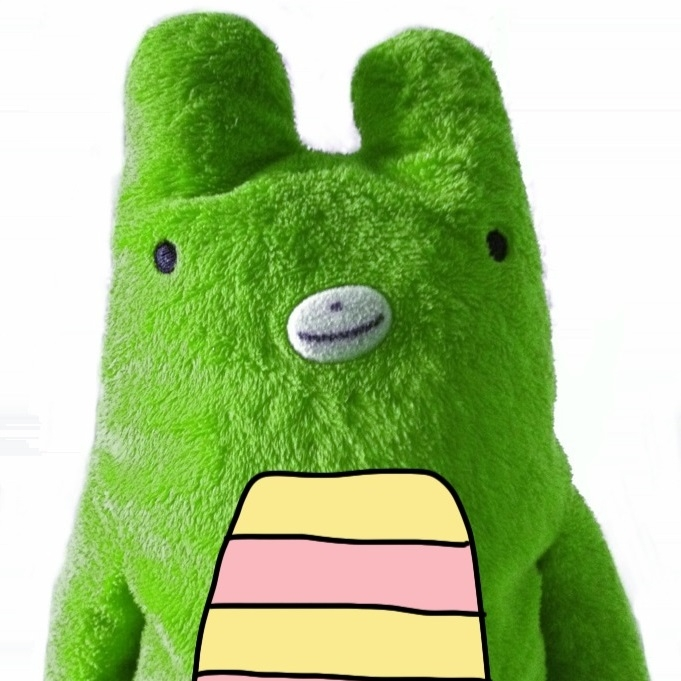

この数日間で、いつの間にか10万ツイートを超えていたみたい。塵も積もれば山になるものですね。ほんとに塵ばっかりだけど！

というわけで、気分を一新するためにも、<a class="keyword" href="http://d.hatena.ne.jp/keyword/Twitter">Twitter</a> のアイコンを変えてみました。ちょっとおねだりしてしまった<a href="#f1" name="fn1" title="めかちゃん、ありがと！">*1</a>。前のアイコンもそうだけど、おなかのやっつけ感が気に入っている。

<a href="#fn1" name="f1" class="footnote-number">*1</a>:めかちゃん、ありがと！

