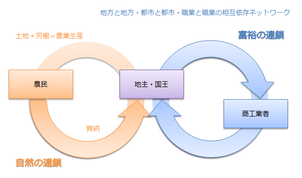
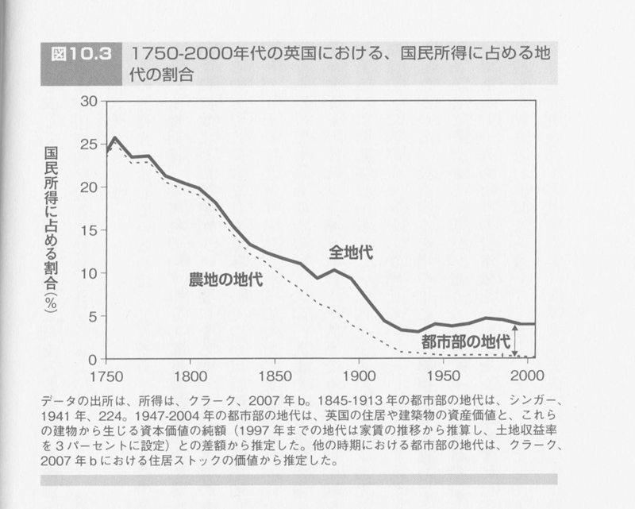

<a href="http://www.amazon.co.jp/exec/obidos/ASIN/4106005158/bestylesnet-22/">貨幣の思想史―お金について考えた人びと (新潮選書)</a>
<ul><li>作者: 内山節</li><li>出版社/メーカー: 新潮社</li><li>発売日: 1997/05</li><li>メディア: 単行本</li><li>購入: 2人 クリック: 32回</li><li><a href="http://d.hatena.ne.jp/asin/4106005158/bestylesnet-22" target="_blank">この商品を含むブログ (9件) を見る</a></li></ul>

今日は第2章の『経済表』について。

古典とは「名前は知られているが、だれも読んだことのない本」を言うのだそうだ。かくいう僕も、『<a class="keyword" href="http://d.hatena.ne.jp/keyword/%B9%F1%C9%D9%CF%C0">国富論</a>』だの『資本論』だのは読んだけど、さすがに『経済表』は読んでない。知名度ではまったく劣っていないのにね。ほかの人も、だいたいそうなんじゃないかな。そういう意味では、本書こそ古典中の古典と言っていいのかもしれない。

富とはなんだろうか。それについて、『貨幣の思想史』では3つ提示されている。

<ul>
<li>交易：　富とは売り買いの差額です。<a href="#f1" name="fn1" title="いわゆる、初期の重商主義の発想">*1</a></li>
<li>労働：　富は労働（と、<死んだ労働>であるところの資本）から生まれます。<a href="#f2" name="fn2" title="スミスからマルクスに至る労働価値説学派">*2</a></li>
<li><b>自然：　富は自然が授けてくれたものです。</b><a href="#f3" name="fn3" title="重農主義">*3</a></li>
</ul>
個人的にはそのどれとも思わないのだけど、『経済表』が示した「自然」という考え方は面白いと思う。ただ、この考え方は『経済表』がオリジナルであるわけではないのだけど……フランスは農業国だったので、自然とこういった発想が生れるみたい。

自然が富であるというのを、ちょっと過激かつ自分なりにまとめるとこうだ。

<blockquote>

私たちは、自然から水だの、農作物だの、鉱物だのを授かる。これが富だ。

収穫された富は、流通過程を通じて、そのカタチを変えながら全世界に染みわたっていく。

</blockquote>

無論、富はタダでさずかるものではない。種を残しておいたり、田を耕しておいたり、器具をあらかじめこさえておくといった<前払い>が必要であり、収穫 → 投資 → 収穫……という<再生産>の仕組みを整えておかなくてはならない。

<a href="#f4" name="fn4" title="http://www.be-styles.jp/archives/3980">*4</a>

そして、私たちは流通過程でなんら価値を付け加えない。売買で得た利益だの、加工のために労働しただの、そんなものは無価値であり、自然から得た富の総量になんら加えるものではない。私たちにできるのは、<b>自然にもらった価値をなるべく損なわないようにみんなで分け合うこと</b>、それだけだ！……僕たちは結局、資源を少しずつ食いつぶしながら生きている。それを思えば、必ずしも的を外したものの見方ではないと思う。

ケネーはかならずしもそんな過激こと言ってない<a href="#f5" name="fn5" title="曲解すればそれっぽいことは言ってる">*5</a>。けれど、そうやって極端に解釈してみれば「良価」の概念がすっきりと見えてくる。

<blockquote>

単なる消費は、消滅して再び帰らない。だから、これは再生産に使用されない支出、つまり不生産的な支出とみられるべきだ。農業にとってよけいであり不利となるならば、有害な支出、贅沢な支出とさえみられるべきだ。

</blockquote>

経済は循環している。だから、その流れを阻害しちゃいけない。貨幣はその流れを円滑にするので有用だが、それ自体に価値はない。

<blockquote>

彼ら（農民）にとって貨幣は、再生産なき、一瞬にして消え失せる仲介的小富たるにすぎぬ。

</blockquote>

ケネーの考え方は、土地そのものが生む富よりも、交換のネットワークで生み出される富が重視されるようになるにしたがって、忘れ去られていく。

<a href="#f6" name="fn6" title="http://www.be-styles.jp/archives/5091">*6</a>

けれどただ忘れ去るには惜しいので、後日、自然との相互贈与について考えるときに役に立たないかなぁ、と思う。

<a href="#fn1" name="f1" class="footnote-number">*1</a>:いわゆる、初期の<a class="keyword" href="http://d.hatena.ne.jp/keyword/%BD%C5%BE%A6%BC%E7%B5%C1">重商主義</a>の発想

<a href="#fn2" name="f2" class="footnote-number">*2</a>:スミスから<a class="keyword" href="http://d.hatena.ne.jp/keyword/%A5%DE%A5%EB%A5%AF%A5%B9">マルクス</a>に至る労働価値説学派

<a href="#fn3" name="f3" class="footnote-number">*3</a>:重農主義

<a href="#fn4" name="f4" class="footnote-number">*4</a>:http://www.be-styles.jp/archives/3980

<a href="#fn5" name="f5" class="footnote-number">*5</a>:曲解すればそれっぽいことは言ってる

<a href="#fn6" name="f6" class="footnote-number">*6</a>:http://www.be-styles.jp/archives/5091

