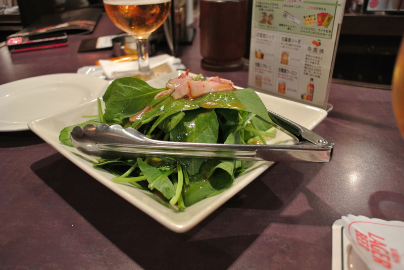

<a href="http://www.amazon.co.jp/exec/obidos/ASIN/B005OD1DNQ/bestylesnet-22/">Nikon デジタル一眼カメラ Nikon 1 (ニコンワン) V1 (ブイワン) 薄型レンズキット ブラックN1 V1ULK BK</a>
<ul><li>出版社/メーカー: ニコン</li><li>発売日: 2011/10/20</li><li>メディア: エレクトロニクス</li><li>購入: 2人 クリック: 51回</li><li><a href="http://d.hatena.ne.jp/asin/B005OD1DNQ/bestylesnet-22" target="_blank">この商品を含むブログ (18件) を見る</a></li></ul>

薄型レンズキットと、ボディケースのセットを、ヤフオクで36,500円でゲット。相場よりも結構安く入手できたんじゃないかな？　満足満足。

<a class="keyword" href="http://d.hatena.ne.jp/keyword/Nikon">Nikon</a> <a class="keyword" href="http://d.hatena.ne.jp/keyword/D300s">D300s</a> のバックアップとして、おれみたいなアホでも簡単に・きれいに撮れるカメラがほしかったのだけど、かなり満足できそう。

コンパクトだけど、ちゃんとレンズ交換式。<a class="keyword" href="http://d.hatena.ne.jp/keyword/D300s">D300s</a> とのレンズの使いまわしも可能。ただ、純正アダプタは結構高いね……まぁ、いずれ買うだろうけど。

J1との違いは、アクセサリポートの有無。たとえば、GPSなんかを付けられる。いまどき写真に位置情報入れられないのは、正直ナイと思うんだよね。あと、V1にはファインダー（EVF）もついている。センサーがついているみたいで、顔を近づけると自動で液晶がOFFになり、EVFがONになる。

色は白をチョイス。黒は当たり前すぎるし、ほかの色は目立ちすぎ＆レンズと合わない（レンズは白＆黒のカラーリングのみ）。おまけでついてきたカバーは気に入らなかったので、ヤフオクでさばく予定。これをつけると、電池パックやSDカードを取り出すのがすごく面倒になる。色も、どうせならボディと違う色がいい。

あと、［ターゲット追尾］AFモードが気に入った。フォーカスターゲットを決めたら、カメラを動かしてもそれを自動追尾して逃がさない。ピントを合わせるところを選んでから構図を変えられるのが面白いなー。最近のカメラには当たり前の機能なのかな？

さて、これをいつも腰につるしておけるような、よさげな袋はないものか……

長らく愛用していた Canon <a class="keyword" href="http://d.hatena.ne.jp/keyword/PowerShot">PowerShot</a> G10 はこれで退役。0円オークションにかけるつもりだけど、もし知り合いにほしい人がいたらあげるので、<a class="keyword" href="http://d.hatena.ne.jp/keyword/Twitter">Twitter</a> かなにかでコンタクトください。

