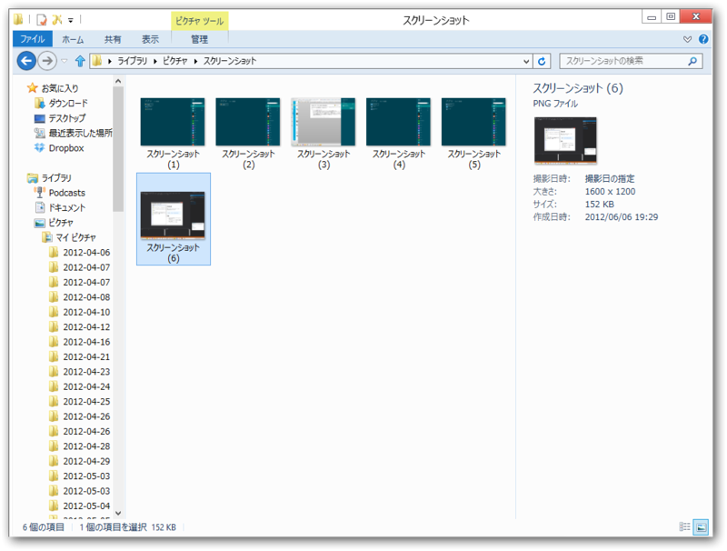

<a href="http://daruyanagi.hatenablog.com/entry/2012/03/05/220912">Windows 8 &#x306F;&#xFF3B;Windows&#xFF3D;&#xFF0B;&#xFF3B;PrintScreen&#xFF3D;&#x30AD;&#x30FC;&#x3067;&#x30C7;&#x30B9;&#x30AF;&#x30C8;&#x30C3;&#x30D7;&#x306E;&#x30B9;&#x30AF;&#x30EA;&#x30FC;&#x30F3;&#x30B7;&#x30E7;&#x30C3;&#x30C8;&#x3092;&ldquo;&#x30D4;&#x30AF;&#x30C1;&#x30E3;&#x30FC;&rdquo;&#x30D5;&#x30A9;&#x30EB;&#x30C0;&#x306B;&#x4FDD;&#x5B58;&#x3067;&#x304D;&#x308B; - &#x3060;&#x308B;&#x308D;&#x3050;</a>

<a class="keyword" href="http://d.hatena.ne.jp/keyword/Windows%208">Windows 8</a> CP では<a class="keyword" href="http://d.hatena.ne.jp/keyword/%A5%B9%A5%AF%A5%EA%A1%BC%A5%F3%A5%B7%A5%E7%A5%C3%A5%C8">スクリーンショット</a>が「ピクチャ」フォルダに保存されていたけど、<a class="keyword" href="http://d.hatena.ne.jp/keyword/Windows%208">Windows 8</a> RP では「ピクチャ\<a class="keyword" href="http://d.hatena.ne.jp/keyword/%A5%B9%A5%AF%A5%EA%A1%BC%A5%F3%A5%B7%A5%E7%A5%C3%A5%C8">スクリーンショット</a>」フォルダに保存されるようになったみたい。

というわけで、<a href="http://daruyanagi.hatenablog.com/entry/2012/05/27/161348">08&#x5F0F;&#x673A;&#x4E0A;&#x64AE;&#x5F71;&#x6A5F; v1.4.0 - &#x3060;&#x308B;&#x308D;&#x3050;</a> を少しだけ手直ししようかと思う。

