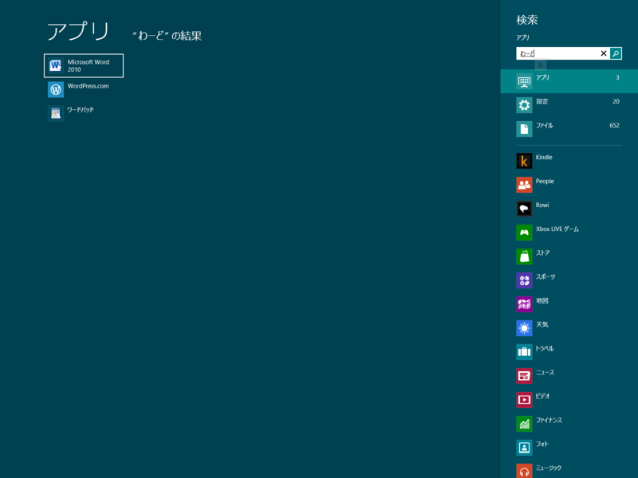
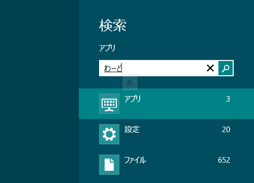
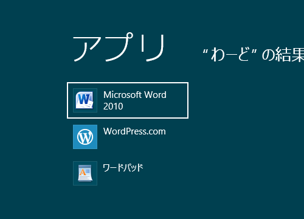
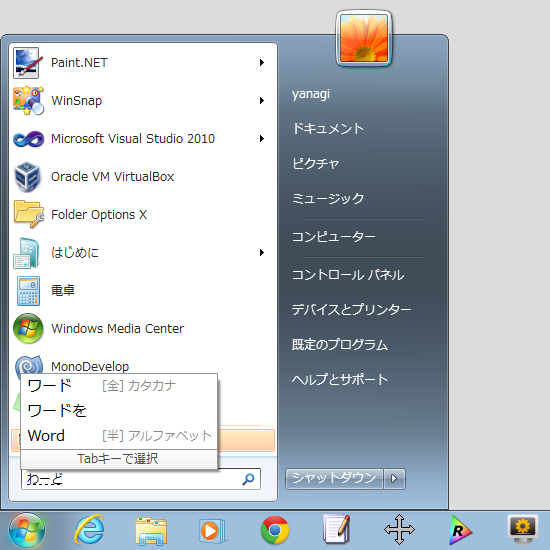

これまで、 Windows のスタートメニューはアプリケーションランチャーだった。そして、機能や責務が増えこそすれ、その基本的な役割はこれからも変わらない。なんせ、アプリケーションはなんらかの方法でかならず起動（ローンチ）しなくてはならないのだから。

たとえばこれを見てくれ。［Windows］キーを押すと Metro デスクトップが起動し、さらにテキストを入力するとアプリやファイルの絞り込み検索が始まる。見た目ががらりと変わっているので騙されやすいが、実は <a class="keyword" href="http://d.hatena.ne.jp/keyword/Windows%207">Windows 7</a> での動作と基本的にはまったく同じだ。

しかも、進化している。

たとえば、「わーど」（未変換）と入力すると、

「Microsoft Word」がちゃんと候補に出てくる！　<a class="keyword" href="http://d.hatena.ne.jp/keyword/IME">IME</a>が未確定状態でも十字キーでアプリケーションを選択し、起動することができる。さらに、検索結果は利用頻度の高いものが優先されるので、次回からはもっと高速に望みのアプリケーションへアクセスできるようになる。

ためしに <a class="keyword" href="http://d.hatena.ne.jp/keyword/Windows%207">Windows 7</a> ではどうだったか確かめてみよう。

<a class="keyword" href="http://d.hatena.ne.jp/keyword/IME">IME</a>が未確定状態だと検索が始まらないし、「わーど」で「Microsoft Word」を探し出すこともできない。無論、アプリケーションの起動もできない。

この改善は、僕みたいなキーボード派にとってはうれしい<a href="#f1" name="fn1" title="これは Twitter で教えてもらいました。……だれだっけか、忘れたけどありがとう。">*1</a>。 Metro デスクトップは「タッチ・ファースト」で設計されているし、今までの入力方法が蔑ろにされているのではないかとつい心配してしまう。けれど、キーボード入力に関してはそれは杞憂だ。

ただ、マウス操作中心のユーザーにとっては、あまりメリットがないのも確か。アプリケーションを起動させるためのカーソル移動距離が、かなり延びてしまう。けれど、これはタスクバーへのピン止めや、 Metro デスクトップのアイコンの配置をカスタマイズすることでカバーできるはず。日常的に使うアプリケーションの数なんて、実はたかが知れている。逆に数が多いのならば、キーボード操作のほうが断然早い。近年流行の<a class="keyword" href="http://d.hatena.ne.jp/keyword/%A5%DE%A5%A6%A5%B9%A5%B8%A5%A7%A5%B9%A5%C1%A5%E3%A1%BC">マウスジェスチャー</a>にしろ、タッチジェスチャーのほうが直観的で使いやすいはず。キーボードはタッチ操作でもエミュレートすることしかできないが、マウスはタッチ操作でほとんど代替できる。マウスは要らなくなる。

タッチパネルという黒船が、マウスの地位を脅かし、その長い歴史に幕を下ろそうとしている。すぐに死にはしないだろうが、いずれ<a class="keyword" href="http://d.hatena.ne.jp/keyword/%A5%C8%A5%E9%A5%C3%A5%AF%A5%DC%A1%BC%A5%EB">トラックボール</a>と大して変わらない扱いに落ち着くだろう。<a class="keyword" href="http://d.hatena.ne.jp/keyword/%A5%DE%A5%A4%A5%AF%A5%ED%A5%BD%A5%D5%A5%C8">マイクロソフト</a>がマウスの製造をやめるのも、そう遠い未来の話ではないかもしれない。

知らんけど。

<a href="#fn1" name="f1" class="footnote-number">*1</a>:これは <a class="keyword" href="http://d.hatena.ne.jp/keyword/Twitter">Twitter</a> で教えてもらいました。……だれだっけか、忘れたけどありがとう。

