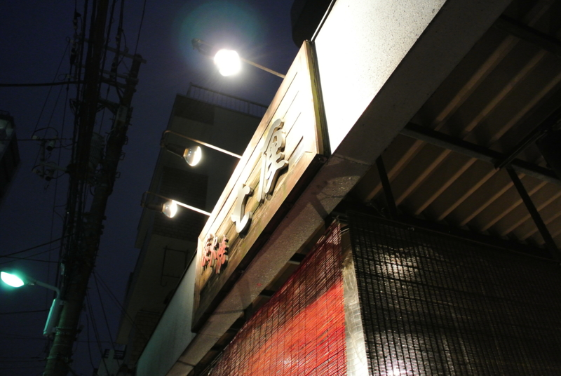
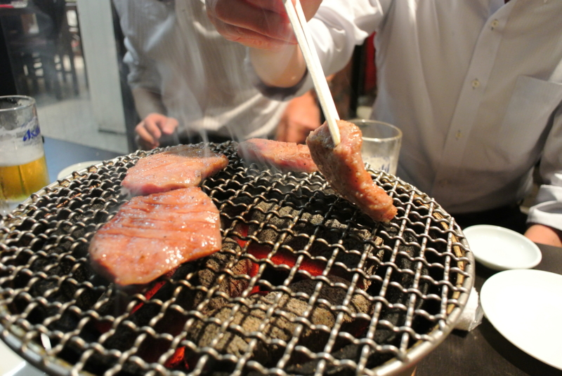
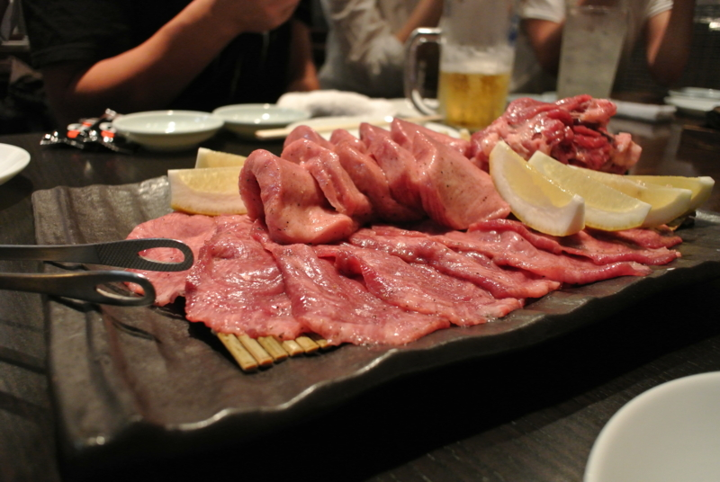
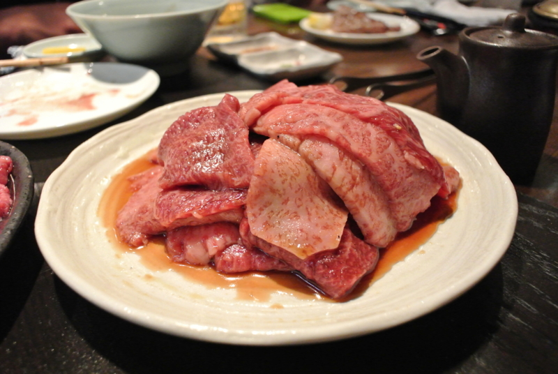

バイク友達で集まって焼肉食べに行った。むろん、バイクで集まったわけではないけど。

<iframe width="425" height="350" frameborder="0" scrolling="no" marginheight="0" marginwidth="0" src="https://maps.google.co.jp/maps?q=%E4%B8%83%E5%8E%98&amp;ie=UTF8&amp;hl=ja&amp;hq=%E4%B8%83%E5%8E%98&amp;hnear=&amp;radius=15000&amp;t=m&amp;brcurrent=3,0x60188e7d6074448b:0x151204694a73934f,0&amp;cid=4101364313059903033&amp;ll=35.741775,139.793215&amp;spn=0.024383,0.036478&amp;z=14&amp;iwloc=A&amp;output=embed"></iframe> <small><a href="https://maps.google.co.jp/maps?q=%E4%B8%83%E5%8E%98&amp;ie=UTF8&amp;hl=ja&amp;hq=%E4%B8%83%E5%8E%98&amp;hnear=&amp;radius=15000&amp;t=m&amp;brcurrent=3,0x60188e7d6074448b:0x151204694a73934f,0&amp;cid=4101364313059903033&amp;ll=35.741775,139.793215&amp;spn=0.024383,0.036478&amp;z=14&amp;iwloc=A&amp;source=embed" style="color:#0000FF;text-align:left">大きな地図で見る</a></small>

<a href="http://www.7-rin.com/">&#x6771;&#x4EAC;&#x90FD; &#x8352;&#x5DDD;&#x533A; &#x65E5;&#x6BD4;&#x8C37;&#x7DDA;&#x4E09;&#x30CE;&#x8F2A;&#x99C5; &#x70AD;&#x706B;&#x713C;&#x8089; &#x4E03;&#x5398; &#x5BB4;&#x4F1A;</a>

お任せコースにしたら、じゃんじゃかお肉が出てくる。全然お肉の名前を憶えていないのだけど、どれもこれもおいしかった。うまい肉を食うとテンションが上がるね！　お値段は一人8,000円といったところ。

はっきり言って、カード支払いに上乗せ5％かかる以外は不満なかった<a href="#f1" name="fn1" title="ほんまはこれやったらあかんでしょ？　残念と言わざるをえない">*1</a>。周りのコンビニは<a class="keyword" href="http://d.hatena.ne.jp/keyword/%C5%EC%B5%FE%BB%B0%C9%A9UFJ%B6%E4%B9%D4">東京三菱UFJ銀行</a>の口座すら扱えない「<a class="keyword" href="http://d.hatena.ne.jp/keyword/%A5%BC%A5%ED%A5%D0%A5%F3%A5%AF">ゼロバンク</a>」しかなかったし。ちゃんと前もってお金おろしておけばよかったなー。

結局、もう一軒ハシゴして、<a class="keyword" href="http://d.hatena.ne.jp/keyword/%A5%DE%A5%F3%A5%AC%B5%CA%C3%E3">マンガ喫茶</a>で始発まで『<a class="keyword" href="http://d.hatena.ne.jp/keyword/%C5%B4%B7%FD%A5%C1%A5%F3%A5%DF">鉄拳チンミ</a>』を読んで、家に帰った。行くつもりだった Community Open Day は……ドタキャンです。ゴメンナサイ。

<a href="#fn1" name="f1" class="footnote-number">*1</a>:ほんまはこれやったらあかんでしょ？　残念と言わざるをえない

