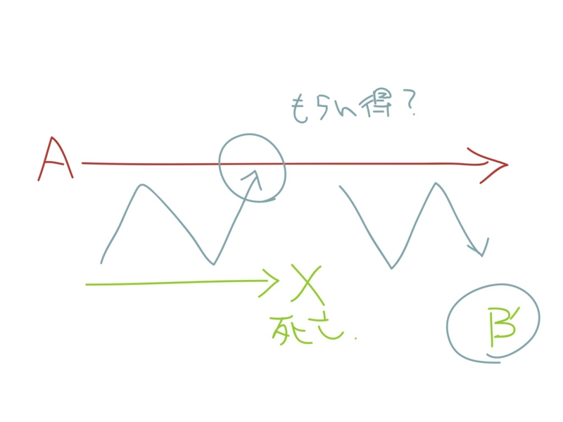
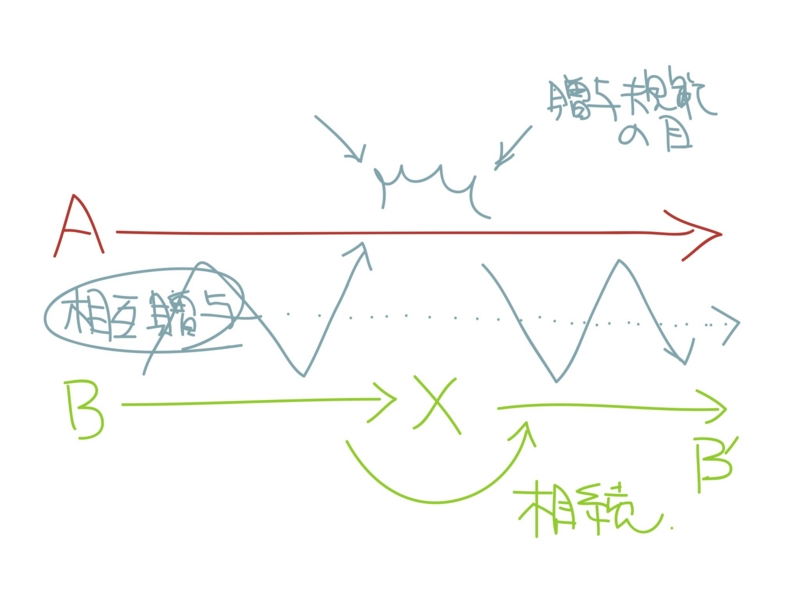

<a href="http://www.amazon.co.jp/exec/obidos/ASIN/4106005158/bestylesnet-22/">貨幣の思想史―お金について考えた人びと (新潮選書)</a>
<ul><li>作者: 内山節</li><li>出版社/メーカー: 新潮社</li><li>発売日: 1997/05</li><li>メディア: 単行本</li><li>購入: 2人 クリック: 32回</li><li><a href="http://d.hatena.ne.jp/asin/4106005158/bestylesnet-22" target="_blank">この商品を含むブログ (9件) を見る</a></li></ul>

『貨幣の思想史』でこれが取り扱われているなんて、意外だなと思った。けれど確かに、「使用価値」と「交換価値」、「所有」、「労働」の考え方には興味深いものがあるのも確か。

<a href="http://www.amazon.co.jp/exec/obidos/ASIN/4334752349/bestylesnet-22/">市民政府論 (光文社古典新訳文庫)</a>
<ul><li>作者: ジョンロック,John Locke,角田安正</li><li>出版社/メーカー: 光文社</li><li>発売日: 2011/08/10</li><li>メディア: 文庫</li><li> クリック: 1回</li><li><a href="http://d.hatena.ne.jp/asin/4334752349/bestylesnet-22" target="_blank">この商品を含むブログ (5件) を見る</a></li></ul>

『市民政府論』は読んだことがあるけれど、あんまり「使用価値」という文脈では読んでこなかったように思う。残念ながら、ブログを引っ越す折に、読んだ感想の記事が失われてしまっているらしいので、改めて読んでみていいかもしれない。

『貨幣の思想史』では、ロックの所有権論にまずフォーカスがあてられている。

<blockquote>

人はだれでも、自分の一身については所有権をもっている。

</blockquote>

だから、

<blockquote>

彼の身体の労働、彼の手の働きは、まさしく彼のものと言ってよい。

</blockquote>

つまり、所有権の源泉は労働だ（これは、労働価値説にもつながっていく）。貨幣が現れるまで、人は自分に必要である以上の労働はしなかった。必要である以上の価値は、交換も貯蔵もできなかったからだ<a href="#f1" name="fn1" title="これはむしろ逆で、交換を行うとき、交換物が貨幣性を帯びるようになる。貯蔵に適したものが貨幣性を帯びると、価値は貯蔵できるようになる">*1</a>。しかし貨幣が出現すると、事態は一変する。個人所有のリミッターが解除され、貪欲が世界を支配するだろう。

けれど、僕にしてみれば、そこには重大な見落としがあるようにも思う。

権利というのは、他者からの承認があってこそ確立される。ほかの人にも認められてこそ、権利は確立したといえる。逆にいえば、だれにも承認されない権利は権利ではない。<a class="keyword" href="http://d.hatena.ne.jp/keyword/%B4%F0%CB%DC%C5%AA%BF%CD%B8%A2">基本的人権</a>しかり、<a class="keyword" href="http://d.hatena.ne.jp/keyword/%BB%B2%C0%AF%B8%A2">参政権</a>しかり、今では当たり前とされる権利も、社会の成熟と権利への理解・承認があって築かれてきた。ロックの労働＝所有論には、そういった他者の目が欠けている。ロックが<b>すでに権利というものを知っていた</b>から、社会による承認の論議をせずに、労働＝所有権を何か自然に備わった法則として語ってしまった。みなが奪い合わないのは所有権があるから？　たぶんそうではないだろう。所有権の概念がなければ争奪状態には陥りやすいかもしれないけれど、ないからといって即争奪状態に陥るかと言われれば疑問だ。

では、より本源的な権利とはなんだろう。

それは多分、「相続権」だろう<a href="#f2" name="fn2" title="知らんけど">*2</a>と僕は思う。財産（モノ）の相続権ではなく、相互贈与関係の相続権（継承権）と呼んだほうがよいか。

相互贈与関係は、それ自体が目的で、価値だ。だから、片方がそれを継続できなくなったとき（たとえばBが死亡する）、短期的には贈与の"もらい得"であっても、そこで関係を途切れさせずに、後継者に継承させるインセンティブが存在する。相互贈与関係に愛着があれば、すでにこの世にいない人に対してであっても、義理やウトゥは返すべきだ。返すべき人がいなければ、残ったものが受け取るべきだろう。

もう一つは、贈与規範の問題だ。相互贈与関係には、常にフリーライドの危険が伴う。関係を一方的に打ち切って"もらい得"をするのが、短期的には利得が大きい。それを許さないのがコミュニティの目、贈与規範だ。"もらい得"には社会的制裁が加えられる。たとえば、相互贈与コミュニティから排除（<a class="keyword" href="http://d.hatena.ne.jp/keyword/%C2%BC%C8%AC%CA%AC">村八分</a>）されたり、不名誉の烙印を押されたりするだろう。相互贈与関係には、お互いに与え合うという正の意味だけでなく、<b>お互いに奪い合わない</b>という裏の意味がある。これが守られる限り、多少窮屈ではあっても、一人で生きる以上の可能性を手にすることができる。

ともあれ、AがB→B'の継承を認めれば、いつか来るであろうA→A'の継承をB'に保障してもらえると期待できる。この相互保障関係は、相互贈与関係の一つのカタチであり、定式化すれば相続権、財産権、所有権になる。そしてそういった権利は、いずれ特定のコミュニティの制裁機構によらず、個人と個人で取り結べる関係にまで発展・一般化していくだろう。

これが近代の始まりだ。

<a href="#fn1" name="f1" class="footnote-number">*1</a>:これはむしろ逆で、交換を行うとき、交換物が貨幣性を帯びるようになる。貯蔵に適したものが貨幣性を帯びると、価値は貯蔵できるようになる

<a href="#fn2" name="f2" class="footnote-number">*2</a>:知らんけど

