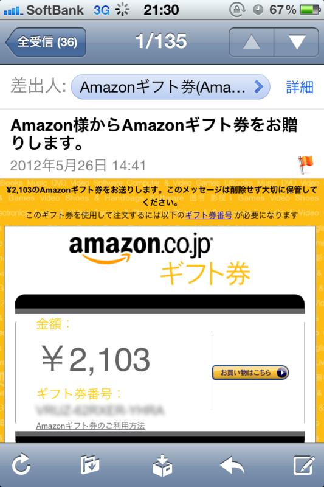

今のブログはともかく、昔やっていたブログは案外アクセスがあって、ごくたまに広告収入がある。けれど、それも <a class="keyword" href="http://d.hatena.ne.jp/keyword/Google">Google</a> からが大半。もう7年ぐらい放置しているけれど、 Amazon からもらったのは初めてだった。というのも、 Amazon は5,000円以上収益を上げないと来季に繰り越されてしまう。こうやってギフト券にすれば、少額でももらえるんだけどね。いや、ずっと知らなかったんだけどね。

それにしても、<b>自分のことを Amazon 様と呼ぶ</b> Amazon 様、カッコイイ！

というわけで、臨時収入をゲットしたので、久しぶりに音楽CDを買ってみたりなどした。気になってた CD があったのだ。

<a href="http://www.amazon.co.jp/exec/obidos/ASIN/B007N6SD76/bestylesnet-22/">空も飛べるはず/ビアンカ/恋するスポーツ(初回生産限定盤)</a>
<ul><li>アーティスト: さよならポニーテール</li><li>出版社/メーカー: <a class="keyword" href="http://d.hatena.ne.jp/keyword/ERJ">ERJ</a></li><li>発売日: 2012/05/23</li><li>メディア: CD</li><li>購入: 1人 クリック: 8回</li><li><a href="http://d.hatena.ne.jp/asin/B007N6SD76/bestylesnet-22" target="_blank">この商品を含むブログ (9件) を見る</a></li></ul>

たまたまTVで聞いたのだけど、<a class="keyword" href="http://d.hatena.ne.jp/keyword/%A5%B9%A5%D4%A5%C3%A5%C4">スピッツ</a>の「<a class="keyword" href="http://d.hatena.ne.jp/keyword/%B6%F5%A4%E2%C8%F4%A4%D9%A4%EB%A4%CF%A4%BA">空も飛べるはず</a>」のカバーが可愛らしい。ほかの曲は……最初は耳障りだったけど、慣れるとまぁまぁよい。今の音楽ってこんな感じなんだなぁ。

それはともかく。

<blockquote cite="http://news.mynavi.jp/c_career/level1/yoko/2012/06/cd.html">

「CDが売れなーい！」と音楽業界が叫び出してからかなりの時間がたちました。確かに、2000年にはシングルCDの生産枚数約10,500万枚、CDアルバムの生産枚数約27,600万枚でしたが、これが2010年にはシングルCDの生産枚数約5,100万枚、CDアルバムの生産枚数約15,600万枚になっています。

<cite><a href="http://news.mynavi.jp/c_career/level1/yoko/2012/06/cd.html">CD&#x304C;&#x58F2;&#x308C;&#x306A;&#x3044;&#x672C;&#x5F53;&#x306E;&#x7406;&#x7531; | &#x30AD;&#x30E3;&#x30EA;&#x30A2; | &#x30DE;&#x30A4;&#x30CA;&#x30D3;&#x30CB;&#x30E5;&#x30FC;&#x30B9;</a></cite>
</blockquote>

最近 CD が売れないんだそうだ。そういえば、自分もあまり買わない。なんでだろうね。

<a class="keyword" href="http://d.hatena.ne.jp/keyword/iTunes">iTunes</a> は使わない。<a class="keyword" href="http://d.hatena.ne.jp/keyword/DRM">DRM</a>だのなんだのウザそうだから。ツタヤも最近は行かない。引越ししたら、近所になかったから。

けれど、音楽自体は毎日聞いている。お気に入りのヘッドフォンで、この10年貯めた MP3 を延々とループする毎日だ。

なのになんで買わないんだろうね。

「今の音楽ってこんな感じなんだなぁ。」――そうだ、そもそも最近の曲を知らない！　今回買ったのだって、たまたまTVで聞いていいなーと思って、<a class="keyword" href="http://d.hatena.ne.jp/keyword/Twitter">Twitter</a> でつぶやいたから教えてくれただけで。高校生の頃ならばいざしらず、今は友人同士で音楽の話をすることもない。たまたま気になるモノがあっても、些細な理由で、なんとなく、途中でやめてしまう。意外に高かった、余計なものが付いている、初回限定版が売り切れてた、ショッピングカートに入れたまま、とりあえず「ほしい物リスト」に入れて様子見しよう……etc。

あと今年買う予定のCDは、<a class="keyword" href="http://d.hatena.ne.jp/keyword/%CC%DA%BA%AC%BE%B0%C5%D0">木根尚登</a>のベストアルバムと、<a class="keyword" href="http://d.hatena.ne.jp/keyword/%C0%BB%B7%F5%C5%C1%C0%E2">聖剣伝説</a>2のアレンジアルバムだけ。完全に時間が止まってる。

<h3>ちなみに</h3>

このブログの広告<a href="#f1" name="fn1" title="一部を除く">*1</a>や Amazon <a class="keyword" href="http://d.hatena.ne.jp/keyword/%A5%A2%A5%D5%A5%A3%A5%EA%A5%A8%A5%A4%A5%C8">アフィリエイト</a>の収益は「<a class="keyword" href="http://d.hatena.ne.jp/keyword/%A4%CF%A4%C6%A4%CA%A5%D6%A5%ED%A5%B0">はてなブログ</a>」に上納される<a href="#f2" name="fn2" title="執筆時現在/2012-06-29 追記、自分のIDが反映されるようになったっぽい。記事の再生成が必要だけど。">*2</a>ので、僕におこづかいをあげたくない人でも、気に入ったものがあればじゃんじゃん買えばいいと思います。

<a href="#fn1" name="f1" class="footnote-number">*1</a>:一部を除く

<a href="#fn2" name="f2" class="footnote-number">*2</a>:執筆時現在/2012-06-29 追記、自分のIDが反映されるようになったっぽい。記事の再生成が必要だけど。

