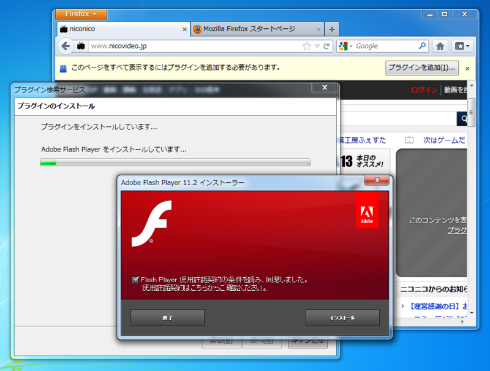
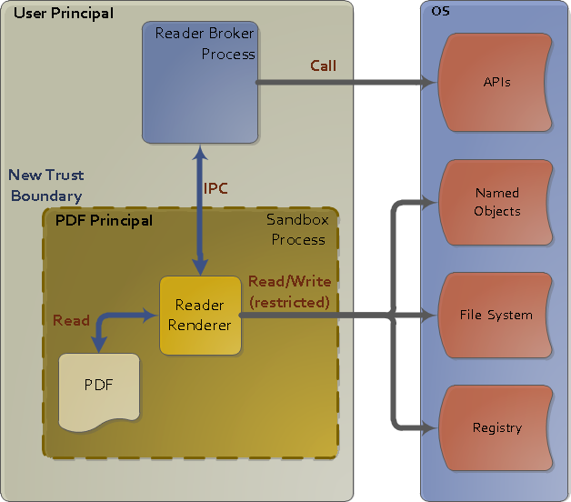
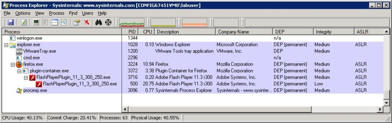

<blockquote cite="http://www.forest.impress.co.jp/docs/news/20120611_539456.html">

「<a class="keyword" href="http://d.hatena.ne.jp/keyword/Adobe">Adobe</a> Flash Player」v11.3.300.257は、8日（米国時間）に公開された「<a class="keyword" href="http://d.hatena.ne.jp/keyword/Adobe">Adobe</a> Flash Player」の最新版。このバージョンでは<a class="keyword" href="http://d.hatena.ne.jp/keyword/Windows%20Vista">Windows Vista</a>/7で動作する「<a class="keyword" href="http://d.hatena.ne.jp/keyword/Firefox">Firefox</a>」向けにセキュリティ機能“保護モード”が追加されており、問題はこの“保護モード”機能に起因するものとみられる。

<cite><a href="http://www.forest.impress.co.jp/docs/news/20120611_539456.html">&#x7A93;&#x306E;&#x675C; - &#x3010;NEWS&#x3011;&#x300C;Firefox&#x300D;&#x3068;&#x300C;Adobe Flash Player 11.3&#x300D;&#x306E;&#x7D44;&#x307F;&#x5408;&#x308F;&#x305B;&#x306B;&#x554F;&#x984C;&#x3001;&#x52D5;&#x753B;&#x304C;&#x8996;&#x8074;&#x4E0D;&#x80FD;&#x306B;</a></cite>
</blockquote>

厄介な問題だよね……テスト不足ではあると思うけれど。ベータ版の Flash は一般公開されているけれど、実用にはちょっと厳しいし（バージョンチェックでハネられて使えない場合がある）、 <a class="keyword" href="http://d.hatena.ne.jp/keyword/Firefox">Firefox</a> ユーザーでかつ動画サイトも頻繁にチェックするテスターなんて、ユーザーレベルではあまりいないのかもしれない。まぁ、次からはテストケースに組み込まれるんだろうけど。

今のところ、Flash が未導入の場合はひとつ古い <a class="keyword" href="http://d.hatena.ne.jp/keyword/Adobe">Adobe</a> Flash Player 11.2 が案内される。けれど、すでにアップデートしてしまったユーザーは自分で<a class="keyword" href="http://d.hatena.ne.jp/keyword/%A5%ED%A1%BC%A5%EB%A5%D0%A5%C3%A5%AF">ロールバック</a>しなきゃいけない<a href="#f1" name="fn1" title="まさか、勝手にやってくれるとか？">*1</a>。 11.3 にはセキュリティ問題の修正も入っているし<a href="#f2" name="fn2" title="セキュリティの高さ（笑）は Firefox のウリのひとつでもあるので放置はできまい">*2</a>、これで解決というわけにもいかない。なんせ、ほかのブラウザーでは問題なく動いているわけで。

今回問題となった"保護モード（Protected Mode）"は、<a class="keyword" href="http://d.hatena.ne.jp/keyword/Windows%20Vista">Windows Vista</a>以降で導入された"Windows 整合性レベル(Windows Integrity Levels、WIL)"によるアクセス制御機能を利用して、権限が一段低い<a class="keyword" href="http://d.hatena.ne.jp/keyword/%A5%B5%A5%F3%A5%C9%A5%DC%A5%C3%A5%AF%A5%B9">サンドボックス</a>プロセスを生成し、そこでプラグインコンテンツを再生させる<a href="#f3" name="fn3" title="「Windows XP最強！」とか言ってる人は、自前でこれをやるように。踏み台にされたらみんなの迷惑なので。">*3</a>。

<ul>
<li><a href="http://blogs.adobe.com/asset/2012/06/inside-flash-player-protected-mode-for-firefox.html">Inside Flash Player Protected Mode for Firefox &laquo;  Adobe Secure Software Engineering Team (ASSET) Blog</a></li>
<li><a href="http://blogs.adobe.com/asset/2010/10/inside-adobe-reader-protected-mode-part-1-design.html">Inside Adobe Reader Protected Mode &ndash; Part 1 &ndash; Design &laquo;  Adobe Secure Software Engineering Team (ASSET) Blog</a></li>
<li><a href="http://blogs.adobe.com/asset/2010/10/inside-adobe-reader-protected-mode-%E2%80%93-part-2-%E2%80%93-the-sandbox-process.html">Inside Adobe Reader Protected Mode &ndash; Part 2 &ndash; The Sandbox Process &laquo;  Adobe Secure Software Engineering Team (ASSET) Blog</a></li>
</ul>
<a class="keyword" href="http://d.hatena.ne.jp/keyword/%A5%B5%A5%F3%A5%C9%A5%DC%A5%C3%A5%AF%A5%B9">サンドボックス</a>プロセスの整合性レベルは"Low"（IEと同じ）で、これはテンポラリフォルダにしかアクセスできないということのようだ。整合性レベルによるアクセス制御は、ユーザ単位でのアクセス許可よりも優先して評価される。

<blockquote cite="http://sophiakunii.wordpress.com/2010/04/22/windows%E6%95%B4%E5%90%88%E6%80%A7%E3%83%AC%E3%83%99%E3%83%AB/">

<ul>
<li><b>Untrusted</b> – Anonymousと同等</li>
<li><b>Low</b> – IEで実行されるプロセスに割り当てられ、テンポラリフォルダへのアクセスのみ可能</li>
<li><b>Medium</b> – <a class="keyword" href="http://d.hatena.ne.jp/keyword/UAC">UAC</a>の一般ユーザーに割り当てられ、俗に言う盾マークがない部分へのアクセスが可能</li>
<li><b>High</b> – <a class="keyword" href="http://d.hatena.ne.jp/keyword/UAC">UAC</a>の管理者ユーザーに割り当てられ、盾マーク部分へのアクセスが可能</li>
<li><b>System</b> – LocalSystem等のサービスアカウントに割り当てられる</li>
<li><b>Trusted Installer</b> – 更新プログラムなどをインストールするプロセスに割り当てられる</li>
</ul>
<cite><a href="http://sophiakunii.wordpress.com/2010/04/22/windows%E6%95%B4%E5%90%88%E6%80%A7%E3%83%AC%E3%83%99%E3%83%AB/">Windows&#x6574;&#x5408;&#x6027;&#x30EC;&#x30D9;&#x30EB; &laquo; Always on the clock</a></cite>
</blockquote>

今回の問題は、おそらくどこかで与えられた以上に高いアクセス権限を要する処理が残っていて、そこでエラーになるんだろう。ポジティブにみれば、そういう部分がちゃんと見つかったのはいいことなのかもしれない。そこを突かれたら、あんなことこんなことができてしまうんだろうし。

<ul>
<li><a href="http://msdn.microsoft.com/ja-jp/library/cc402001.aspx">

CreateRestrictedToken &#x95A2;&#x6570;

</a></li>
<li><a href="http://msdn.microsoft.com/ja-jp/magazine/cc163486.aspx">
&#x6700;&#x5C0F;&#x9650;&#x306E;&#x7279;&#x6A29;: &#x30A2;&#x30D7;&#x30EA;&#x30B1;&#x30FC;&#x30B7;&#x30E7;&#x30F3;&#x3067; Windows Vista &#x306E;&#x30E6;&#x30FC;&#x30B6;&#x30FC; &#x30A2;&#x30AB;&#x30A6;&#x30F3;&#x30C8;&#x5236;&#x5FA1;&#x3092;&#x6709;&#x52B9;&#x306B;&#x6D3B;&#x7528;&#x3059;&#x308B;
</a></li>
<li><a href="http://technet.microsoft.com/en-us/magazine/2007.06.uac.aspx">
Security: Inside Windows Vista User Account Control
</a></li>
</ul>
Flash on <a class="keyword" href="http://d.hatena.ne.jp/keyword/Firefox">Firefox</a> はこの修正で、やっと <a class="keyword" href="http://d.hatena.ne.jp/keyword/Internet%20Explorer">Internet Explorer</a><a href="#f4" name="fn4" title="7以降の"保護モード"。http://windows.microsoft.com/ja-jp/windows-vista/What-does-Internet-Explorer-protected-mode-do">*4</a>や <a class="keyword" href="http://d.hatena.ne.jp/keyword/Google%20Chrome">Google Chrome</a> 、<a class="keyword" href="http://d.hatena.ne.jp/keyword/Adobe%20Reader">Adobe Reader</a> などと伍していけるセキュリティを身につけたのだけど……ちょっと躓いてしまった感じ。ほんとは <a class="keyword" href="http://d.hatena.ne.jp/keyword/Internet%20Explorer">Internet Explorer</a> みたいに、ブラウザー全体がなるべく低い権限で動くのが理想なのだけど……

<b>"権限を上げるのは簡単だけど、下げるのは難しい"</b>。"データを混ぜるのは簡単だけど、分けるのは難しい"と並んで、ぜひ情報の初等教科書にのせておいてもらいたいコトバですね。

今回思ったのは、まだまだ Flash は捨てられないねーということ。そして、こういうところで躓いている <a class="keyword" href="http://d.hatena.ne.jp/keyword/Firefox">Firefox</a> の将来に少し不安を感じる。理想は結構だけど、現実に対応しきれてない、そんな印象を受けた。今回の件だって悪いのは <a class="keyword" href="http://d.hatena.ne.jp/keyword/Adobe">Adobe</a> だけど、まともなプラグインを作ってもらう土壌を用意するのは大事なことだ。 Microsoft や <a class="keyword" href="http://d.hatena.ne.jp/keyword/Google">Google</a> はそこんところしたたかで、折れるところは折れて、あくまでもユーザー・ファーストにやっているのを見ると、なおさらそう感じる。

<ul>
<li><a href="http://www.forest.impress.co.jp/docs/news/20120604_537599.html">&#x7A93;&#x306E;&#x675C; - &#x3010;NEWS&#x3011;&#x300C;Internet Explorer 10 Platform Preview 6&#x300D;&#x304C;&#x516C;&#x958B;&#x3001;Metro&#x7248;&#x306B;Flash&#x3092;&#x7D71;&#x5408;</a></li>
</ul>
ちなみに、僕が常用しているブラウザーは <a class="keyword" href="http://d.hatena.ne.jp/keyword/Google%20Chrome">Google Chrome</a> と IE9 。使い勝手もあるけど、まぁ、そんなのは二の次で、いろいろ考えてそうしているわけですよ。

<a href="#fn1" name="f1" class="footnote-number">*1</a>:まさか、勝手にやってくれるとか？

<a href="#fn2" name="f2" class="footnote-number">*2</a>:セキュリティの高さ（笑）は <a class="keyword" href="http://d.hatena.ne.jp/keyword/Firefox">Firefox</a> のウリのひとつでもあるので放置はできまい

<a href="#fn3" name="f3" class="footnote-number">*3</a>:「<a class="keyword" href="http://d.hatena.ne.jp/keyword/Windows%20XP">Windows XP</a>最強！」とか言ってる人は、自前でこれをやるように。踏み台にされたらみんなの迷惑なので。

<a href="#fn4" name="f4" class="footnote-number">*4</a>:7以降の"保護モード"。http://windows.microsoft.com/ja-jp/windows-<a class="keyword" href="http://d.hatena.ne.jp/keyword/vista">vista</a>/What-does-Internet-Explorer-protected-mode-do

