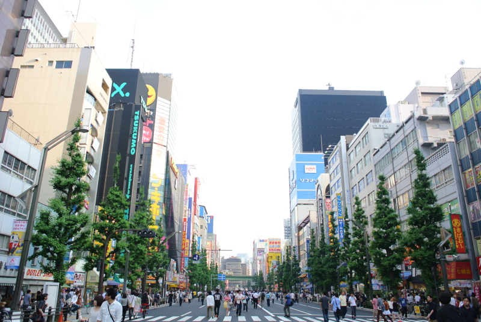
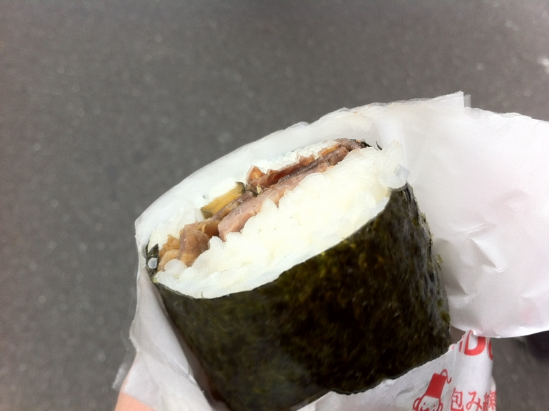
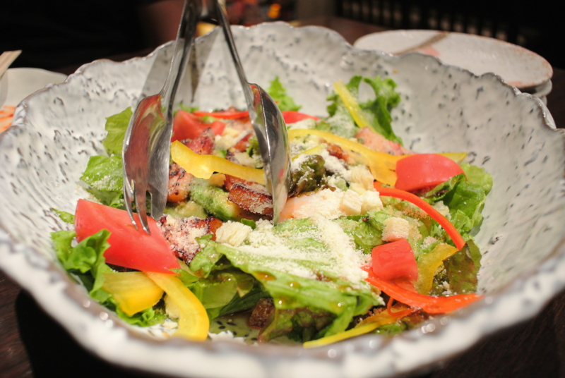
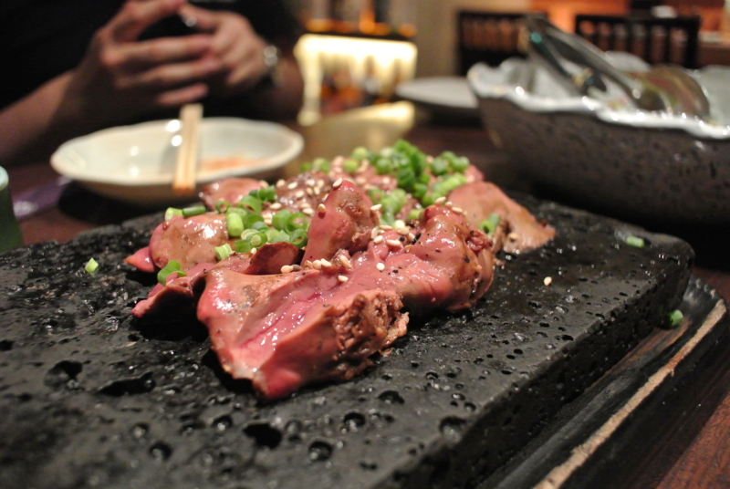
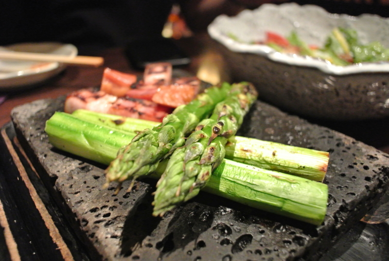
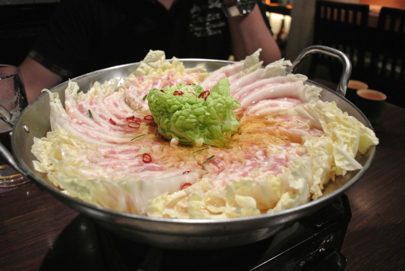

@tyorosan が東京に来てくれたので、秋葉原を少し案内。といっても、わしもそれほど詳しくはないのだけど。

とにかく、ずっと食べたかったのに食べる機会がなかった<b>ケバブ海苔巻き</b>を半強制的に半分こっこ<a href="#f1" name="fn1" title="お店の人に言ったら半分にしてくれる">*1</a>。個人的にはちょっと味が足りないので、なにかソースを付けてもらうといいかもしれない。辛いのとかいろいろあるっぽいので。量は……想像以上に多い。1本400円なのだけど、そんなにお腹が空いていなければこれ一本で十分だと思う。

@shibayan に教えてもらった<b><a class="keyword" href="http://d.hatena.ne.jp/keyword/%A5%E1%A5%A4%A5%C9%B5%CA%C3%E3">メイド喫茶</a></b>にもいった。そこは別に卑猥（？）な感じではなくて、ただ店員さんがメイド服ってだけ（それはそれでイイんだけど！）。私設図書館のイメージらしくて、おもにファンタジー系の本を自由に読むことができる。紅茶のおかわりが自由で、30分につき500円。

そのあとは、あとから参加した @penguineJr1 さん<a href="#f2" name="fn2" title="初対面！　よろしくお願いしまーす">*2</a>を加えて、ちょっとした飲み会。

<a href="http://akiba-pc.watch.impress.co.jp/hotline/20120225/etc_comic1.html">&#x3061;&#x3087;&#x3073;&#xFF06;&#x59C9;&#x3061;&#x3083;&#x3093;&#x306E;&#x300E;&#x30A2;&#x30AD;&#x30D0;&#x3067;&#x3054;&#x306F;&#x3093;&#x98DF;&#x3079;&#x305F;&#x3044;&#x306A;&#x3002;&#x300F; &#x301C;&#x548C;&#x98DF;&#x5C45;&#x9152;&#x5C4B;&#x300C;&#x672C;&#x5BB6;&#x3044;&#x306A;&#x305B;&#x3084; &#x79CB;&#x8449;&#x539F;&#x662D;&#x548C;&#x901A;&#x308A;&#x5E97;&#x300D;&#x7DE8;&#x301C;</a> へ行ったのだけど、なかなかコストパフォーマンスが良くて満足。秋葉原というか、ほとんど岩本町にある立地の微妙さだけが弱点か。豚バラ肉と白菜を交互に挟んだ<b>ミルフィーユ鍋</b>は、家でも簡単にできそう……冬になったら試してみよう！

<a href="#fn1" name="f1" class="footnote-number">*1</a>:お店の人に言ったら半分にしてくれる

<a href="#fn2" name="f2" class="footnote-number">*2</a>:初対面！　よろしくお願いしまーす

