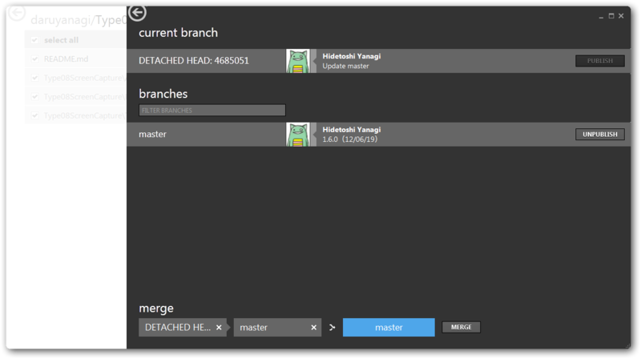
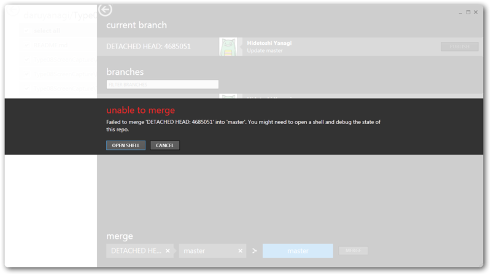
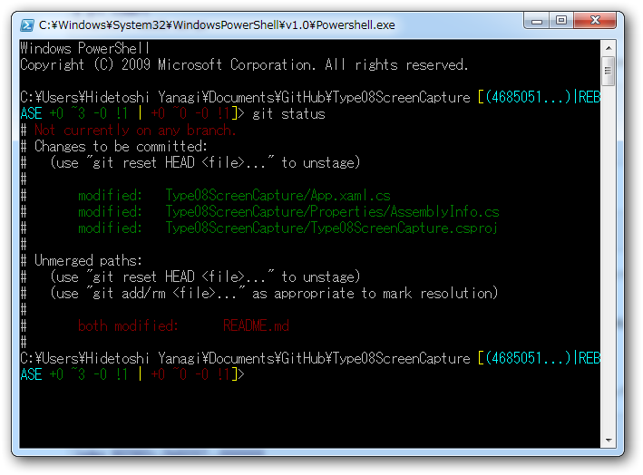
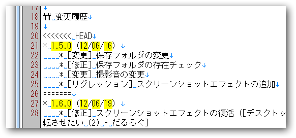
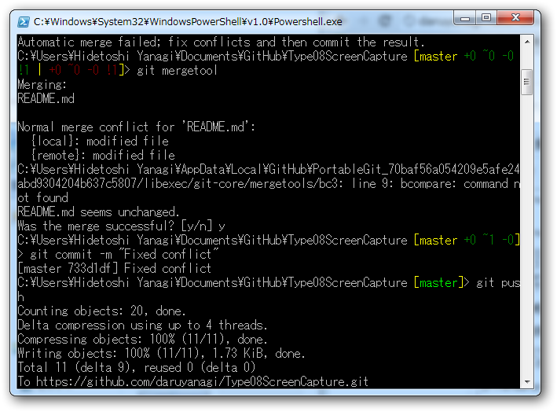

<a href="http://daruyanagi.hatenablog.com/entry/2012/06/18/202158">08&#x5F0F;&#x673A;&#x4E0A;&#x64AE;&#x5F71;&#x6A5F; v1.5.0 - &#x3060;&#x308B;&#x308D;&#x3050;</a> に、<a href="http://daruyanagi.hatenablog.com/entry/2012/06/19/022455">&#x30C7;&#x30B9;&#x30AF;&#x30C8;&#x30C3;&#x30D7;&#x5168;&#x4F53;&#x3092;&#x4E00;&#x6642;&#x7684;&#x306B;&#x6697;&#x8EE2;&#x3055;&#x305B;&#x305F;&#x3044; (2) - &#x3060;&#x308B;&#x308D;&#x3050;</a> を追加。

<a href="http://daruyanagi.net/Type08ScreenCapture">Type08ScreenCapture - Daruboard</a>

<h3>1.6.0（12/06/19）</h3>

<ul>
<li>[修正] <a class="keyword" href="http://d.hatena.ne.jp/keyword/%A5%B9%A5%AF%A5%EA%A1%BC%A5%F3%A5%B7%A5%E7%A5%C3%A5%C8">スクリーンショット</a>エフェクトの復活</li>
<li>[修正] サウンドの存否チェックを追加</li>
</ul>

<h3>Merge 頑張ってみた</h3>

修正には直接関係ないけど、 merge ができないヘタレなので git でちょっと困った。

前回の修正でうっかり README を更新し忘れたので、それを github でチョチョイのちょいと変更したのだけど、<i>それでリモートとローカルでコンフリクトが起こってしまった ／(^o^)＼ </i>気がついたら、作った覚えのないブランチがある。

(ΦωΦ)ﾌﾌﾌ…でも、GitHub for Windows が何とかしてくれるはず！

(´；ω；｀) ﾅﾝﾄﾓﾅﾗﾅｶｯﾀﾖ……

<code>git status</code> というコマンドで何が起こったのか見られるみたい。案の定、 README.md が両方で変更されていると。あうあう。そのあと、あちこちでいろいろ調べながら、いろいろ試してみたのだけど（ちゃんと記録とっとけよ！）、もう、何もわからん。とりあえず、最後に適当に <code>git push</code> してみた。

<pre class="code lang-cs" data-lang="cs" data-unlink>C:\Users\Hidetoshi Yanagi\Documents\GitHub\Type08ScreenCapture [master]&gt; git push
To <a class="keyword" href="http://d.hatena.ne.jp/keyword/https">https</a>://github.com/daruyanagi/Type08ScreenCapture.git
! [rejected]        master -&gt; master (non-fast-forward)
error: failed to push some refs to '<a class="keyword" href="http://d.hatena.ne.jp/keyword/https">https</a>://github.com/daruyanagi/Type08ScreenCapture.git'
hint: Updates were rejected because the tip of your current branch is behind
hint: its remote counterpart. Merge the remote changes (e.g. 'git pull')
hint: before pushing again.
hint: See the 'Note about fast-forwards' in 'git push --help' for details.
</pre>
オーマイガ━━━━(ﾟ∀ﾟ)━━━━!!

けれどこのおかげで、<a href="http://linux.keicode.com/prog/git-resolve-non-fast-forward-push-problem.php">Non-Fast-Forward Push &#x306E;&#x89E3;&#x6C7A; - Linux &#x5165;&#x9580;</a>というページに辿り着いて、そこで言うとおりにぷちぷちコマンドを打つと……治った！

<pre class="code lang-cs" data-lang="cs" data-unlink>C:\Users\Hidetoshi Yanagi\Documents\GitHub\Type08ScreenCapture [master +0 ~0 -0!1 | +0 ~0 -0 !1]&gt; git mergetool
Merging:
README.md

Normal merge conflict for 'README.md':
{local}: modified file
{remote}: modified file
C:\Users\Hidetoshi Yanagi\AppData\Local\GitHub\PortableGit_70baf56a054209e5afe24abd9304204b637c5807/libexec/git-core/mergetools/bc3: line 9: bcompare: command not found
README.md seems unchanged.
Was the merge successful? [y/n] y
</pre>
とりあえず、 <code>git mergetool</code> とか言うのがあればそんなにビビらずにマージできるらしいな。コンフリクトしているところにマークがつくので、それを削りながらどっちの変更が意図した変更なのか明らかにしていけばいいらしい。ほうほぅ……。<a class="keyword" href="http://d.hatena.ne.jp/keyword/%A5%B5%A1%BC%A5%C9%A5%D1%A1%BC%A5%C6%A5%A3">サードパーティ</a>製ツールがあればもっと快適マージライフが送れるのかな？　今度探してみよう。ともあれ、やっぱり、そろそろまとまった書籍でも読まなきゃいけないなぁ<a href="#f1" name="fn1" title="説明書を読むのが嫌いな性格、直さなきゃな……">*1</a>。さっぱりわかんないよ。

しかし、また一つ賢くなってしまった。どうしよう。

<a href="#fn1" name="f1" class="footnote-number">*1</a>:説明書を読むのが嫌いな性格、直さなきゃな……

