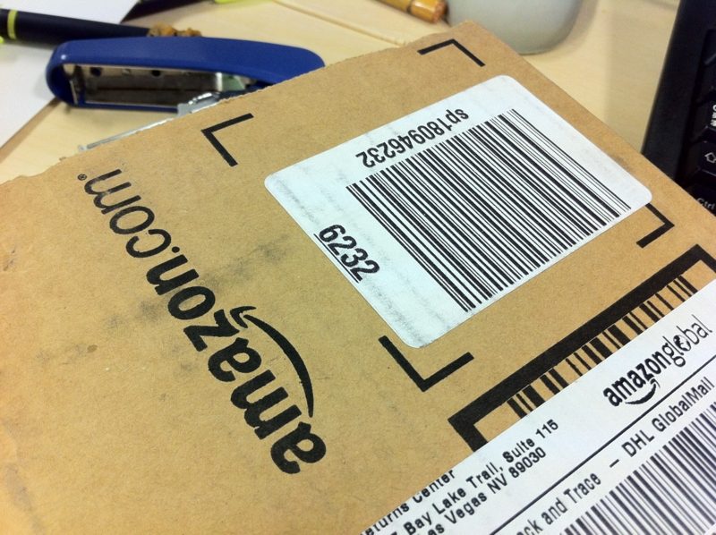
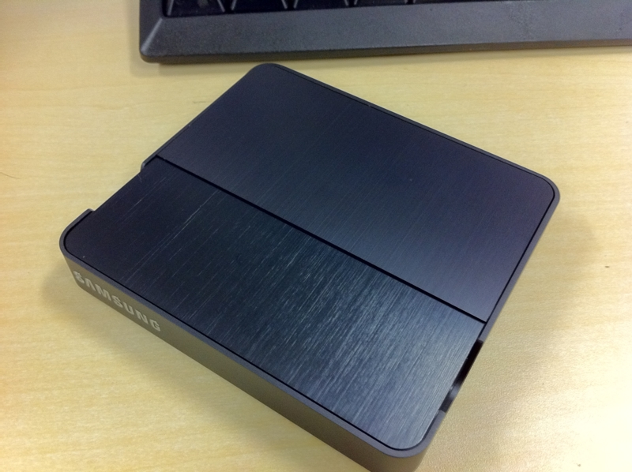
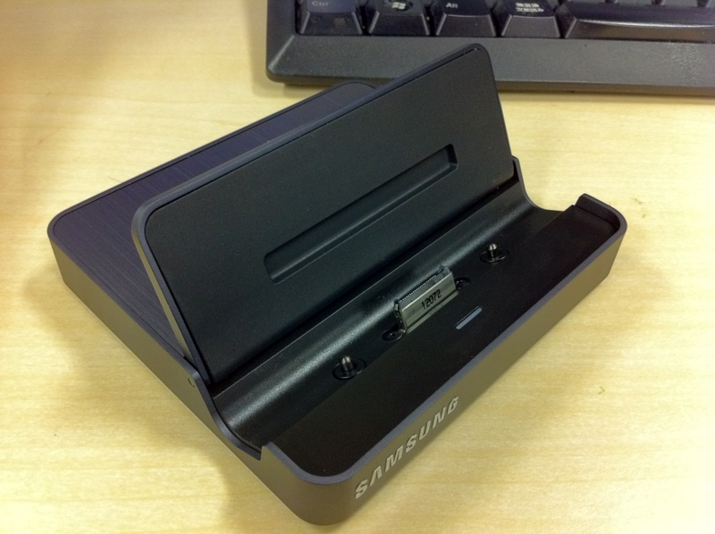
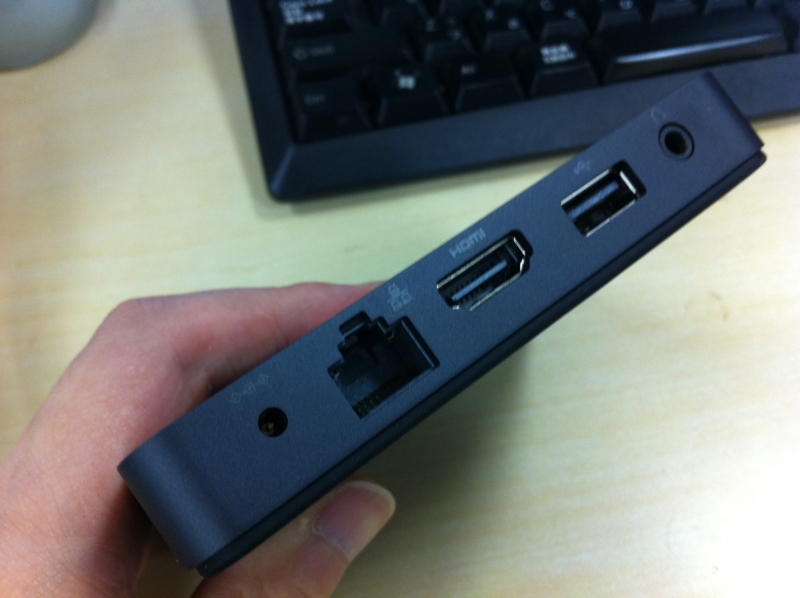
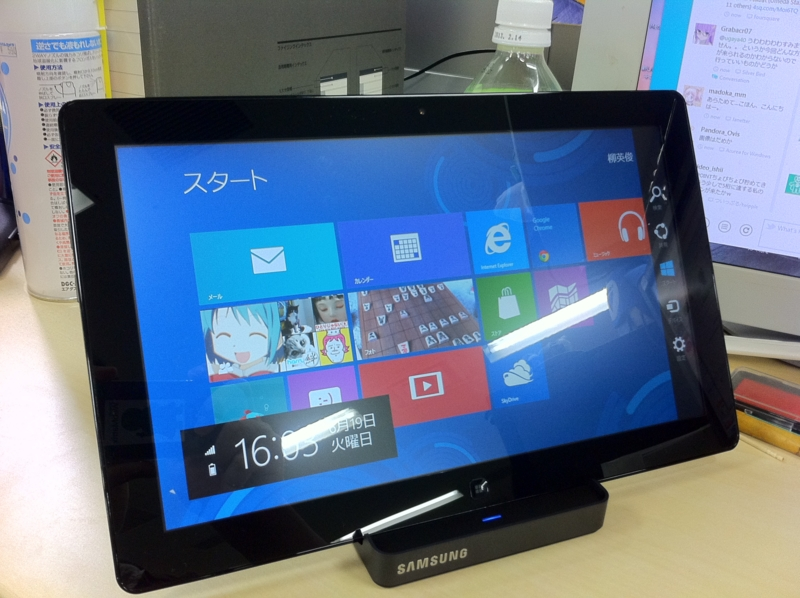

<a href="http://daruyanagi.hatenablog.com/entry/2012/06/07/081352">Samsung Series 7 Slate &#x306E;&#x958B;&#x5C01;&#x5F0F; - &#x3060;&#x308B;&#x308D;&#x3050;</a> のとき、「12,000円で<a class="keyword" href="http://d.hatena.ne.jp/keyword/%A5%AF%A5%EC%A1%BC%A5%C9%A5%EB">クレードル</a>（ドック）を付けますよ」と言われたのだけど、買ったとして使うのかどうか分からなかったので、結局は買わなかった。<i>けれど！　</i>やっぱ要りますわ、<a class="keyword" href="http://d.hatena.ne.jp/keyword/%A5%AF%A5%EC%A1%BC%A5%C9%A5%EB">クレードル</a>。家に帰った時、ポンと置くところがあるだけでもかなり違う。あと、<a class="keyword" href="http://d.hatena.ne.jp/keyword/%A5%AF%A5%EC%A1%BC%A5%C9%A5%EB">クレードル</a>には有線LAN/<a class="keyword" href="http://d.hatena.ne.jp/keyword/HDMI">HDMI</a>出力が付いているのもポイント。家ではデュアルモニターで使いたい！　なんていうとき、<a class="keyword" href="http://d.hatena.ne.jp/keyword/%A5%AF%A5%EC%A1%BC%A5%C9%A5%EB">クレードル</a>は必要なのだ。

<a href="http://www.amazon.co.jp/exec/obidos/ASIN/B005SHUR6W/bestylesnet-22/">Samsung Series 7 Slate Pc Dock</a>
<ul><li>出版社/メーカー: <a class="keyword" href="http://d.hatena.ne.jp/keyword/Samsung">Samsung</a></li><li>メディア: Personal Computers</li><li><a href="http://d.hatena.ne.jp/asin/B005SHUR6W/bestylesnet-22" target="_blank">この商品を含むブログを見る</a></li></ul>

S7S用の<a class="keyword" href="http://d.hatena.ne.jp/keyword/%A5%AF%A5%EC%A1%BC%A5%C9%A5%EB">クレードル</a>（AA-RD5NDOC/US）は米Amazon（略してアメゾン）で購入。本体は海外発送してくれないのだけど、<a class="keyword" href="http://d.hatena.ne.jp/keyword/%A5%AF%A5%EC%A1%BC%A5%C9%A5%EB">クレードル</a>は発送してくれるようだ。価格は税金など諸々込みで8,000円ちょっと。<i>円高バンザイ＼(^o^)／</i>

日本のAmazonよりもちょっとだけワイルドな梱包で無事到着。

<a class="keyword" href="http://d.hatena.ne.jp/keyword/%A5%AF%A5%EC%A1%BC%A5%C9%A5%EB">クレードル</a>の接続部分は開閉式になっていて、使わない場合はフタをしておける。底面は滑りにくく加工されていて、多少の揺れではビクともしない感じ。

背面のポート類。有線LAN×1、USB×1、<a class="keyword" href="http://d.hatena.ne.jp/keyword/HDMI">HDMI</a>×1、ヘッドフォン出力×1、電源×1。ただ、有線LANはOFFにしておいたほうがいいらしい。

<blockquote class="twitter-tweet" data-in-reply-to="214975602434904065" lang="ja">
@<a href="https://twitter.com/daruyanagi">daruyanagi</a> ドックつなぎっぱなにすると有線LANのRealtecがDeep Sleepしてしまうかもしれないので、「このデバイスの電源をオフにできるようにする」をOffにした方がいいかもです。<a href="http://t.co/09Rxyq1U" title="http://bit.ly/MkTzB9">bit.ly/MkTzB9</a>
&mdash; Kaoru Nakajimaさん (@kaorun) <a href="https://twitter.com/kaorun/status/214977137516625920" data-datetime="2012-06-19T07:05:18+00:00">6月 19, 2012</a></blockquote>

接続した様子。うむ、満足！　早速家に帰ってデュアルモニターにしてみたけれど、本体に十分なスペックがあるせいか、デスクトップがわりに使っても申し分ない感じ。メインPCは <a class="keyword" href="http://d.hatena.ne.jp/keyword/Windows%207">Windows 7</a>、S7Sは <a class="keyword" href="http://d.hatena.ne.jp/keyword/Windows%208">Windows 8</a>という体制で、当分は使い分けていこうかなと思います。

