
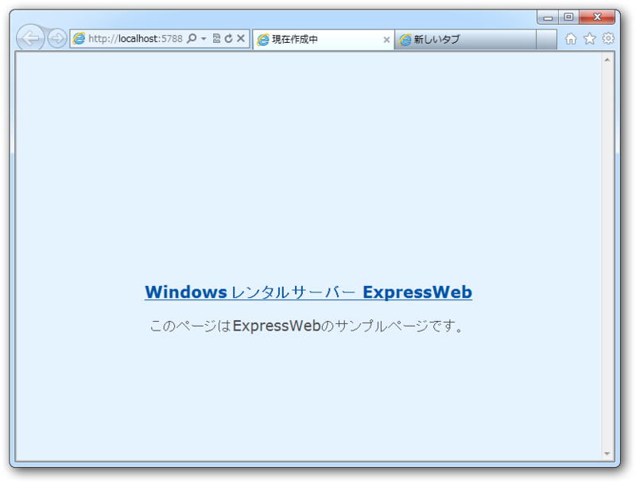

みてくれたまえ。これが昨日までの <a href="http://download.daruyanagi.net/">http://download.daruyanagi.net/</a> だ。ワイルドだろ？<a href="#f1" name="fn1" title="TVみないので、ネタに影響されるのが人よりかなり遅れております">*1</a>　さすがにこれを放置するのも何なので、<a class="keyword" href="http://d.hatena.ne.jp/keyword/WebMatrix">WebMatrix</a> 2.0 <a class="keyword" href="http://d.hatena.ne.jp/keyword/Release%20Candidate">Release Candidate</a> でキレイにしてみることにした。

<h3>なにはともあれインストール</h3>

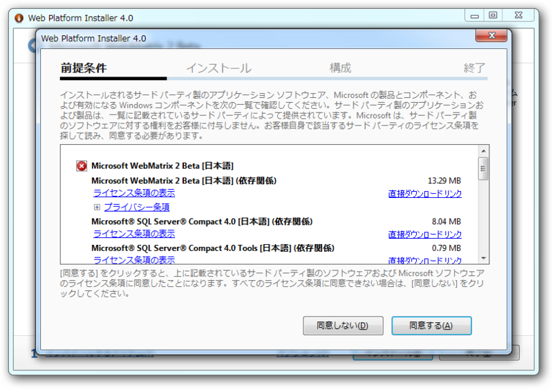

まず、<a class="keyword" href="http://d.hatena.ne.jp/keyword/WebMatrix">WebMatrix</a> 2 を <a href="http://www.microsoft.com/web/webmatrix/next/">
 
WebMatrix 2
 
</a> からダウンロードしてくれたまえ。うちの場合は、なんか2・3回インストーラーを実行するハメになったけど（なんでだ？）、まぁ、すんなり入る。

<h3>Webサイト側でリモート管理を有効にする</h3>

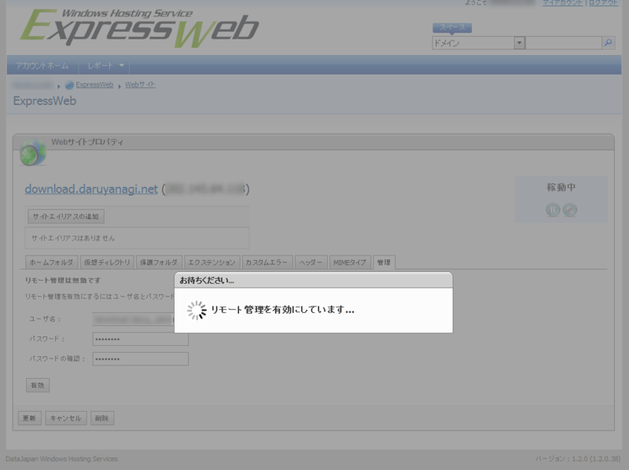

<a class="keyword" href="http://d.hatena.ne.jp/keyword/%A5%EC%A5%F3%A5%BF%A5%EB%A5%B5%A1%BC%A5%D0">レンタルサーバ</a>ーはもちろん、<a class="keyword" href="http://d.hatena.ne.jp/keyword/ASP.NET">ASP.NET</a> がお安く使える <a href="http://www.epw.jp/">
 
&#x9AD8;&#x6A5F;&#x80FD;&#x30FB;&#x6FC0;&#x5B89; Windows &#x30EC;&#x30F3;&#x30BF;&#x30EB;&#x30B5;&#x30FC;&#x30D0;&#x30FC; ExpressWeb
 
</a> を使ってるよな？　Web配置で楽をしましょう。

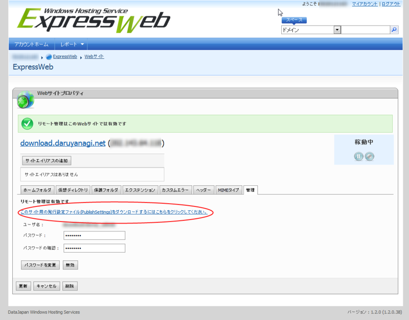

設定ファイルをダウンロードしておくとあとで捗る。

<h3>Webサイトのダウンロード</h3>

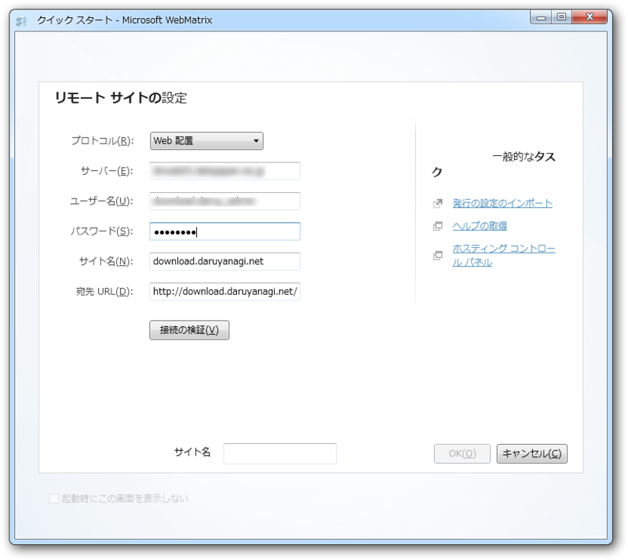

<a class="keyword" href="http://d.hatena.ne.jp/keyword/WebMatrix">WebMatrix</a> でリモートサイトを開く。さっきダウンロードしておいた設定ファイルを読みこめば、かなり楽ちん。リモート管理のアカウント情報を入力するだけで済む。

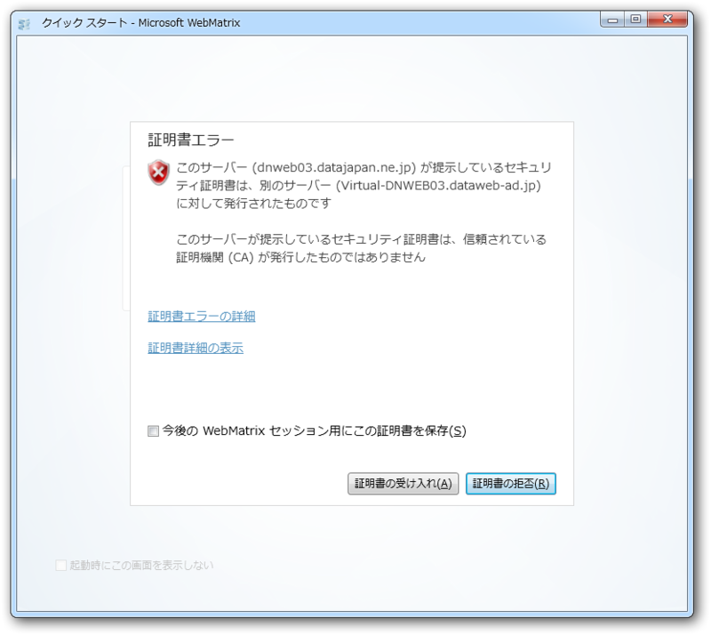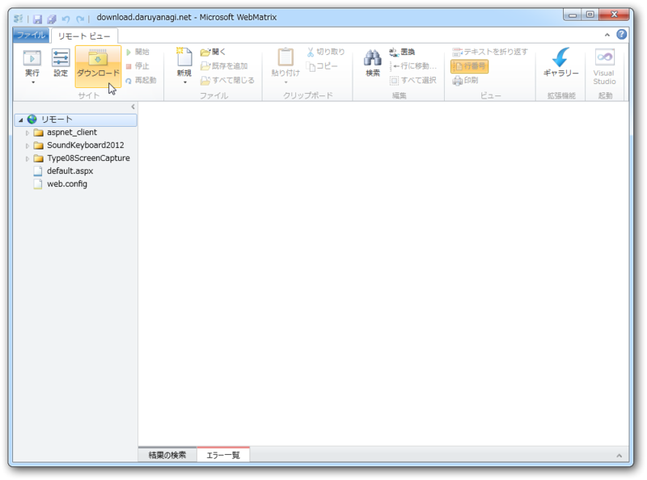

無事接続できた。このまま作業をしてもいいのだけど、やっぱりローカルにコピーを作っておいたほうが何かと安全なのでダウンロードしておく。

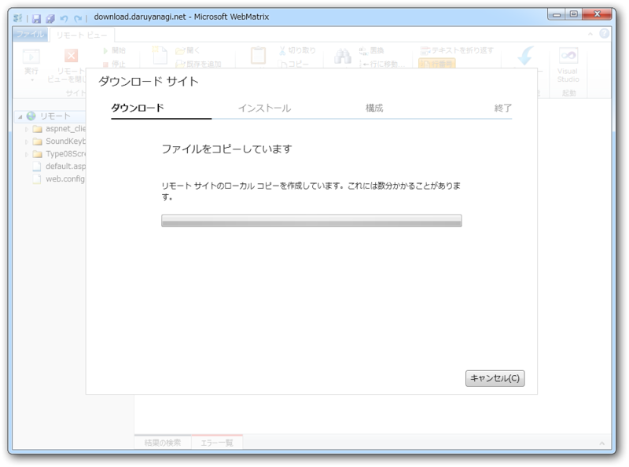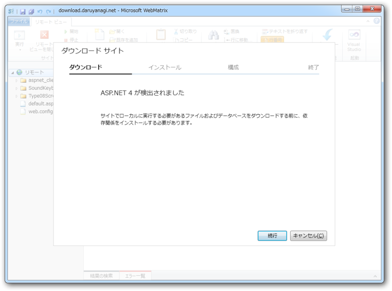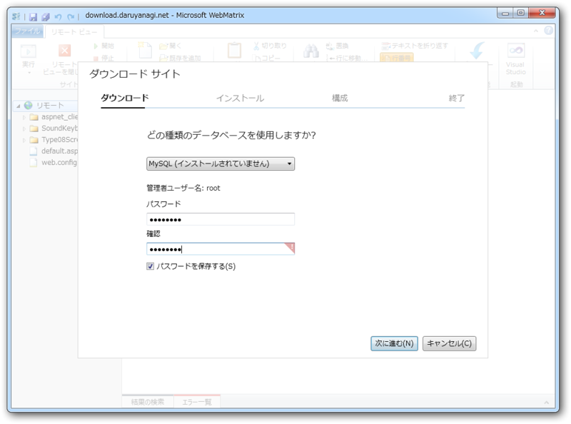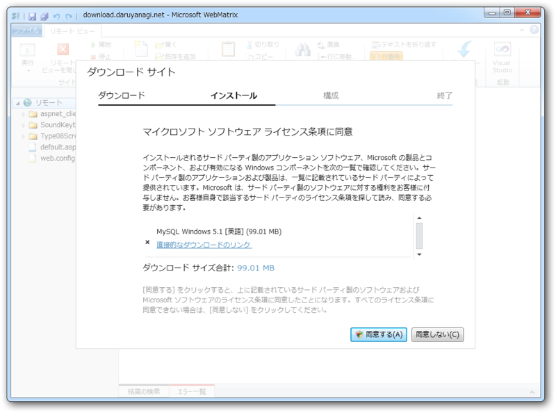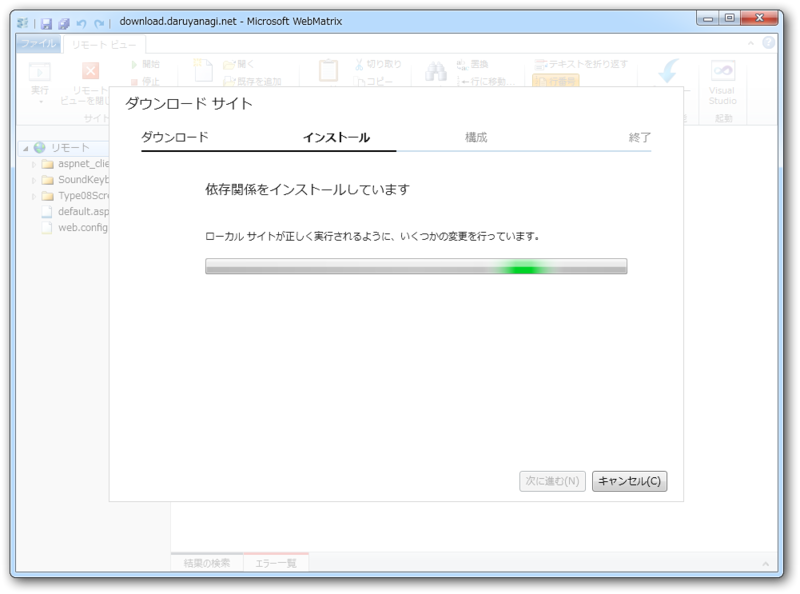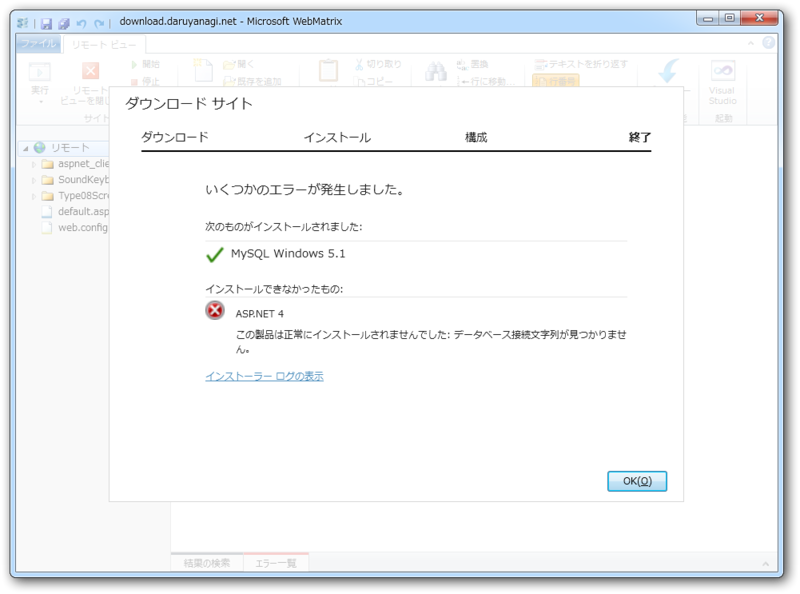

これがやたら時間かかる。なぜか使ってもいない <a class="keyword" href="http://d.hatena.ne.jp/keyword/MySQL">MySQL</a> もインストールされるし。まぁ、細かいことは気にしない。 <a class="keyword" href="http://d.hatena.ne.jp/keyword/ASP.NET">ASP.NET</a> 4 のインストールにも失敗したけど、とくに問題なく動いているみたい。

<blockquote class="twitter-tweet" data-in-reply-to="214925063458275330" lang="ja">
@<a href="https://twitter.com/daruyanagi">daruyanagi</a> そういう時は、<a class="keyword" href="http://d.hatena.ne.jp/keyword/MySQL">MySQL</a>のサイトで日本のサーバーから落とすのが早いっす。
&mdash; ウェブマトリクスマンさん (@WebMatrixMan) <a href="https://twitter.com/WebMatrixMan/status/214940986089017344" data-datetime="2012-06-19T04:41:39+00:00">6月 19, 2012</a></blockquote>

WebMatrixman はほんとデキる子だな。

<h3>Git for <a class="keyword" href="http://d.hatena.ne.jp/keyword/WebMatrix">WebMatrix</a> のインストール</h3>

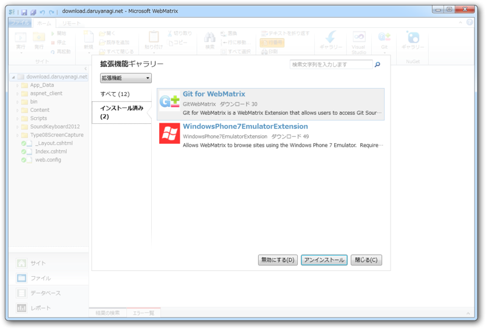

この作業はスキップしていいのだけど、どうせならバージョン管理できるようにしておけば<a class="keyword" href="http://d.hatena.ne.jp/keyword/%A5%ED%A1%BC%A5%EB%A5%D0%A5%C3%A5%AF">ロールバック</a>とか楽になるよね。というわけで、<a class="keyword" href="http://d.hatena.ne.jp/keyword/%B3%C8%C4%A5%B5%A1%C7%BD">拡張機能</a>ギャラリーから「Git for <a class="keyword" href="http://d.hatena.ne.jp/keyword/WebMatrix">WebMatrix</a>」をインストールしておく。

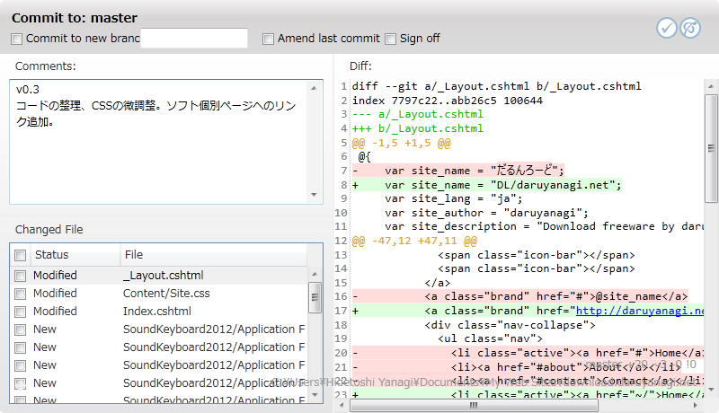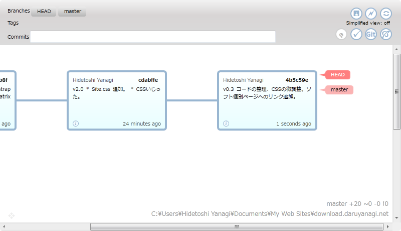

リリース当初はハングアップしたりして大変だったけど、週明けのバージョンアップでかなり使えるようになった。

<h3><a class="keyword" href="http://d.hatena.ne.jp/keyword/Twitter">Twitter</a> Bootstrap のインストール</h3>

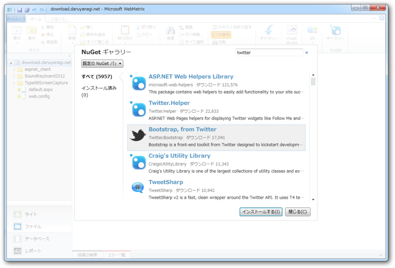

<a class="keyword" href="http://d.hatena.ne.jp/keyword/WebMatrix">WebMatrix</a> 2 では NuGet もよりお手軽に利用できるようになっている。どこかの誰かが作ってくれた便利ツールが自由に使えるというわけだ！　使わないなんて損、損。今回は、デザインセンスのない開発者御用達の<a class="keyword" href="http://d.hatena.ne.jp/keyword/CSS">CSS</a><a class="keyword" href="http://d.hatena.ne.jp/keyword/%A5%D5%A5%EC%A1%BC%A5%E0%A5%EF%A1%BC%A5%AF">フレームワーク</a> <a href="http://twitter.github.com/bootstrap/">Twitter Bootstrap</a> を利用してみた。 <a class="keyword" href="http://d.hatena.ne.jp/keyword/WebMatrix">WebMatrix</a> 2 は LESS なんかも扱えるから、今後はカスタマイズ可能な Bootstrap なんかも利用できるようになるかも。夢が広がる……

<h3>コーディング</h3>

さて、ようやくコーディングのお時間なのだけど……基本的には <a href="http://twitter.github.com/bootstrap/examples/hero.html">Bootstrap, from Twitter</a> （サンプル）の<a class="keyword" href="http://d.hatena.ne.jp/keyword/%A5%BD%A1%BC%A5%B9%A5%B3%A1%BC%A5%C9">ソースコード</a>をガバっとコピペしてチョチョイのちょいとイジるだけ。一瞬で終わってしまった。

<h4>_Layout.cshtml</h4>

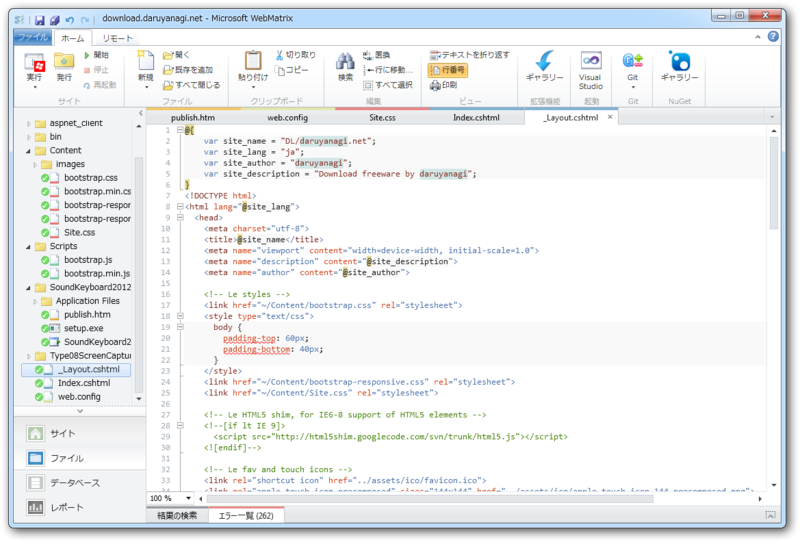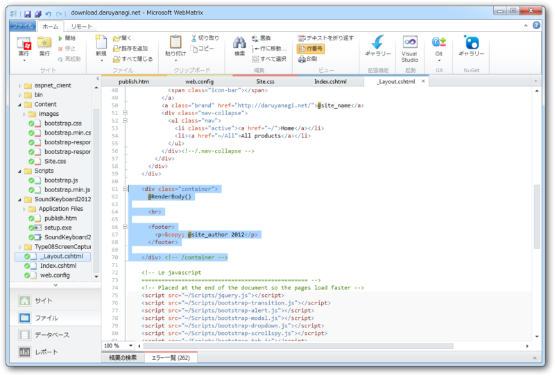

Webページのひな形。

それぞれのWebページの内容を挿入する場所に`@RenderBody()`を埋め込んでおく。ついでに、サイト名や作者名なんかは冒頭の`@{ }`セクションで変数にしておくと、あとで管理するのが楽になる。スクリプトや<a class="keyword" href="http://d.hatena.ne.jp/keyword/%A5%B9%A5%BF%A5%A4%A5%EB%A5%B7%A1%BC%A5%C8">スタイルシート</a>のパスを /Scripts や /Content に書き換えておくのを忘れずに。

<h4>Index.cshtml</h4>

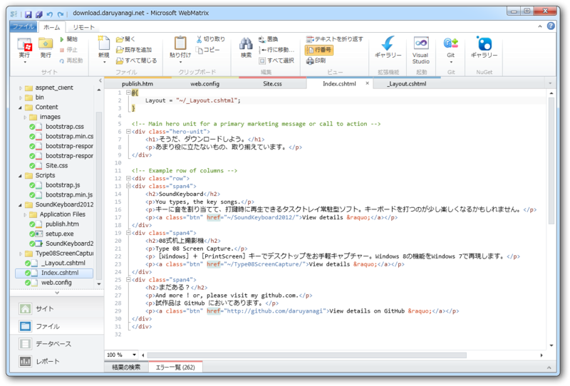

<pre class="code lang-cs" data-lang="cs" data-unlink>@{
Layout = &quot;~/_Layout.cshtml&quot;;
}
</pre>
でレイアウトを指定し、レイアウトの `@RenderBody()` を書いていく感じ。 <a href="http://twitter.github.com/bootstrap/examples/hero.html">Bootstrap, from Twitter</a> の<a class="keyword" href="http://d.hatena.ne.jp/keyword/%A5%BD%A1%BC%A5%B9%A5%B3%A1%BC%A5%C9">ソースコード</a>で言えば、 `&lt;div class="container"&gt;` のヘッダー以外の部分をココにコピーして自分なりに書き換えていく。

あとは、同じ要領でページを増やしていけばいい。 About.cshtml を書けば download.daruyanagi.net/About になるし、 Contact.cshtml を書けば download.daruyanagi.net/Contact になる。レイアウトを指定すれば、見栄えも共通化できる。

<h3>完成！</h3>

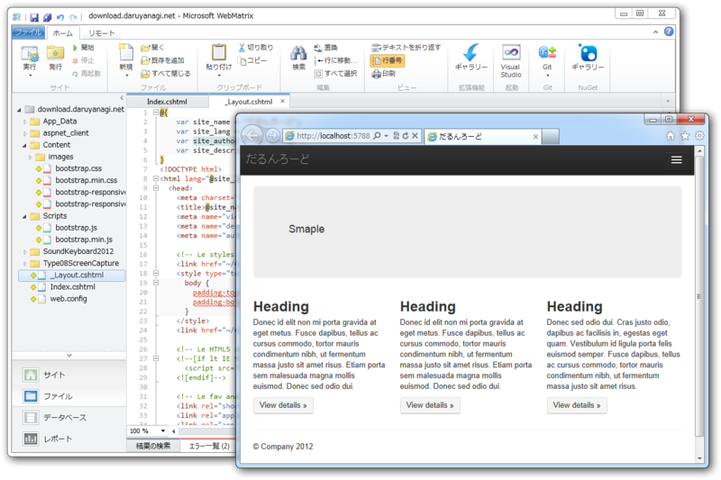

<a class="keyword" href="http://d.hatena.ne.jp/keyword/WebMatrix">WebMatrix</a> だったら、IE/<a class="keyword" href="http://d.hatena.ne.jp/keyword/Chrome">Chrome</a>/<a class="keyword" href="http://d.hatena.ne.jp/keyword/Firefox">Firefox</a>どころか、モバイルOSシミュレーターでもテストできる！　Bootstrap は MediaQuery でモバイルからも快適に閲覧できるけど、それをシミュレーターで確かめられる。

実際のコーディングはものの10分ぐらい。動的サイトも作れるし、その時、<a class="keyword" href="http://d.hatena.ne.jp/keyword/%A5%D5%A5%EC%A1%BC%A5%E0%A5%EF%A1%BC%A5%AF">フレームワーク</a>を<a class="keyword" href="http://d.hatena.ne.jp/keyword/ASP.NET">ASP.NET</a>/<a class="keyword" href="http://d.hatena.ne.jp/keyword/PHP">PHP</a>/Node.js のなかから自由に選べるのがナイス。 Azure へのデプロイもできるみたいなので、次は試してみたい。

<h3>参考</h3>

<ul>
<li><a href="http://blogs.msdn.com/b/chack/archive/2012/06/19/new-features-webmatrix-2-osc-2012-hokkaido-session-follow-up.aspx">
WebMatrix 2 &#x65B0;&#x6A5F;&#x80FD; &#xFF5E; OSC 2012 Hokkaido &#x30BB;&#x30C3;&#x30B7;&#x30E7;&#x30F3; &#x30D5;&#x30A9;&#x30ED;&#x30FC;&#x30A2;&#x30C3;&#x30D7; (&#x305D;&#x306E;&#xFF11;) &#xFF5E; - THE TRUTH IS OUT THERE - Site Home - MSDN Blogs
</a></li>
</ul>

<a href="#fn1" name="f1" class="footnote-number">*1</a>:TVみないので、ネタに影響されるのが人よりかなり遅れております

