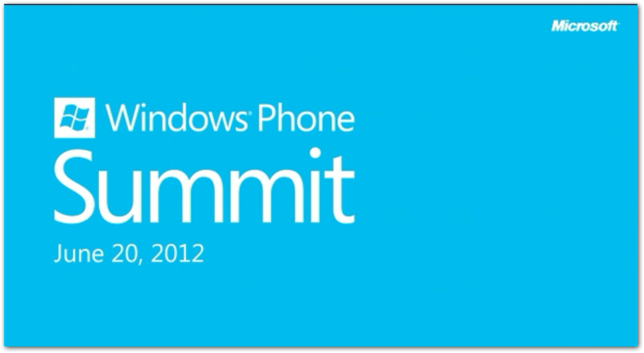
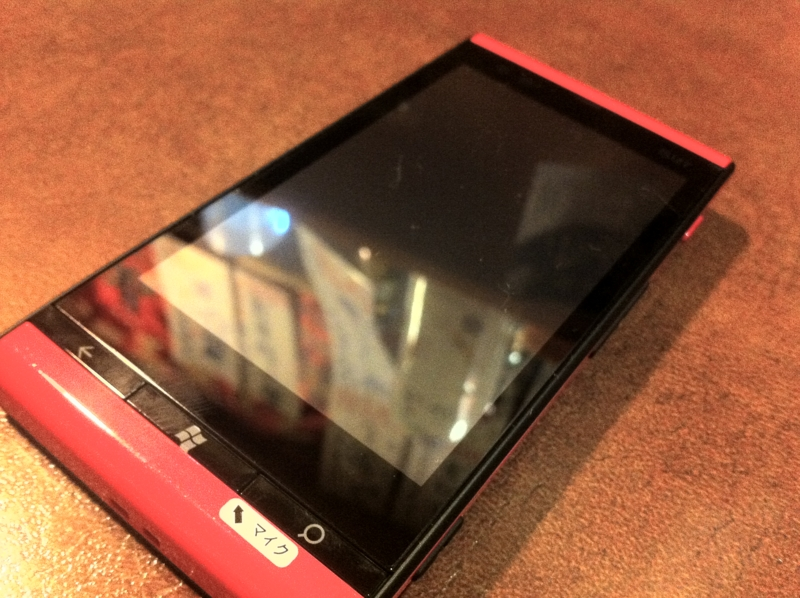
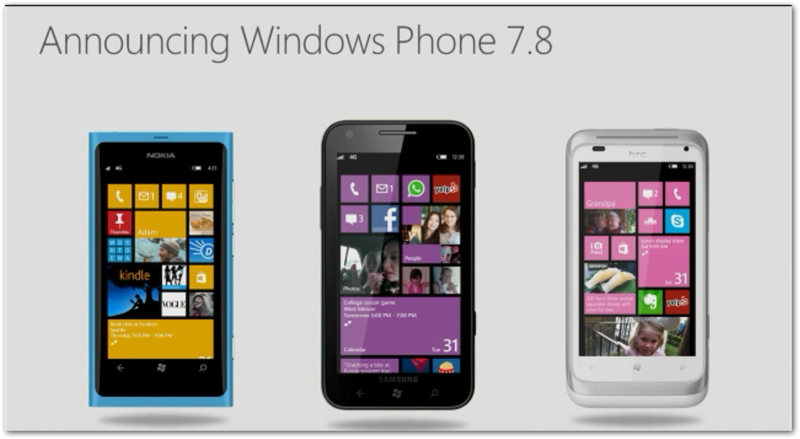

<a href="http://nanapho.jp/archives/2012/06/details-of-windows-phone-summit-on-june-20/">  6&#x6708;20&#x65E5;&#x3001;Windows Phone Summit &#x304C;&#x958B;&#x50AC;&#x3002;&#x30E9;&#x30A4;&#x30D6;&#x914D;&#x4FE1;&#x3082; - &#x306A;&#x306A;&#x3075;&#x3049;</a>　をみてました。まぁ、いろんな人がまとめてくれると思うので、これに関しては書かなくていいよね。そんなことより、奥さん。修理に出していた（<a href="http://daruyanagi.hatenablog.com/entry/2012/06/11/224613">&#x8FD1;&#x6240;&#x306E;&#x4E2D;&#x83EF;&#x5C4B;&#x306B;&#x6F5C;&#x5165; - &#x3060;&#x308B;&#x308D;&#x3050;</a>） IS12T が帰ってきたんですよ！　今日はそれでちょっと気になったことを。

今回の破損はカメラボタンがとれただけ。でも、

<blockquote>

<ul>
<li>ケース一式交換</li>
<li>念のため基板交換</li>
<li>最新ソフトウェアへの更新</li>
</ul>
</blockquote>

までしてくれた。修理代は5,050円だけれども、保険が効いたので支払額は0。ちょっと嬉しい。

でもよく考えれば、10日間使えないほうがよっぽど不便で嬉しくない。

Windows Phone は最新機である IS12T だけなので、代替機は古い <a class="keyword" href="http://d.hatena.ne.jp/keyword/Android">Android</a> 端末のみ<a href="#f1" name="fn1" title="おそらくIS03だっけ？　あれ">*1</a>。でも、OSが違えば使い方はぜんぜん違うし、購入したアプリも使えない。しかも型落ち機のくせに、万が一落としたら修理代がスゴい。というわけで、代替機の貸し出しは辞退せざるをえない。これは不便だよ。

試しに「カメラボタンを取り寄せてくれれば、自分で直しますよ」と言ってみたけど、案の定それは無理だと。ボタンが壊れただけなのに、10日間入院は大仰すぎる。

結局、ここらへん過剰品質なんだよね。今回の修理代 5,050円。その場で懐は痛まないけれど、保証サービスで徴収されたお金が充当されているわけだ。なんだかなぁ、と思わないでもない。ハード屋さんにとっては貴重な収入源なのだろうけど。

とにかく、IS12T は Windows Phone 7.8 端末としてこれからも活躍してもらわなきゃいけないので、大事にしようと思います。

<a href="#fn1" name="f1" class="footnote-number">*1</a>:おそらくIS03だっけ？　あれ

