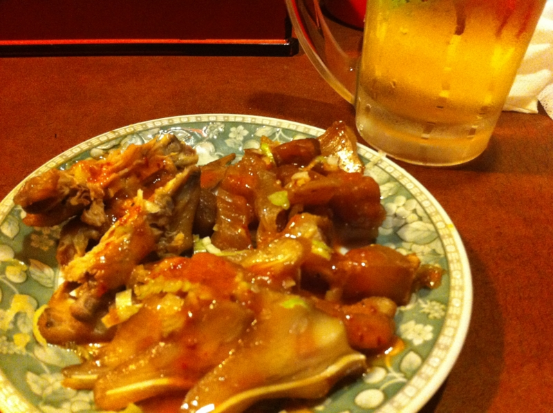
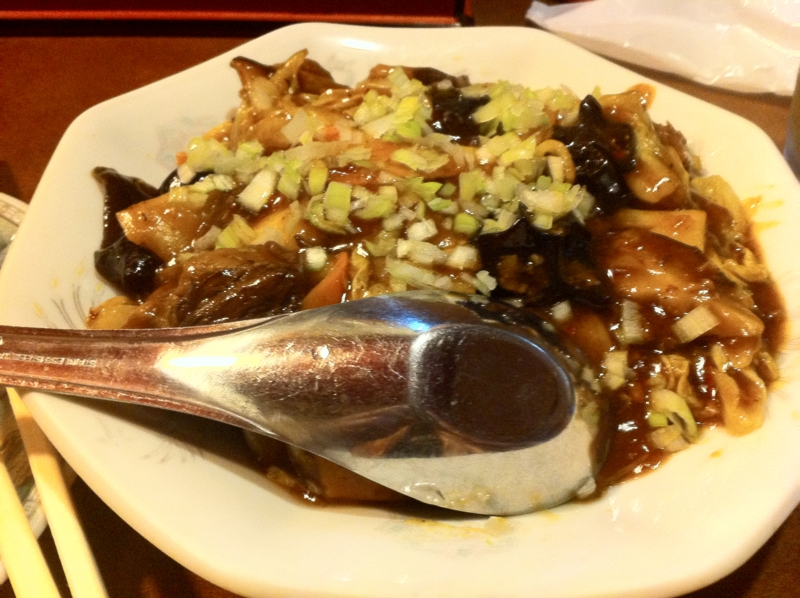

<a href="http://daruyanagi.hatenablog.com/entry/2012/06/21/035316">IS12T &#x304C;&#x9000;&#x9662;&#x3002; - &#x3060;&#x308B;&#x308D;&#x3050;</a> のお祝いに、帰りは台湾料理を食べた。 au ショップの近くに、あるのを見つけたのだ。油断していると見落としてしまう、そんな小さなお店。

ビール用の盛り合わせがあるのがいい。ただ、生ビールは不味かったので、瓶ビールのほうがよさげ。手羽先以外は何なのかよくわかんないけど、ゼラチンっぽい食感が面白い。

そんじゃそこらのなまやさしい中華料理屋ではない。日本語で説明がついているものの、メニューを読んでもどんなものが出てくるのか、ほんとに想像がつかない。興味に任せていろいろ頼んだが、おかげで食べ過ぎて、苦しくなった。

ここは日を改めて再攻略しなければならぬ。

