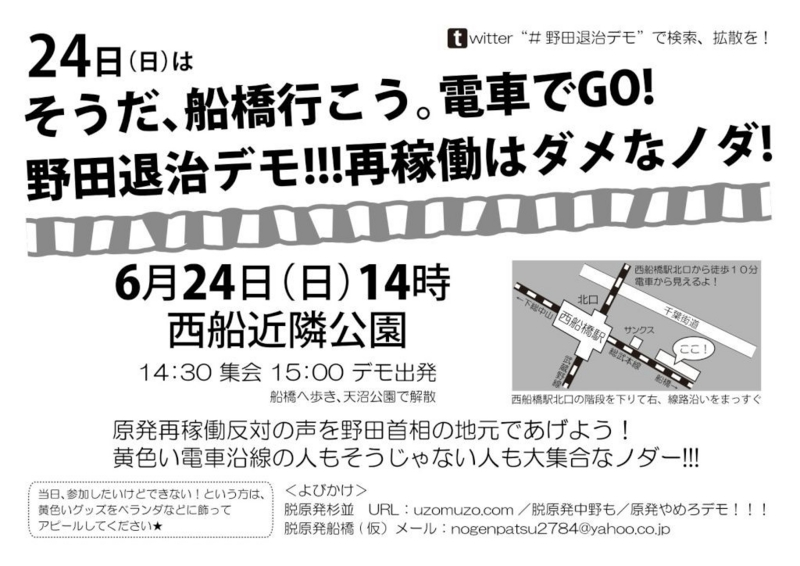

デモは嫌い。なぜなら、いろんなことをすっ飛ばした、安易な手段だからだ。反<a class="keyword" href="http://d.hatena.ne.jp/keyword/%B8%B6%C8%AF">原発</a>デモ？　あれは単なる楽しい“お祭り”に過ぎない。

<h3>デモは迷惑</h3>

デモをやるなら、それが基本的に迷惑な行為であることを自覚してほしい。大声を上げて、公共の場を占有し、ゴミを巻き散らかして<a href="#f1" name="fn1" title="日本の場合は比較的お行儀がいいようだが">*1</a>までやるべき行為なのかをもう一度見直してほしい。

経済的自由が封建制度を打破したあとにできあがったのが市民社会（Civil Society）であり、それが民主主義の揺りかごだ。それは忘れちゃいけない。デモは一般的に民主主義の一手段だと思われているけれど、市民社会の生命活動を阻害・破壊する面をもつ。これも忘れちゃいけない。

確かにデモは<b>“表現の自由”</b>の一つとして認められている<a href="#f2" name="fn2" title="日本国憲法第21条 集会、結社及び言論、出版その他一切の表現の自由は、これを保障する。">*2</a>けれど、<b>“他人の自由を侵害しない限り自由”</b>という市民社会の倫理とは対立しているわけだ<a href="#f3" name="fn3" title="どちらが優先すべきかといえば、僕は後者だと思う。表現の自由は、権力者によってそれが制限され、ときに命を奪われるのに反対しているわけで、他人を傷つけたり、往来を疎外していい権利ではない">*3</a>。

個人的には、デモというものは代議制が機能不全になったときの最後の手段だと思うし、最終手段であるからこそ説得力をもつ。

それ以外の場合には、投票（いざとなれば立候補）という手段が用意されている。もっと有効に用いるべきだろう。

話は変わるけれど、企業に対するデモは比較的容認できると思う。なぜなら、企業の活動が市民に害を及ぼすことがあっても、市民が企業の意思決定に干渉する手段がない。これは「外部性」の問題の一種だと思う。外部性を解消するには、市民の企業参加やデモといった手段が必要となる場合がある。

<h3>デモ基本をすっ飛ばす</h3>

政治は投票によってコントロールできる。これが前提。そうではない場合のみ、非常手段が肯定される。けれど、あくまでも非常手段としてだ。順番をすっ飛ばしてはいけない。

これが基本だ。そして、もうひとつ。

それは、市民であれば「集団による意思表示」を行う前に、「個人による意思表示」をすべきだ、ということ<a href="#f4" name="fn4" title="「市民（Citizen）」は理想的人民という概念の具現であるが、その前にあくまでも「個人」だ。ちなみに、単なる「集団」としての人は「民衆（People）」と呼ぶ">*4</a>。それも、自分なりに一貫したものをもたなければならない、と思う。一貫しない・アドホックな考えは、アドホックに批判をかわすことができる<a href="#f5" name="fn5" title="匿名による意思表明が望ましくないのは、思想の一貫性に乏しいというのが根本的な理由だ。匿名であっても、思想に一貫性があれ場問題がない。ただし、一貫性には文脈がなければならない。文脈のある個は、必然的に純粋な匿名とはいえなくなるだろう。">*5</a>。ゆえに、万が一誤りがあっても反省がない。<a class="keyword" href="http://d.hatena.ne.jp/keyword/%CC%B1%BC%E7%C5%DE">民主党</a>に反省がないのは、その理念に一貫性がないので、誤りに対してその場限り（アドホック）の言い訳を許してしまうからだ。

そういった「誤り」や「無反省」が群れても、所詮“お祭り”にしかならない。同じ考え同士で、ぬるま湯に浸かっているだけのこと。そのなかに、真摯な真理の追究や過ちへの反省があるのだろうか。

<h3>身近なところで、自分を、テストしよう</h3>

<b>個人による一貫した理念の表明</b>の集合体としてのデモにのみ、意味がある。きっとそれは驚くほど強力なはずだし、デモは本来その力をもつべきだ。

でも、反<a class="keyword" href="http://d.hatena.ne.jp/keyword/%B8%B6%C8%AF">原発</a>デモなどにそれは感じない。

<a class="keyword" href="http://d.hatena.ne.jp/keyword/%B8%B6%C8%AF">原発</a>によってこの50年、エネルギーと環境と安全保障と経済の面においてメリットを享受してきた。今それを捨てようという。それはそれでアリだ。けれど、<a class="keyword" href="http://d.hatena.ne.jp/keyword/%B8%B6%C8%AF">原発</a>は今の社会に深くロックインされてしまっている。それが真の問題じゃないだろうか。<a class="keyword" href="http://d.hatena.ne.jp/keyword/%B8%B6%C8%AF">原発</a>を即時撤廃するとして、

<ul>
<li>代替エネルギーはどうする？</li>
<li>温暖化ガスの排出はどうする？</li>
<li>燃料を輸入に依存すれば、世界経済へ一定の影響を与えるし、海外情勢の変動に左右されやすくなる。じゃぁ、安全保障はどうする？</li>
<li>急に経済環境が変わって倒産する会社もあるだろうけれど、どう対策する？</li>
<li>そもそも、全廃へのプロセスはどうなる？</li>
</ul>
これらの問題の逆が、まさに<a class="keyword" href="http://d.hatena.ne.jp/keyword/%B8%B6%C8%AF">原発</a>の恩恵であるし、今の社会が<a class="keyword" href="http://d.hatena.ne.jp/keyword/%B8%B6%C8%AF">原発</a>を前提としてしまっている証拠だ。これを解消するには、今まで<a class="keyword" href="http://d.hatena.ne.jp/keyword/%B8%B6%C8%AF">原発</a>を利用してきた50年に匹敵するか、それ以上の時間がかかってもおかしくないし、また、時間をかけるに値すると思う。それに対して、デモはなにを提示してくれているのか？　なにもない。

では、<b>個人による一貫した理念の表明</b>はどこからはじめよう？

手っ取り早いのは、ブログで継続して<b>個人による一貫した理念の表明</b>を記述することだ――が、それは面倒。けれど、手始めに身近な人と政治的な話して、自分の考えをテストするところからはじめるのは、誰でもできることだと思う。

古代ローマ人は「食卓でも法律の話をした」という。さすがにそれは面倒だと感じるけれど、同じく<a class="keyword" href="http://d.hatena.ne.jp/keyword/%CB%A1%BC%A3%BC%E7%B5%C1">法治主義</a>をいただき、「民が主（あるじ）であるべき主義」を掲げる日本人が、内輪でまったく政治の話をしないのもおかしい。

僕は、家族や親友がどのような政治信条をもっていて、だいたいどんな政党に入れているのかを知っている<a href="#f6" name="fn6" title="といっても、弟1号と妹だけはあまり把握していないけれど">*6</a>。面倒にならない程度にそういった話をするし、家族とはみんなで選挙にも行くからだ。みんなが投票する政党は、あまりカブっていない。だから、同意するところは同意して、ケンカするところはケンカする。すると、自分の考えていなかったこと、いまいち筋が通っていないこと気付く。それが自分の理念に対するテストになって、一貫性を補強していく。

デモに参加するのもいいけど、基本的に背伸びしすぎなんだよ。自分が変えられるのは自分自身と、自分の周りのほんの少しなんだから、そこからじっくり取り組もうよ。

<ul>
<li><a href="http://daruyanagi.hatenablog.com/entry/2012/05/31/060027">&#x300C;&#x7279;&#x6B8A;&#x306A;&#x4E8B;&#x4F8B;&#x3092;&#x53E3;&#x5B9F;&#x306B;&#x300D; - &#x3060;&#x308B;&#x308D;&#x3050;</a></li>
<li><a href="http://daruyanagi.hatenablog.com/entry/2012/05/07/063811">&#x305D;&#x308D;&#x305D;&#x308D;&#x539F;&#x767A;&#x554F;&#x984C;&#x306B;&#x3064;&#x3044;&#x3066;&#x3072;&#x3068;&#x3053;&#x3068;&#x8A00;&#x3063;&#x3066;&#x304A;&#x304F;&#x304B;&#x3002; - &#x3060;&#x308B;&#x308D;&#x3050;</a></li>
<li><a href="http://daruyanagi.hatenablog.com/entry/2012/04/06/134453">&#x7D44;&#x7E54;&#x7968;&#x306B;&#x3064;&#x3044;&#x3066; - &#x3060;&#x308B;&#x308D;&#x3050;</a></li>
<li><a href="http://daruyanagi.hatenablog.com/entry/2012/03/12/012754">&#x653F;&#x6CBB;&#x5BB6;&#x3092;&#x597D;&#x304D;&#x5ACC;&#x3044;&#x3067;&#x9078;&#x3076;&#x3053;&#x3068;&#x306E;&#x662F;&#x975E;&#x306B;&#x3064;&#x3044;&#x3066; - &#x3060;&#x308B;&#x308D;&#x3050;</a></li>
</ul>

<a href="#fn1" name="f1" class="footnote-number">*1</a>:日本の場合は比較的お行儀がいいようだが

<a href="#fn2" name="f2" class="footnote-number">*2</a>:<a class="keyword" href="http://d.hatena.ne.jp/keyword/%C6%FC%CB%DC%B9%F1%B7%FB%CB%A1">日本国憲法</a>第21条 集会、結社及び言論、出版その他一切の表現の自由は、これを保障する。

<a href="#fn3" name="f3" class="footnote-number">*3</a>:どちらが優先すべきかといえば、僕は後者だと思う。表現の自由は、権力者によってそれが制限され、ときに命を奪われるのに反対しているわけで、他人を傷つけたり、往来を疎外していい権利ではない

<a href="#fn4" name="f4" class="footnote-number">*4</a>:「市民（<a class="keyword" href="http://d.hatena.ne.jp/keyword/Citizen">Citizen</a>）」は理想的人民という概念の具現であるが、その前にあくまでも「個人」だ。ちなみに、単なる「集団」としての人は「民衆（People）」と呼ぶ

<a href="#fn5" name="f5" class="footnote-number">*5</a>:匿名による意思表明が望ましくないのは、思想の一貫性に乏しいというのが根本的な理由だ。匿名であっても、思想に一貫性があれ場問題がない。ただし、一貫性には文脈がなければならない。文脈のある個は、必然的に純粋な匿名とはいえなくなるだろう。

<a href="#fn6" name="f6" class="footnote-number">*6</a>:といっても、弟1号と妹だけはあまり把握していないけれど

