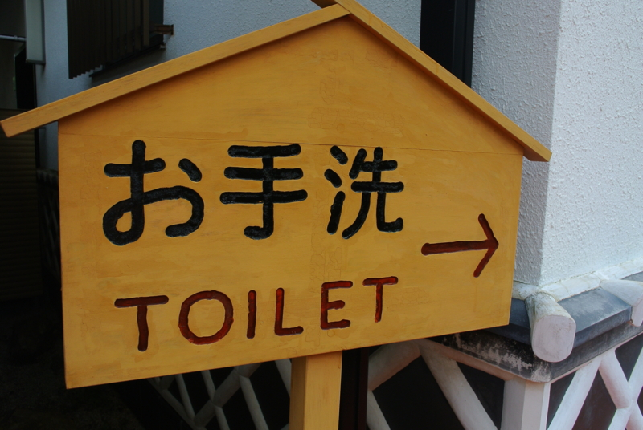
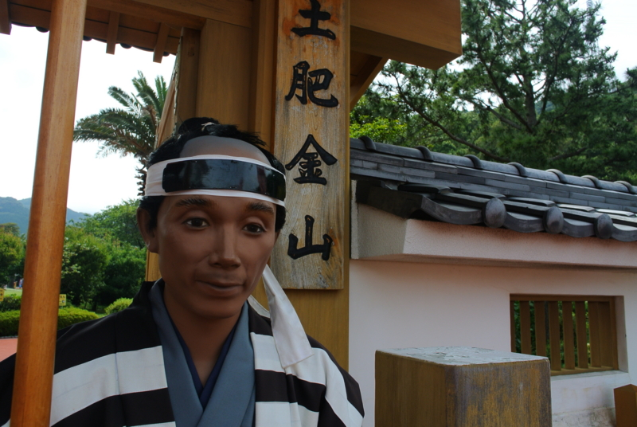
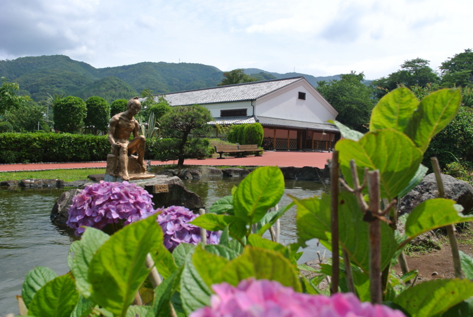
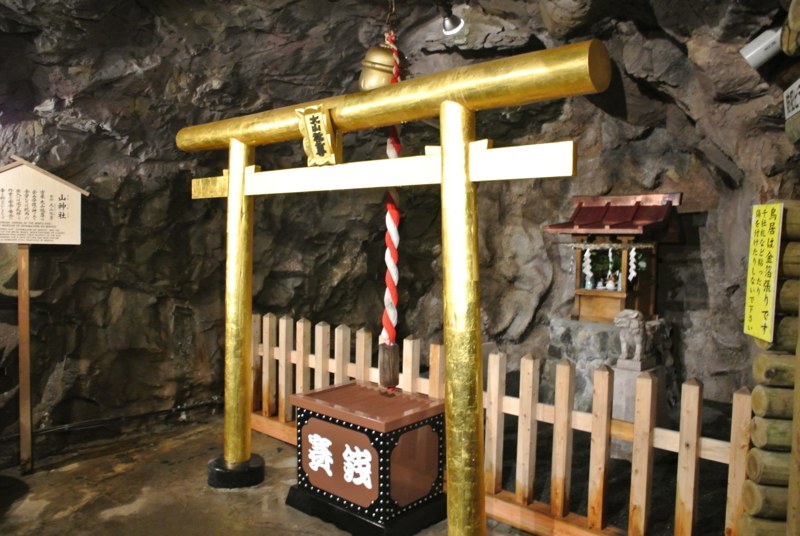
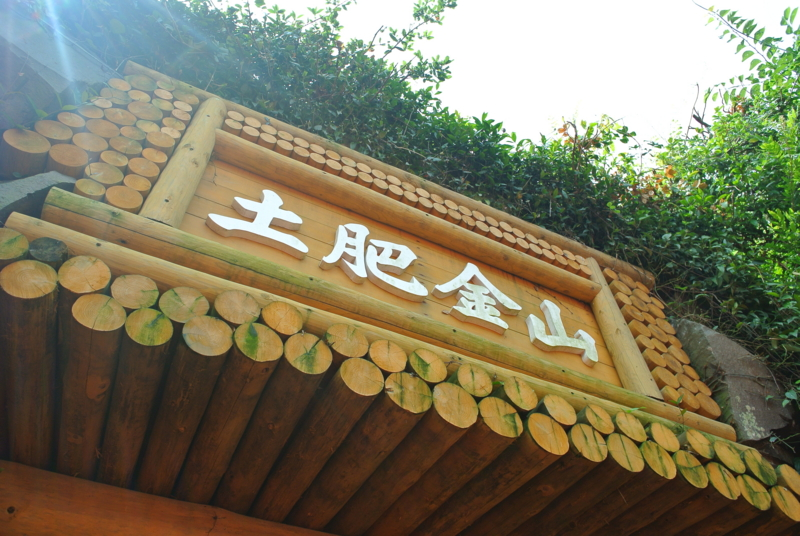
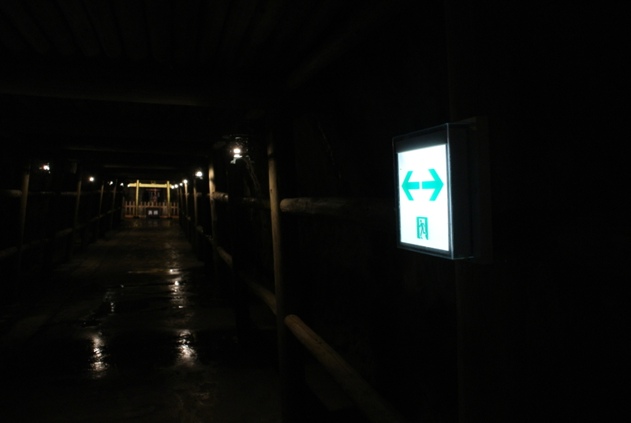
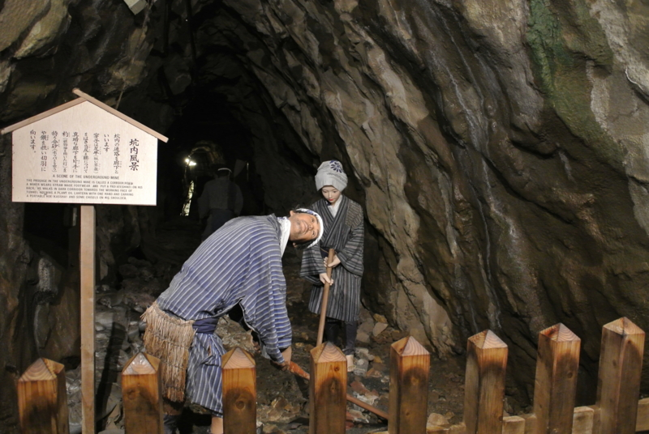
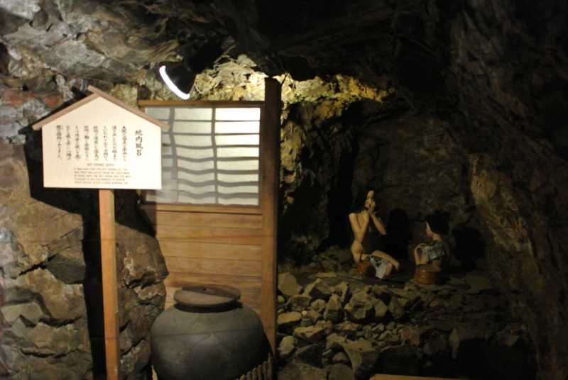
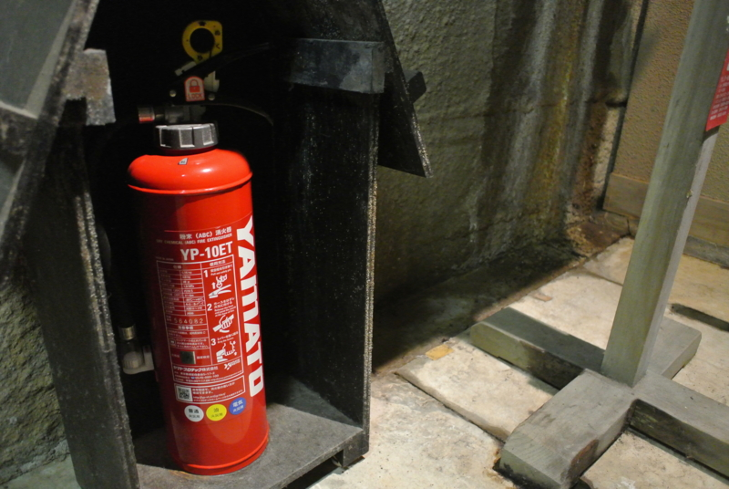

おっさん二人の旅は続く（<a href="http://daruyanagi.hatenablog.com/entry/2012/06/24/174143">&#x304A;&#x3063;&#x3055;&#x3093;&#x4E8C;&#x4EBA;&#x3067;&#x897F;&#x4F0A;&#x8C46;&#x306B;&#x884C;&#x3063;&#x3066;&#x304D;&#x305F;&#x3002; - &#x3060;&#x308B;&#x308D;&#x3050;</a>）。

向かった先は、黄金の国<a class="keyword" href="http://d.hatena.ne.jp/keyword/%A5%B8%A5%D1%A5%F3%A5%B0">ジパング</a>が誇るエル・ドラド、土肥金山。ここは科学が発達しており、ロボット化が徹底している。入場券売り場やおみやげ売り場のおばちゃん以外、従業員のほとんどはロボットだ。当然、門番もロボットで、無表情ではあるが妙に威勢のいい挨拶で私達を迎えてくれる。

紫陽花に囲まれた池の真ん中で、静かに腰を下ろす王の像。マルコ・ポーロの『東方見聞録』でも広く知られるように、ここ土肥は何から何まで金でできている。王の像はもちろん、純金製だ。曇天からわずかに差す陽の光が、その肌を照らす。これほど神々しい像など、ほかにはあるまい。

王の像だけではない。土肥では神社ですら金でできている。しかも、こんなに贅沢な作りでありながら、なお巨大な賽銭箱を置き、少しでも参拝者から浄財を巻き上げようとするこの根性たるや！　この飽くなき金銭欲。これこそが、土肥の豊かさを支えるスピリットなのだ。

私達は、さらに奥へ進む。

土肥のことをもっと知りたい。 
土肥の富の秘密を知りたい。 
あわよくば、金塊の一欠片でもお母ちゃんのおみやげに持って帰りたい。

そんな衝動が、私達を駆り立てて止まない。

そしてとうとう、一度入った者で生きて帰ったものはいないという土肥の心臓部、そのすべてが謎に包まれた金山へと足を踏み入れたのだった。

暗い坑道。水の滴り落ちる音と、うめき声だろうか、どこか遠くから響く鉱夫の声にならない声が漏れ聞こえる。

そこではなんと、かわいそうなロボットたちが大量に働かされていたのだ！

壊れたように同じ所作を繰り返すロボットたち。その内の一体は、すでに限界を迎えているのであろう。首の向きがおかしい。背筋の凍る風景だ。

しかし、目に見えるものはモノゴトの一面でしかない。ここで憤るのは簡単だが、それでは探求の灯を消してしまう。私達は歯を食いしばって泣く泣くその凄惨な光景から目を背け、さらに坑道の奥へと潜入するのであった。富の真実を知るために。

すると、なんということだ！　女たちが楽しそうに湯浴みをしているではないか。彼女たちもロボットに相違ない。なのになぜ、壊れる寸前まで働くロボットと、ゆっくり寛いでいるロボットがいるのか！　ロボットの間ですら、格差社会が存在するというのか。

私達は憤懣を抑えきれず、サルのようにシャッターを連打し、その裸体をカメラに収めたのであった。

結局、そこで <a class="keyword" href="http://d.hatena.ne.jp/keyword/Nikon">Nikon</a> 1 V1 の電池が切れたため、それ以上の潜入は断念せざるをえず、土肥の富の秘密を探り出すには至らなかった。しかし、この手記はあとに続く者たちにとって役に立つはず。もしかしたら、それはあなたかもしれない。これを読むあなたがいつか土肥金山の謎を解明したならば、私にも金一封を分けていただきたい。

