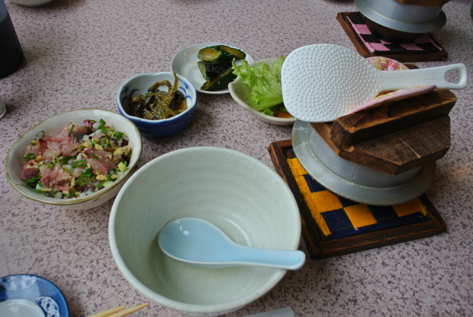
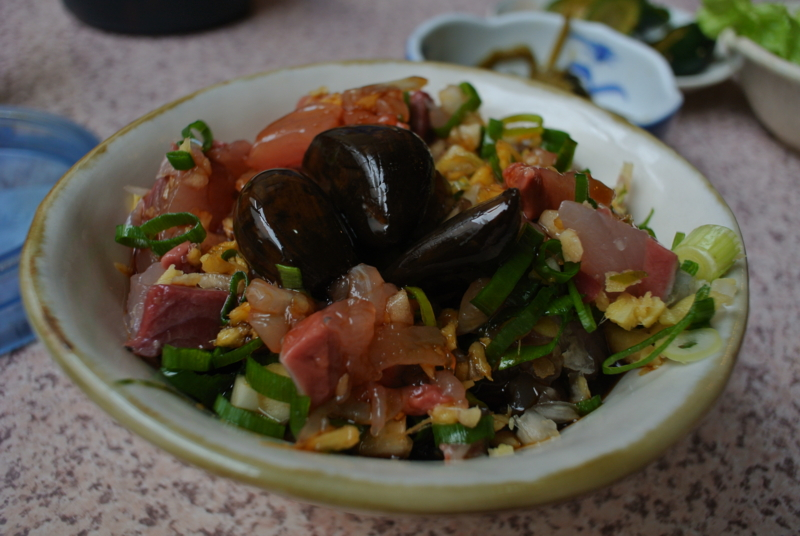
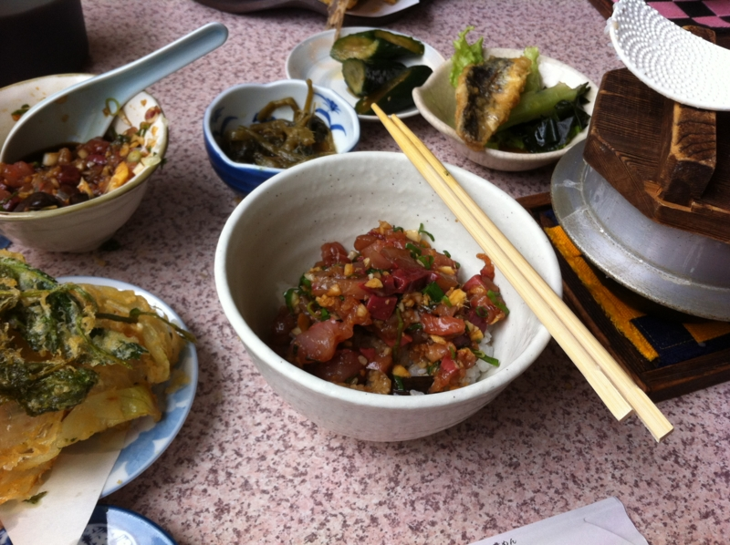
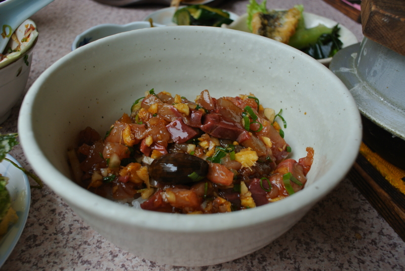
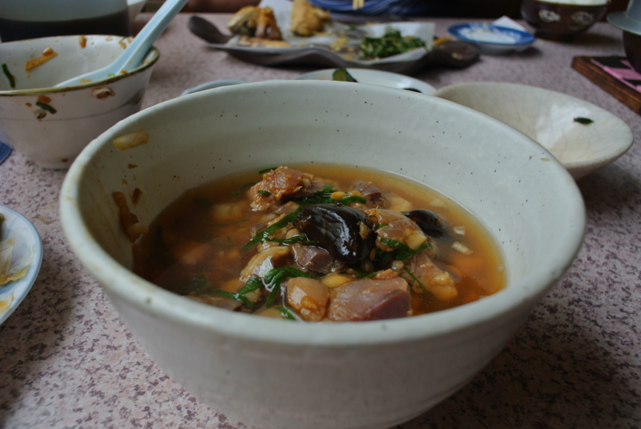
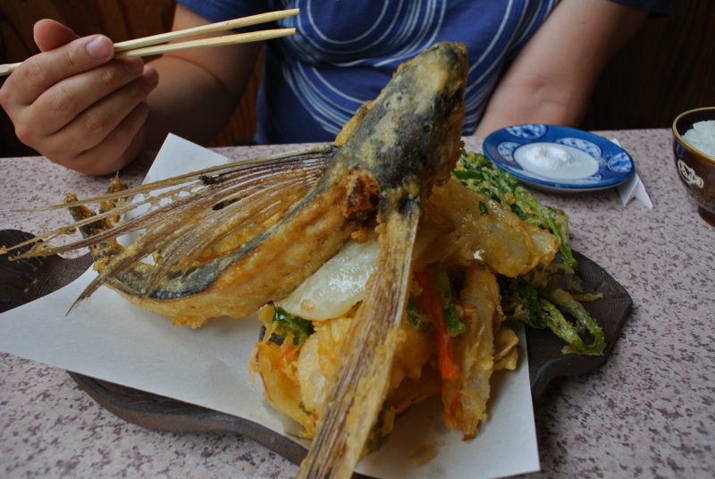

<ul>
<li><a href="http://daruyanagi.hatenablog.com/entry/2012/06/24/174143">&#x304A;&#x3063;&#x3055;&#x3093;&#x4E8C;&#x4EBA;&#x3067;&#x897F;&#x4F0A;&#x8C46;&#x306B;&#x884C;&#x3063;&#x3066;&#x304D;&#x305F;&#x3002; - &#x3060;&#x308B;&#x308D;&#x3050;</a></li>
<li><a href="http://daruyanagi.hatenablog.com/entry/2012/06/24/183810">&#x9EC4;&#x91D1;&#x306E;&#x56FD;&#x30B8;&#x30D1;&#x30F3;&#x30B0;&#x304C;&#x8A87;&#x308B;&#x30A8;&#x30EB;&#x30FB;&#x30C9;&#x30E9;&#x30C9;&#x3001;&#x571F;&#x80A5;&#x91D1;&#x5C71;&#x3078;&#x6F5C;&#x5165;&#x3002;&#x305D;&#x3053;&#x3067;&#x76EE;&#x306B;&#x3057;&#x305F;&#x3082;&#x306E;&#x306F;&hellip;&hellip;&#xFF01; - &#x3060;&#x308B;&#x308D;&#x3050;</a></li>
</ul>
続き。お昼ごはんは、「さくら」で食べた。バイクで西伊豆に来る人なんかの間では定番かもしれない。

ここは“まご茶漬け”が美味い。

食べ方を間違えるのと怒られるので、軽くレクチャーしよう。あいにくカツオがなかったので、本稿ではアジで説明する。あらかじめご容赦願いたい。

まず、アジにニンニク醤油をタップリかける。口が臭くなっても構わないならば、ニンニクのカケラも丸ごと投入することをおすすめする。

ご飯を半分、その上にアジを半分だけよそう。ニンニク醤油をかけすぎないように。

このままもりもり美味しくいただきましょう。食べる間はご飯の釜にはフタをしておくこと。

食べ終わったら、残りの半分をよそって、おばちゃんに出汁を頼む。すると、そこに出汁をかけてお茶漬け風にしてくれる。味が薄かったら、ニンニク醤油を足して調節しよう。こっちはさらさら美味しくいただきましょう。

1つのメニューで2度美味しい！

ちなみに、 @subsfn はトビウオを食べていた。こっちはこっちでなかなか、白身がほくほくしていて美味しい。

<iframe width="425" height="350" frameborder="0" scrolling="no" marginheight="0" marginwidth="0" src="https://maps.google.co.jp/maps?hl=ja&amp;safe=off&amp;aq=&amp;ie=UTF8&amp;q=%E8%A5%BF%E4%BC%8A%E8%B1%86+%E3%81%95%E3%81%8F%E3%82%89&amp;fb=1&amp;gl=jp&amp;hq=%E8%A5%BF%E4%BC%8A%E8%B1%86+%E3%81%95%E3%81%8F%E3%82%89&amp;cid=0,0,9019532324433851703&amp;t=m&amp;brcurrent=3,0x6019f9bf968cb097:0x5e82f0f5f0a0095a,0&amp;ll=34.75644,138.77743&amp;spn=0.00617,0.00912&amp;z=16&amp;iwloc=A&amp;output=embed"></iframe> <small><a href="https://maps.google.co.jp/maps?hl=ja&amp;safe=off&amp;aq=&amp;ie=UTF8&amp;q=%E8%A5%BF%E4%BC%8A%E8%B1%86+%E3%81%95%E3%81%8F%E3%82%89&amp;fb=1&amp;gl=jp&amp;hq=%E8%A5%BF%E4%BC%8A%E8%B1%86+%E3%81%95%E3%81%8F%E3%82%89&amp;cid=0,0,9019532324433851703&amp;t=m&amp;brcurrent=3,0x6019f9bf968cb097:0x5e82f0f5f0a0095a,0&amp;ll=34.75644,138.77743&amp;spn=0.00617,0.00912&amp;z=16&amp;iwloc=A&amp;source=embed" style="color:#0000FF;text-align:left">大きな地図で見る</a></small>

