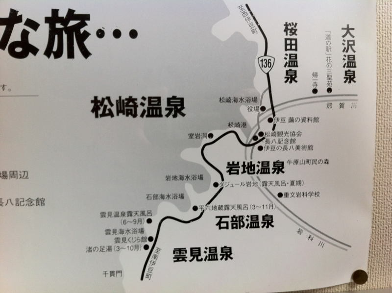
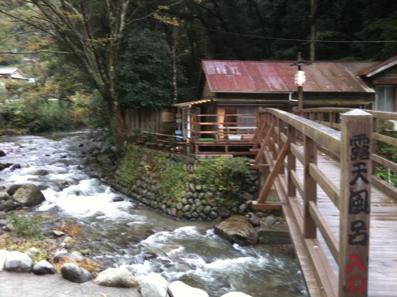
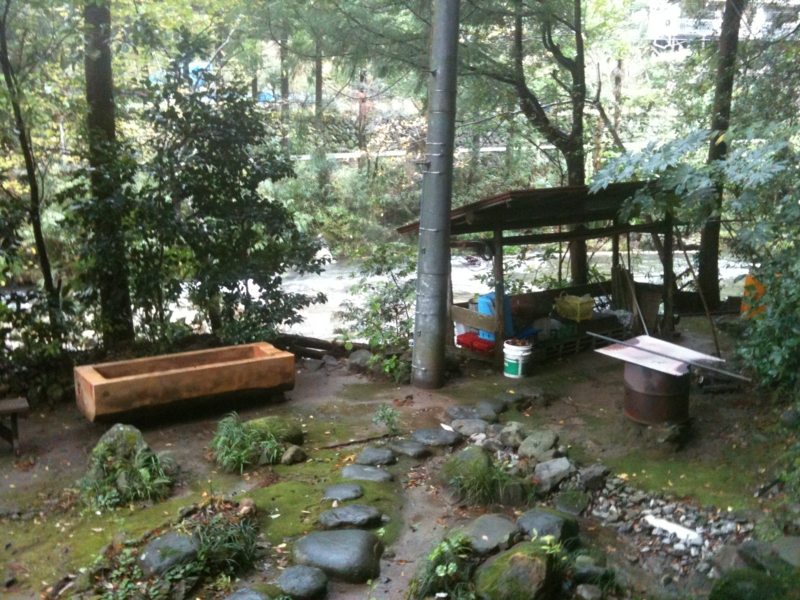
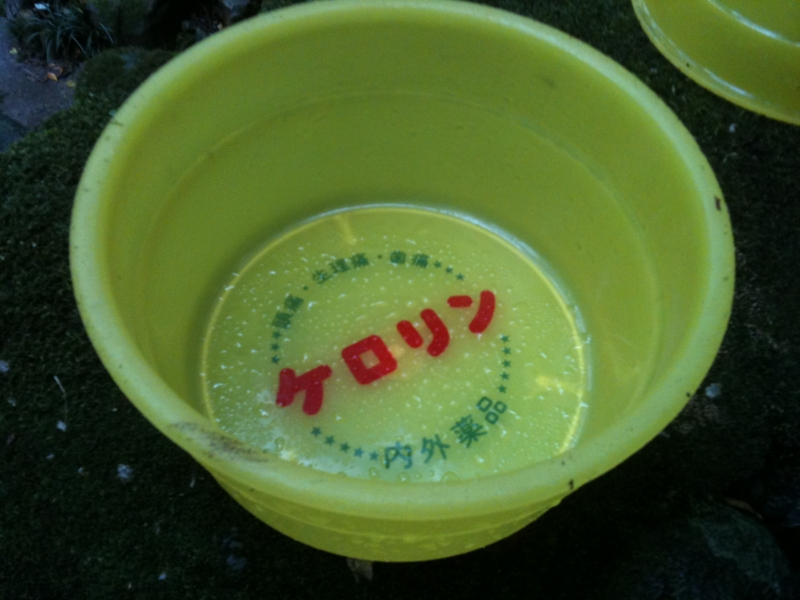
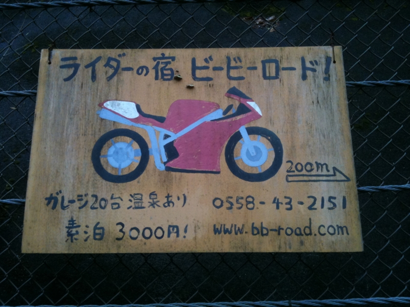
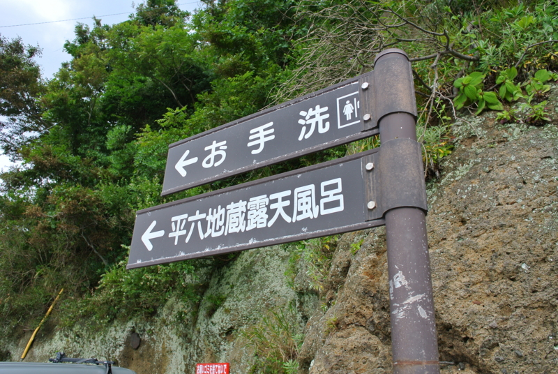
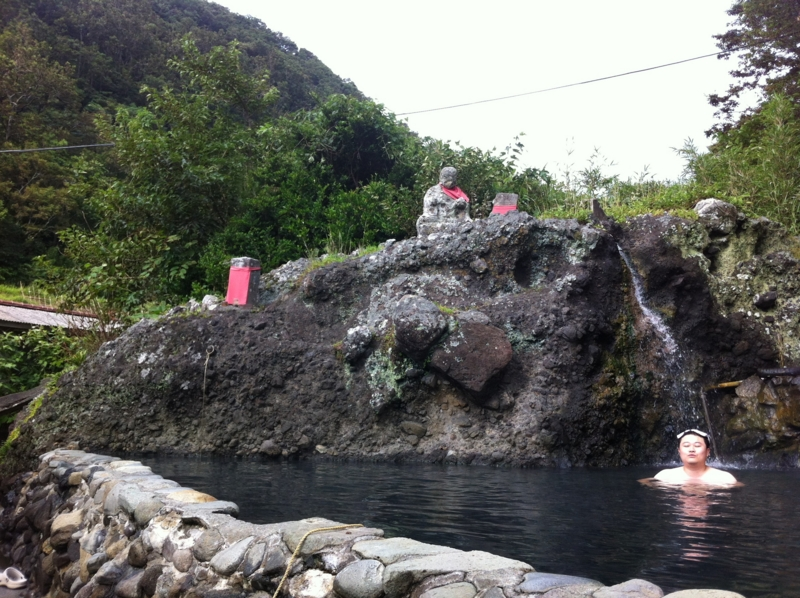
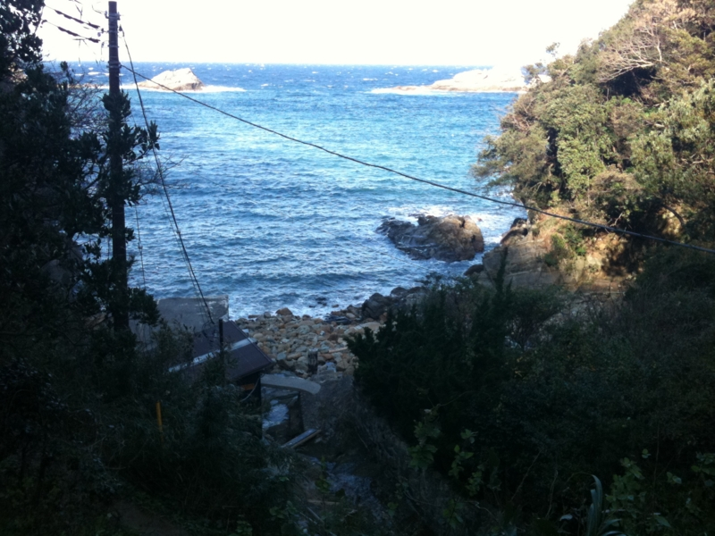
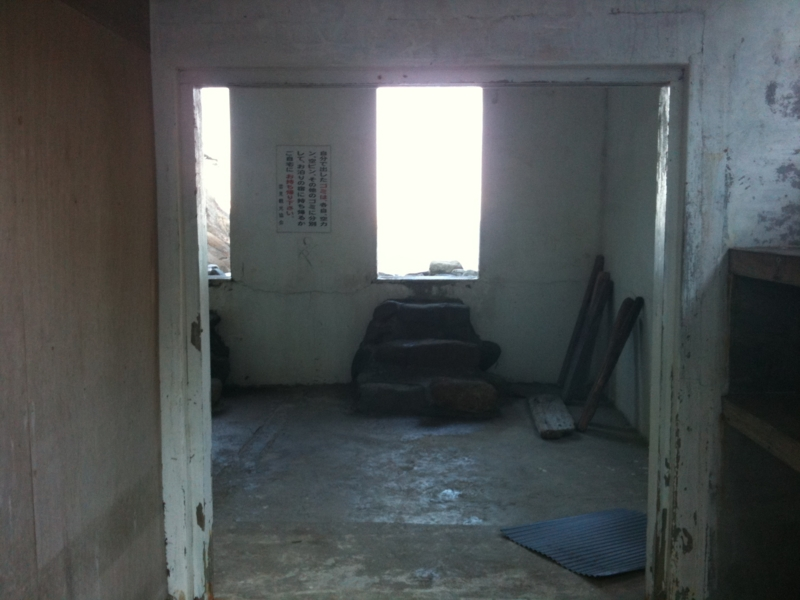
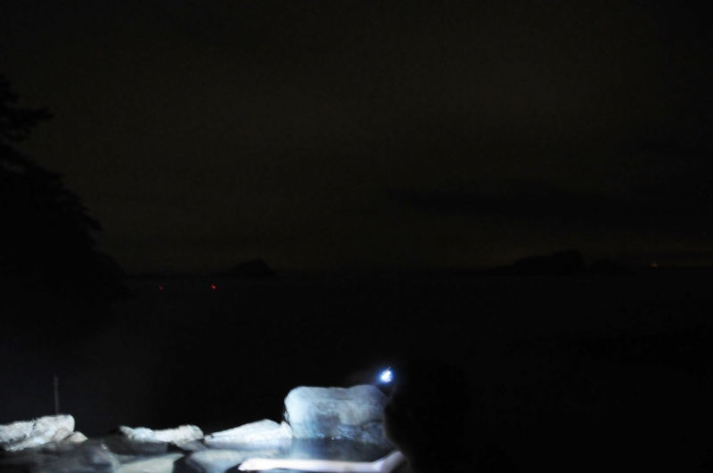

<ul>
<li><a href="http://daruyanagi.hatenablog.com/entry/2012/06/24/174143">&#x304A;&#x3063;&#x3055;&#x3093;&#x4E8C;&#x4EBA;&#x3067;&#x897F;&#x4F0A;&#x8C46;&#x306B;&#x884C;&#x3063;&#x3066;&#x304D;&#x305F;&#x3002; - &#x3060;&#x308B;&#x308D;&#x3050;</a></li>
<li><a href="http://daruyanagi.hatenablog.com/entry/2012/06/24/183810">&#x9EC4;&#x91D1;&#x306E;&#x56FD;&#x30B8;&#x30D1;&#x30F3;&#x30B0;&#x304C;&#x8A87;&#x308B;&#x30A8;&#x30EB;&#x30FB;&#x30C9;&#x30E9;&#x30C9;&#x3001;&#x571F;&#x80A5;&#x91D1;&#x5C71;&#x3078;&#x6F5C;&#x5165;&#x3002;&#x305D;&#x3053;&#x3067;&#x76EE;&#x306B;&#x3057;&#x305F;&#x3082;&#x306E;&#x306F;&hellip;&hellip;&#xFF01; - &#x3060;&#x308B;&#x308D;&#x3050;</a></li>
<li><a href="http://daruyanagi.hatenablog.com/entry/2012/06/24/211414">&#x4E8C;&#x5EA6;&#x7F8E;&#x5473;&#x3057;&#x3044;&#x3002; - &#x3060;&#x308B;&#x308D;&#x3050;</a></li>
</ul>
つづき。西伊豆と言えば、ご飯もいいんですけど、やっぱ温泉ですよねー。なんか色いろあるっぽいのですけど、今回は3つぐらい行って来ました。

<h3><a class="keyword" href="http://d.hatena.ne.jp/keyword/%C2%E7%C2%F4%B2%B9%C0%F4">大沢温泉</a></h3>

ここはいつも行くところ。小さい温泉で、入泉料は500円。お湯はちょっと熱い……湯治のための素泊まり泊まるプランもあるみたい。近所にバイク宿もあるみたいなので、ちょっと気になっちゃったりしますよね。<a href="#f1" name="fn1" title="写真は2009年のものです。今回は撮り忘れた＼(^o^)／">*1</a>

<h3>岩地温泉</h3>

夏季しか入れないけれど、タダで。そんなありがたい温泉が、岩地漁港にある平<a class="keyword" href="http://d.hatena.ne.jp/keyword/%CF%BB%C3%CF%C2%A2">六地蔵</a>露天風呂です。ここは混浴なので、ほんとうは水着が必要っぽいですけど、今回は誰もいなかった＆水着もっていくの忘れたので、そのまま。幸い、男の人すら来ませんでした……

お地蔵さんに見守られながら、広い空の下で入る露天風呂というのも格別ですなぁ。同行した @subsfn は奈良の大仏に似ているので、神々しさの二倍増です。

<h3>雲見温泉</h3>

忘れられたところにある、忘れられた露天風呂<a href="#f2" name="fn2" title="写真は2009年のものです。今回は夜なので撮れなかった＼(^o^)／">*2</a>。

車を路肩に停車して、延々と細い山道を下って行くと、それがあります。もう営業していないようですので、タダ。お湯がヌルいので、冬に入ると死にます<a href="#f3" name="fn3" title="一度やって死にかけました">*3</a>。今回は宿で夕食を楽しんだあとにでかけたのですけど……

なんの施設もないので真っ暗です。波の音（と最近できたらしい施設のモーター音）しか聞こえない。目が夜の暗さに慣れると前面にうっすらと海の影が浮かび上がり、これまたなんとも言えませぬ。

……と、まぁ、15分ぐらい楽しんでいたのだけど、どうも上の道路が明るいというか、赤いチカチカが見える。なんか嫌な予感がしたので、身支度をして戻ってみたところ……

<b>駐在さんが待ってました。</b>夜にお仕事ご苦労様です (｀･ω･´)ゞ

まぁ、近隣の人に通報されるようなことはヤメましょう…… (；´Д｀) ほかにも、尾根の上にある露天風呂とか、もちろん、普通の観光客にも有名ななかなか施設の整ったところもたくさん。宿によっては掛け流しの温泉を自前で用意しているところもあるので、温泉巡りで飽きることはないですね。1週間ぐらいのんびりしながら制覇してみたいもんです。

<a href="#fn1" name="f1" class="footnote-number">*1</a>:写真は2009年のものです。今回は撮り忘れた＼(^o^)／

<a href="#fn2" name="f2" class="footnote-number">*2</a>:写真は2009年のものです。今回は夜なので撮れなかった＼(^o^)／

<a href="#fn3" name="f3" class="footnote-number">*3</a>:一度やって死にかけました

