
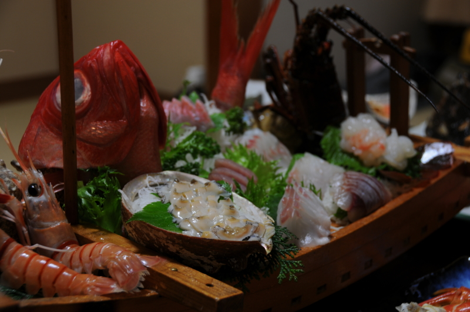

<ul>
<li><a href="http://daruyanagi.hatenablog.com/entry/2012/06/24/174143">&#x304A;&#x3063;&#x3055;&#x3093;&#x4E8C;&#x4EBA;&#x3067;&#x897F;&#x4F0A;&#x8C46;&#x306B;&#x884C;&#x3063;&#x3066;&#x304D;&#x305F;&#x3002; - &#x3060;&#x308B;&#x308D;&#x3050;</a></li>
<li><a href="http://daruyanagi.hatenablog.com/entry/2012/06/24/183810">&#x9EC4;&#x91D1;&#x306E;&#x56FD;&#x30B8;&#x30D1;&#x30F3;&#x30B0;&#x304C;&#x8A87;&#x308B;&#x30A8;&#x30EB;&#x30FB;&#x30C9;&#x30E9;&#x30C9;&#x3001;&#x571F;&#x80A5;&#x91D1;&#x5C71;&#x3078;&#x6F5C;&#x5165;&#x3002;&#x305D;&#x3053;&#x3067;&#x76EE;&#x306B;&#x3057;&#x305F;&#x3082;&#x306E;&#x306F;&hellip;&hellip;&#xFF01; - &#x3060;&#x308B;&#x308D;&#x3050;</a></li>
<li><a href="http://daruyanagi.hatenablog.com/entry/2012/06/24/211414">&#x4E8C;&#x5EA6;&#x7F8E;&#x5473;&#x3057;&#x3044;&#x3002; - &#x3060;&#x308B;&#x308D;&#x3050;</a></li>
<li><a href="http://daruyanagi.hatenablog.com/entry/2012/06/25/032051">&#x9732;&#x5929;&#x98A8;&#x5442;&#x3068;&#x99D0;&#x5728;&#x3055;&#x3093;&#x3002; - &#x3060;&#x308B;&#x308D;&#x3050;</a></li>
</ul>
つづき。お宿は、「太郎」さんへ。もう4回目か、5回目ぐらいかな。のんびりできてご飯も美味しいので、満室の時以外はいつも使わせてもらってます。

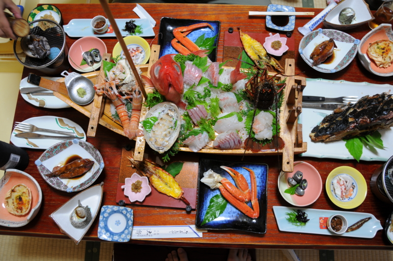

なにげにお部屋で食べれるのがいいんですよねぇ……食堂だとやっぱ気兼ねするし。あと、いつもやっているのだけど、宿泊費に少し足し前して料理は少し豪華に。やっぱ、どうせ行くんだから心底満足しないとねぇ！

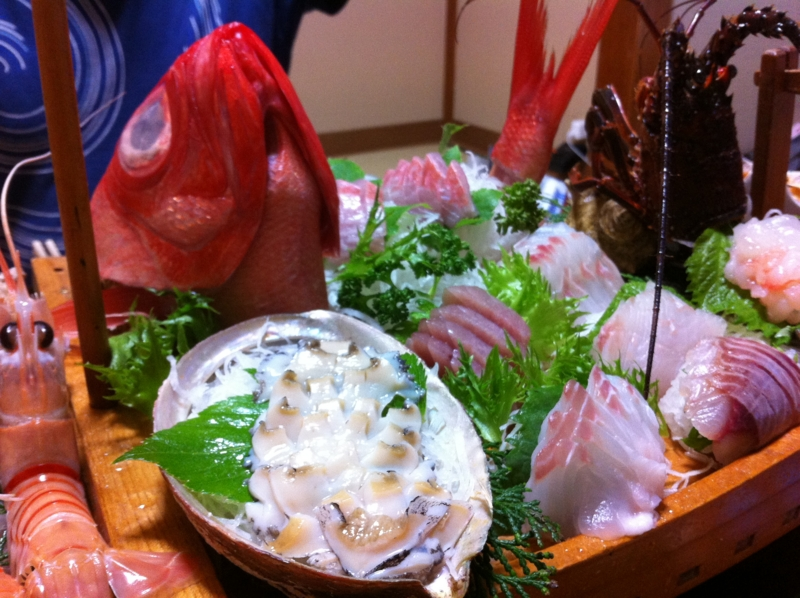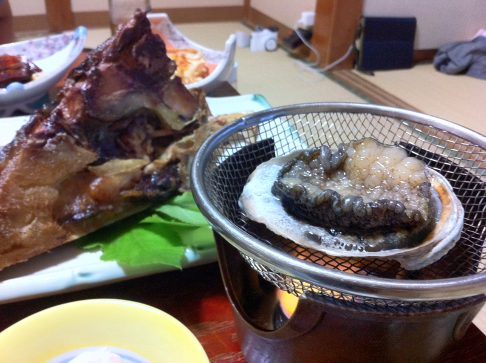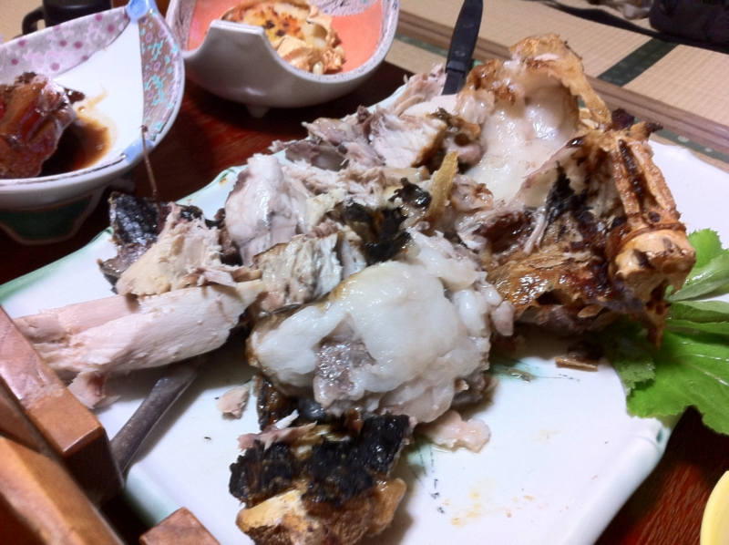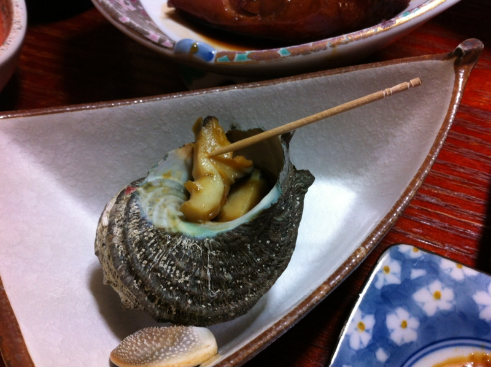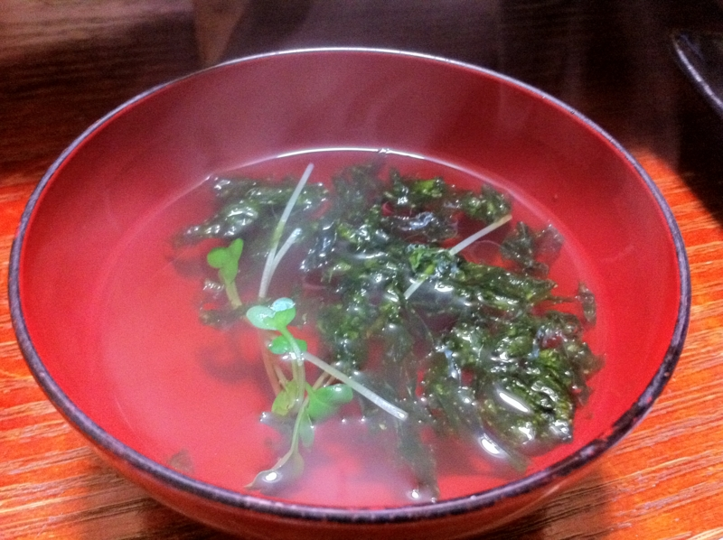

適当にお刺身でビールを飲みながらのんびりのんびり。何品あるんだろう……数えるのも面倒だ。そして最後はご飯を2杯。

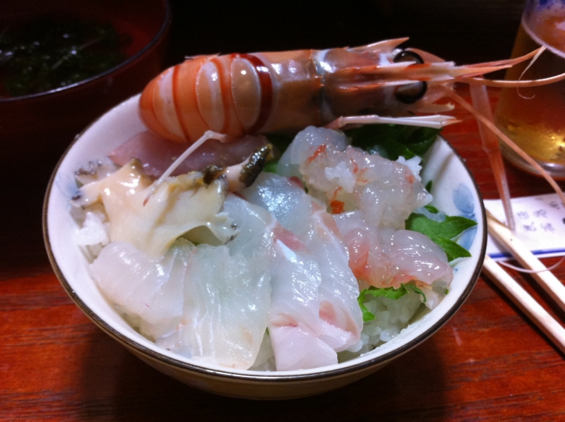

まず、余ったお刺身で海鮮丼を制作。これをガガガッと食べる。

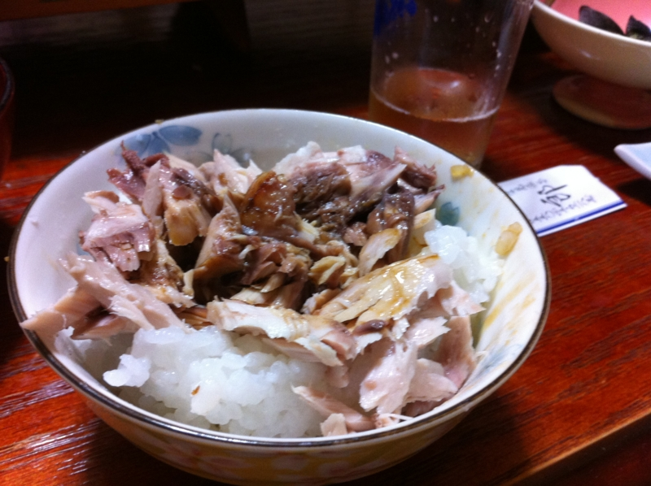

次は、カマ焼きの肉をほぐしてご飯にのっけて、お醤油で食べる。これもまたうまうま。 @subsfn 氏はもしかしたらこれに加えてお茶漬けを食べていたような気がする。

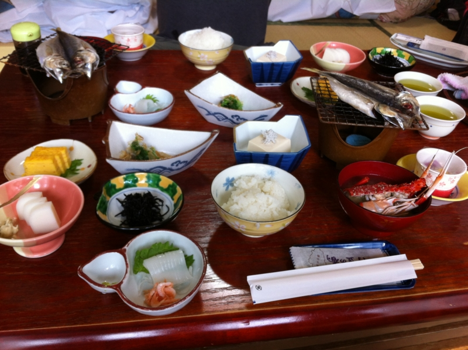

ちなみに朝ごはんはこんな感じ。イカ刺しで1杯、納豆で1杯、ヒラキで1杯、全部でご飯3杯食べるのがわたしのやり方だ！

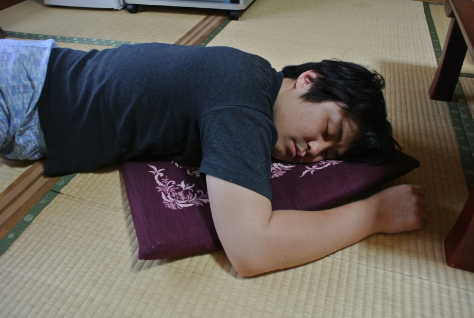

もう、いろいろありがとうございました。大満足です。

<iframe width="425" height="350" frameborder="0" scrolling="no" marginheight="0" marginwidth="0" src="https://maps.google.co.jp/maps?hl=ja&amp;safe=off&amp;aq=&amp;ie=UTF8&amp;q=%E8%A5%BF%E4%BC%8A%E8%B1%86+%E5%A4%AA%E9%83%8E&amp;fb=1&amp;gl=jp&amp;hq=%E5%A4%AA%E9%83%8E&amp;hnear=0x6019f0e0fe418b01:0x8ff6e748cc0f780a,%E9%9D%99%E5%B2%A1%E7%9C%8C%E8%B3%80%E8%8C%82%E9%83%A1%E8%A5%BF%E4%BC%8A%E8%B1%86%E7%94%BA&amp;cid=0,0,7666772428099862477&amp;t=m&amp;brcurrent=3,0x6019f8fbf369a65f:0x493475ca8ef23cf6,0&amp;ll=34.727699,138.745029&amp;spn=0.006172,0.00912&amp;z=16&amp;iwloc=A&amp;output=embed"></iframe> <small><a href="https://maps.google.co.jp/maps?hl=ja&amp;safe=off&amp;aq=&amp;ie=UTF8&amp;q=%E8%A5%BF%E4%BC%8A%E8%B1%86+%E5%A4%AA%E9%83%8E&amp;fb=1&amp;gl=jp&amp;hq=%E5%A4%AA%E9%83%8E&amp;hnear=0x6019f0e0fe418b01:0x8ff6e748cc0f780a,%E9%9D%99%E5%B2%A1%E7%9C%8C%E8%B3%80%E8%8C%82%E9%83%A1%E8%A5%BF%E4%BC%8A%E8%B1%86%E7%94%BA&amp;cid=0,0,7666772428099862477&amp;t=m&amp;brcurrent=3,0x6019f8fbf369a65f:0x493475ca8ef23cf6,0&amp;ll=34.727699,138.745029&amp;spn=0.006172,0.00912&amp;z=16&amp;iwloc=A&amp;source=embed" style="color:#0000FF;text-align:left">大きな地図で見る</a></small>

