
<a class="keyword" href="http://d.hatena.ne.jp/keyword/Windows%20Azure">Windows Azure</a> Web Sites でサクッと <a class="keyword" href="http://d.hatena.ne.jp/keyword/WordPress">WordPress</a> をセットアップしてみたよ。案外サクッといったので、別に説明することもなかった。 <a class="keyword" href="http://d.hatena.ne.jp/keyword/Windows%20Live">Windows Live</a> ID <a href="#f1" name="fn1" title="Microsoft ID になるんだっけ？">*1</a> とクレジットカード <a href="#f2" name="fn2" title="いきなり課金されることはないはず……">*2</a> が必要になるので、あらかじめ用意しておくこと。<a href="http://www.windowsazure.com/ja-jp/">
 
Windows Azure: Microsoft&#39;s Cloud Platform | Cloud Hosting | Cloud Services
 
</a>

<h3>3ヶ月無償評価版の登録</h3>

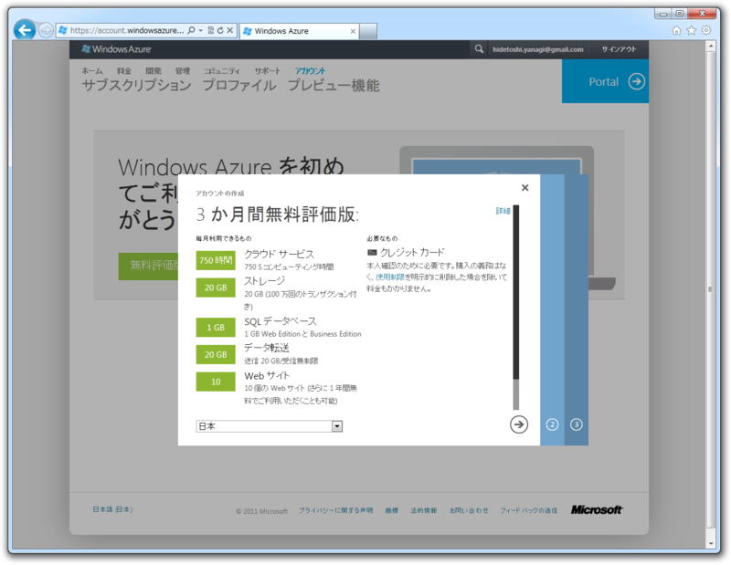

<a class="keyword" href="http://d.hatena.ne.jp/keyword/Windows%20Azure">Windows Azure</a> は3ヶ月無償で利用できるのだそうな。本番ではいくらかかるんだろう……この3ヶ月のうちにシミュレートできるといいのだけど。

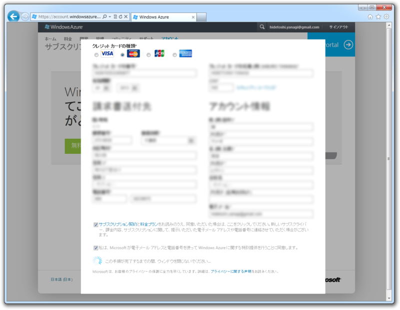

本人確認のためにクレジットカードがいるんだって。ここは素直に登録登録。

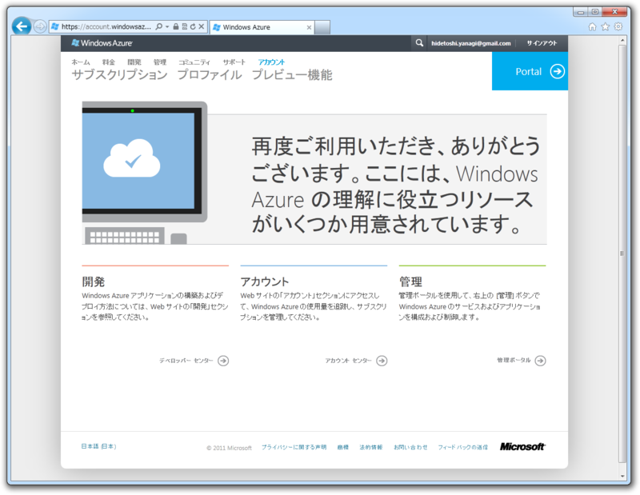

設定はこれだけ。さっそく［管理］っていうところをクリックしてみる。

<h3><a class="keyword" href="http://d.hatena.ne.jp/keyword/HTML5">HTML5</a> で作成された <a class="keyword" href="http://d.hatena.ne.jp/keyword/Windows%20Azure">Windows Azure</a> の新しいポータル画面</h3>

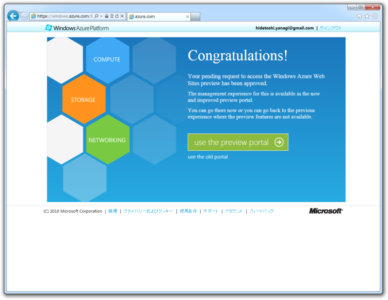

以前までは <a class="keyword" href="http://d.hatena.ne.jp/keyword/Silverlight">Silverlight</a> で作られていたという話だけど、新しいプレピューポータルは <a class="keyword" href="http://d.hatena.ne.jp/keyword/HTML5">HTML5</a> で制作されている。<a class="keyword" href="http://d.hatena.ne.jp/keyword/%A5%AF%A5%ED%A5%B9%A5%D6%A5%E9%A5%A6%A5%B6">クロスブラウザ</a>ーでヌルヌル動くのが気持ちいいですね。

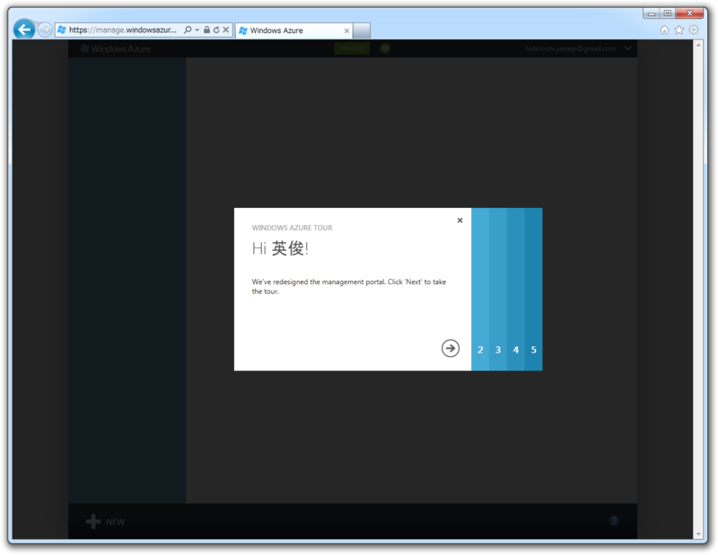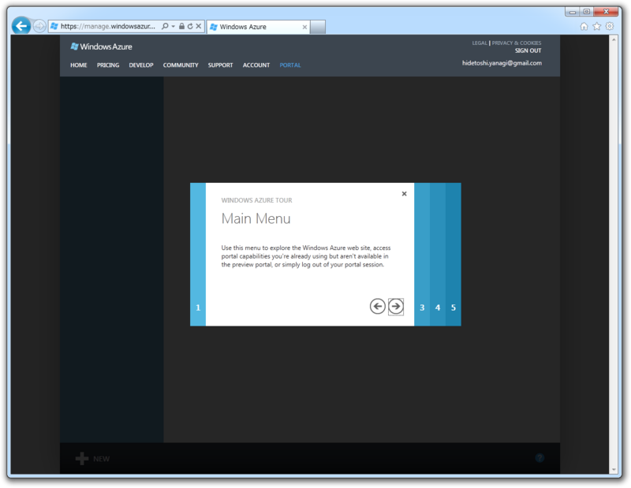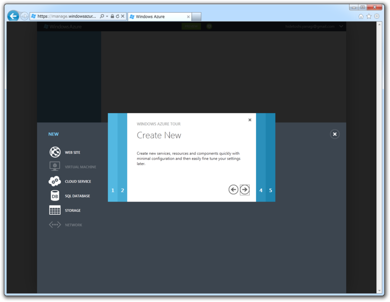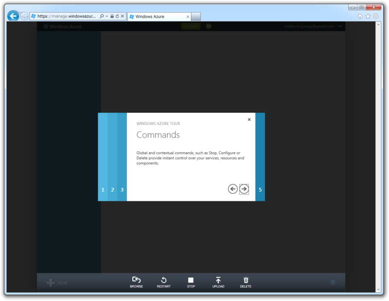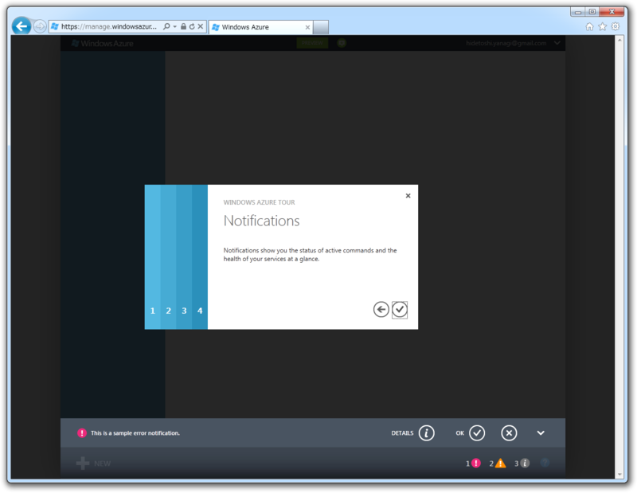

ウィザードでチュートリアルが表示される。だいたいの使い方をこれで把握できる感じ。まぁ、実際に使ったほうが覚えるのは早いと思う。ぱっと見わかりやすいしね。

<h3><a class="keyword" href="http://d.hatena.ne.jp/keyword/WordPress">WordPress</a> の設置</h3>

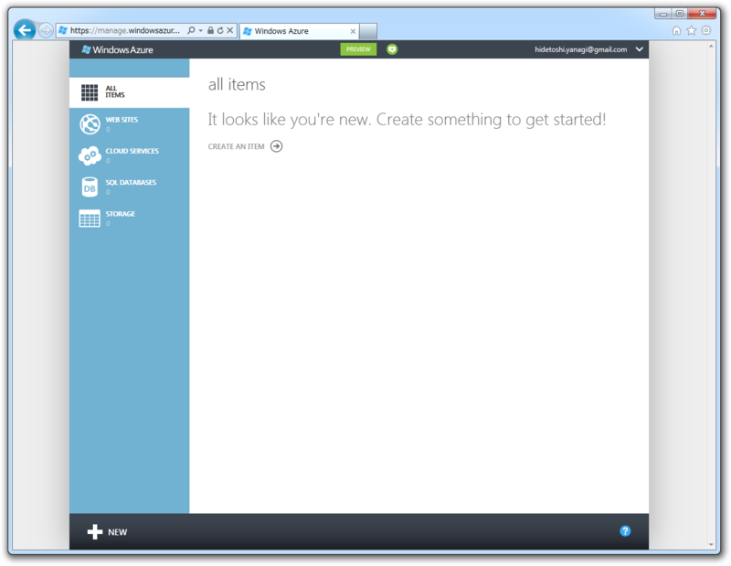

さっきのチュートリアルで、新規プロジェクトは左下の［New］アイコンから、と書いてあった気がするのでそれを選択。

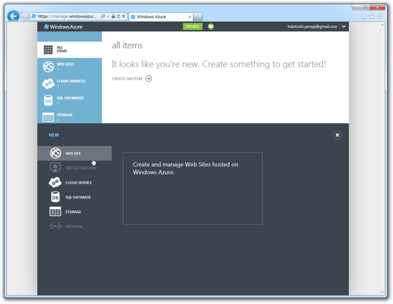

まずは［Web Sites］を選択し……

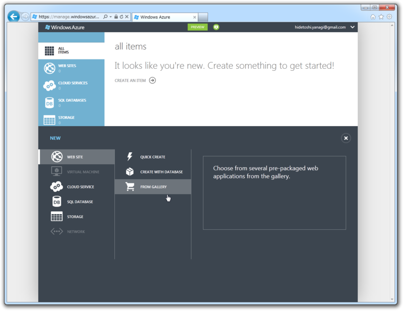

次に［From Gallery］と続き……

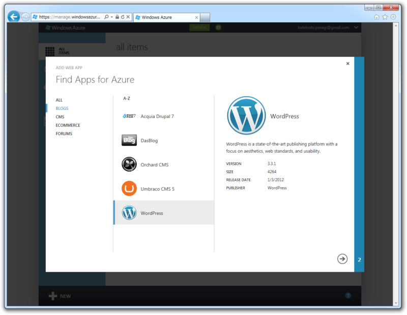

ギャラリーの中から <a class="keyword" href="http://d.hatena.ne.jp/keyword/WordPress">WordPress</a> をチョイス。 <a class="keyword" href="http://d.hatena.ne.jp/keyword/C%23">C#</a> しかわかんないし Orchard <a class="keyword" href="http://d.hatena.ne.jp/keyword/CMS">CMS</a> も考えたのだけど、まぁ、最初はやはり実績のある <a class="keyword" href="http://d.hatena.ne.jp/keyword/WordPress">WordPress</a> かなぁ、と。ほかにもいっぱいありそうだ。

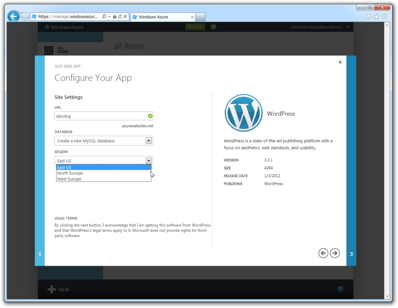

<a class="keyword" href="http://d.hatena.ne.jp/keyword/%A5%B5%A5%D6%A5%C9%A5%E1%A5%A4%A5%F3">サブドメイン</a>とリージョンの選択。まだアジアのリージョンはないんだな……アメリカ西海岸が無難そうだ。

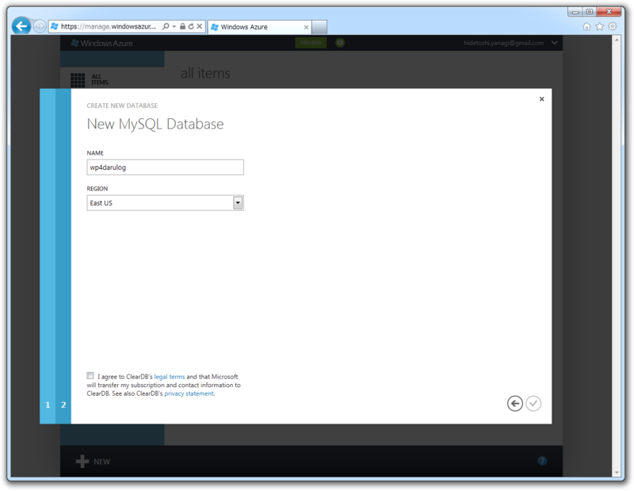

<a class="keyword" href="http://d.hatena.ne.jp/keyword/MySQL">MySQL</a> サーバーの設定。データベース名は……ほかとかぶらなければなんでもいいんじゃないかな。

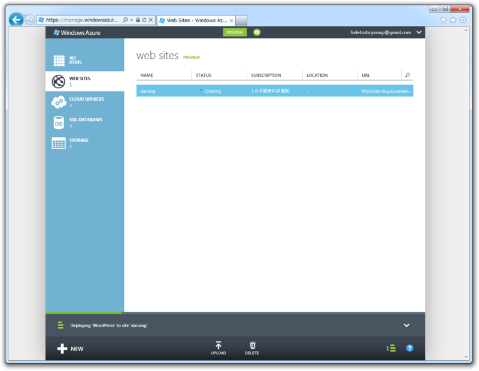

できたっぽい。デプロイは1分もかからなかったと思う。

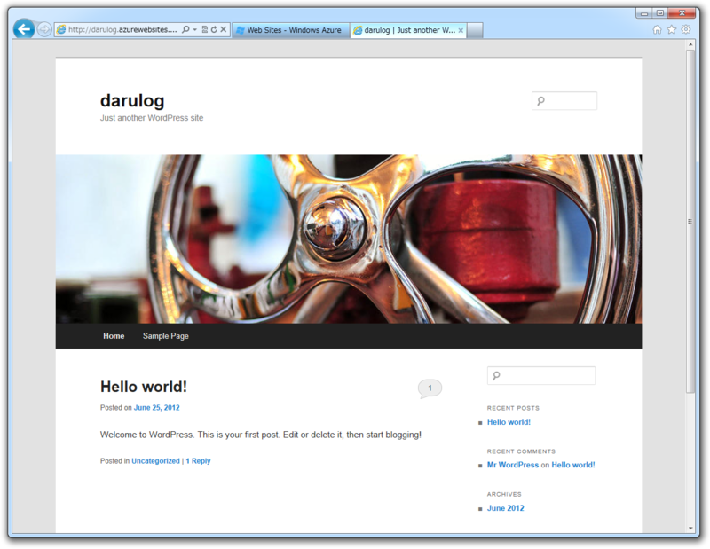

あとは管理者アカウントの設定をすれば、見慣れた <a class="keyword" href="http://d.hatena.ne.jp/keyword/WordPress">WordPress</a> のサイトが現れる。ぶっちゃけ、裏が <a class="keyword" href="http://d.hatena.ne.jp/keyword/Windows%20Azure">Windows Azure</a> だってことを意識しなければ、ユーザーインターフェイスがカッコいい普通の<a class="keyword" href="http://d.hatena.ne.jp/keyword/%A5%EC%A5%F3%A5%BF%A5%EB%A5%B5%A1%BC%A5%D0">レンタルサーバ</a>ーって感じだ。

<a href="#fn1" name="f1" class="footnote-number">*1</a>:Microsoft ID になるんだっけ？

<a href="#fn2" name="f2" class="footnote-number">*2</a>:いきなり課金されることはないはず……

