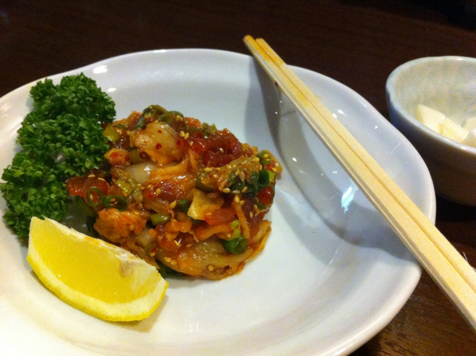

マグロのポキ<a href="#f1" name="fn1" title="マリネの一種らしい">*1</a>。ちょっと美味しかった。

今日は独り居酒屋。まぁ、独りの場合のほうが多いのだけど。なんせ、ちょっとうるさい居酒屋で静かに本を読むのが好きなのだ。わかる人はこれだけでわかると思うし、わからない人はたぶん一生わからないと思うけれど。寂しがりやだけど独りが好きという、どうしようもなく身勝手な奴なのですよ。ここら辺は、ちゃんと空気を読んでくれる弟妹に甘やかされてしまったところだと思う。

それはともかく、独り居酒屋というのはとかく難しいものだ。

なにより、まず自分でメニューを決めなきゃいけない。すべて自分の責任だ。しかも、とくに創作系のお店やガチなお店<a href="#f2" name="fn2" title="店主が日本語わからないぐらい本場なお店など">*2</a>だと、メニューだけでは何が出てくるのか予想がつかない。味はおいとくとしても、量がどれだけ出てくるのかすらもわからない。なので、一通りメニューを制覇しないと、自分の中での最適な「献立」が作れない。食べるものを決めるためには、すべてを食べなければならないのだ！

最初は、一品目でおなかがいっぱいになってしまったり、 
量が足りないのでメニューを足していくうちに予算をオーバーしたり、 
冷たいもの・温かいもの、味の濃いもの・薄いものの食べる順番を間違えたり。

それはちょっとした賭けで、一種の楽しみでもあるけれど、確かにリスクでもある。逆に、一度行けばわかるような、お店の雰囲気や店主の性格などは、あまりリスクとは感じない。どうせ一度目の来店ではお金を捨てに行くようなものだし、元からあまり長居しないように心がけるのがコツだと思う。

<a href="#fn1" name="f1" class="footnote-number">*1</a>:マリネの一種らしい

<a href="#fn2" name="f2" class="footnote-number">*2</a>:店主が日本語わからないぐらい本場なお店など

