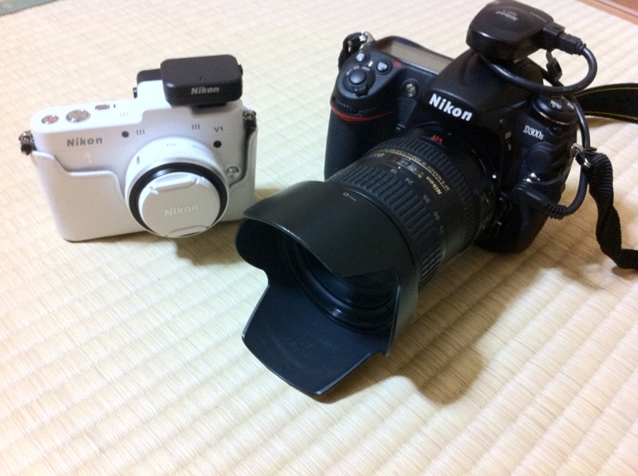
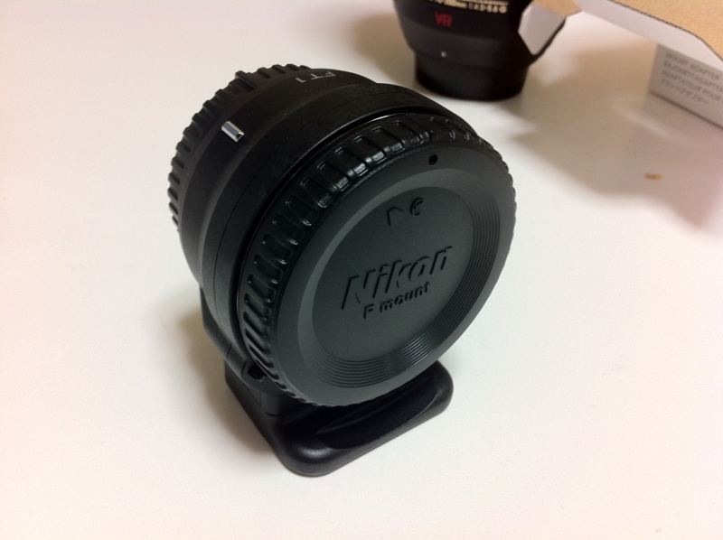
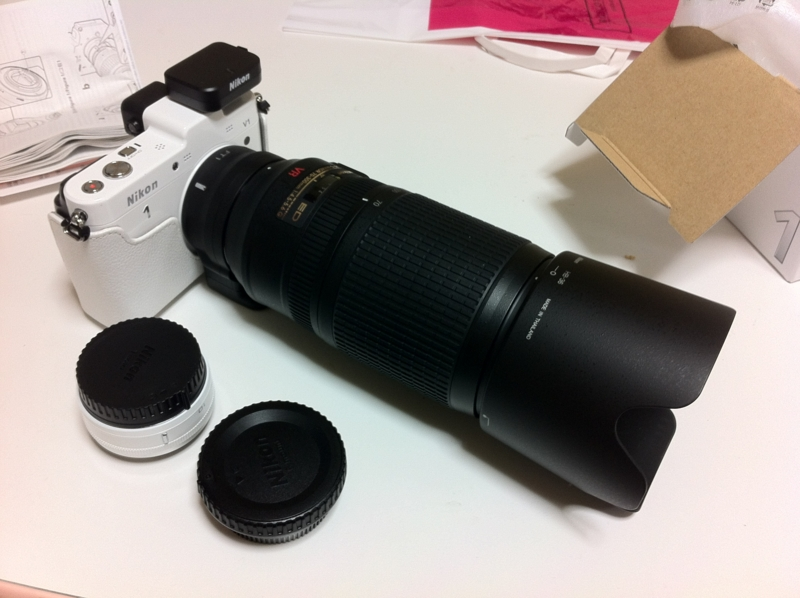

<ul>
<li><a href="http://daruyanagi.hatenablog.com/entry/2012/06/24/174143">&#x304A;&#x3063;&#x3055;&#x3093;&#x4E8C;&#x4EBA;&#x3067;&#x897F;&#x4F0A;&#x8C46;&#x306B;&#x884C;&#x3063;&#x3066;&#x304D;&#x305F;&#x3002; - &#x3060;&#x308B;&#x308D;&#x3050;</a></li>
<li><a href="http://daruyanagi.hatenablog.com/entry/2012/06/24/183810">&#x9EC4;&#x91D1;&#x306E;&#x56FD;&#x30B8;&#x30D1;&#x30F3;&#x30B0;&#x304C;&#x8A87;&#x308B;&#x30A8;&#x30EB;&#x30FB;&#x30C9;&#x30E9;&#x30C9;&#x3001;&#x571F;&#x80A5;&#x91D1;&#x5C71;&#x3078;&#x6F5C;&#x5165;&#x3002;&#x305D;&#x3053;&#x3067;&#x76EE;&#x306B;&#x3057;&#x305F;&#x3082;&#x306E;&#x306F;&hellip;&hellip;&#xFF01; - &#x3060;&#x308B;&#x308D;&#x3050;</a></li>
<li><a href="http://daruyanagi.hatenablog.com/entry/2012/06/24/211414">&#x4E8C;&#x5EA6;&#x7F8E;&#x5473;&#x3057;&#x3044;&#x3002; - &#x3060;&#x308B;&#x308D;&#x3050;</a></li>
<li><a href="http://daruyanagi.hatenablog.com/entry/2012/06/25/032051">&#x9732;&#x5929;&#x98A8;&#x5442;&#x3068;&#x99D0;&#x5728;&#x3055;&#x3093;&#x3002; - &#x3060;&#x308B;&#x308D;&#x3050;</a></li>
<li><a href="http://daruyanagi.hatenablog.com/entry/2012/06/25/074624">&#x5BBF;&#x3067;&#x98DF;&#x3079;&#x3066;&#x5BDD;&#x308B;&#x3002; - &#x3060;&#x308B;&#x308D;&#x3050;</a></li>
</ul>
この前の伊豆旅行で活躍した <a class="keyword" href="http://d.hatena.ne.jp/keyword/Nikon">Nikon</a> <a class="keyword" href="http://d.hatena.ne.jp/keyword/D300s">D300s</a> と <a class="keyword" href="http://d.hatena.ne.jp/keyword/Nikon">Nikon</a> 1 V1。 

<a href="http://daruyanagi.hatenablog.com/entry/2012/06/06/052011">Nikon 1 V1 &#x3092;&#x3052;&#x3063;&#x3068;&#x306A;&#x3046; - &#x3060;&#x308B;&#x308D;&#x3050;</a>

<a class="keyword" href="http://d.hatena.ne.jp/keyword/Nikon">Nikon</a> 1  （ニコイチ）を選んだのは、「何も考えずにサッと綺麗な写真を撮る」ため。 <a class="keyword" href="http://d.hatena.ne.jp/keyword/Nikon">Nikon</a> <a class="keyword" href="http://d.hatena.ne.jp/keyword/D300s">D300s</a> みたいな一眼レフはマニュアルでいろいろいじれるのがいいけれど、正直まだよくわかんないところがあるので、単に記録するだけならばニコイチみたいにすべて賢く・オートでやってくれる方が確実性が高い。

<a href="http://www.amazon.co.jp/exec/obidos/ASIN/B005OD1DH2/bestylesnet-22/">Nikon マウントアダプター FT1</a>
<ul><li>出版社/メーカー: ニコン</li><li>発売日: 2011/12/22</li><li>メディア: エレクトロニクス</li><li>購入: 1人 クリック: 27回</li><li><a href="http://d.hatena.ne.jp/asin/B005OD1DH2/bestylesnet-22" target="_blank">この商品を含むブログ (4件) を見る</a></li></ul>

もうひとつは、これ。純正レンズアダプターの存在。これがあれば、手持ちのレンズをニコイチでも使いまわせる。

ﾄﾞ━━━━m9(ﾟ∀ﾟ)━━━━ﾝ!! 

70-300mm をつけたところ。<a class="keyword" href="http://d.hatena.ne.jp/keyword/FX%A5%D5%A5%A9%A1%BC%A5%DE%A5%C3%A5%C8">FXフォーマット</a>で810mm換算（2.7倍）になる。ワイルドだろぉ？

実際のところ、付け替えは面倒くさいし、オートフォーカスはAF-Sシリーズのレンズのみ、中央一点、AF-S（シングルAF）のみといった制限があるので、それほど実用的ではない。でも、こういうことができるってだけでちょっとドキドキする。

とりあえず、飛行機を撮るなどといった用途には使えそう。コックピットに座るパイロットの鼻毛まで写してやるぜ！（無理

<a href="http://www.amazon.co.jp/exec/obidos/ASIN/B005OD1DHM/bestylesnet-22/">Nikon GPSユニット GP-N100</a>
<ul><li>出版社/メーカー: ニコン</li><li>発売日: 2011/10/20</li><li>メディア: エレクトロニクス</li><li> クリック: 4回</li><li><a href="http://d.hatena.ne.jp/asin/B005OD1DHM/bestylesnet-22" target="_blank">この商品を含むブログを見る</a></li></ul>

あと、GPS 。<a class="keyword" href="http://d.hatena.ne.jp/keyword/D300s">D300s</a> にもつけているけど、 GPS 大好き。これのために J1 じゃなくてアクセサリーポート付きの V1 を選択したぐらいですよ。 <a class="keyword" href="http://d.hatena.ne.jp/keyword/iPad">iPad</a> へ画像をインポートした時に、写真が地図にマッピングされるのが楽しい。ぶっちゃけ、これは内蔵機能であってほしいとすら思う。

