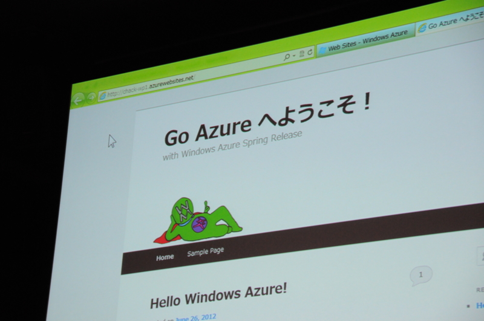
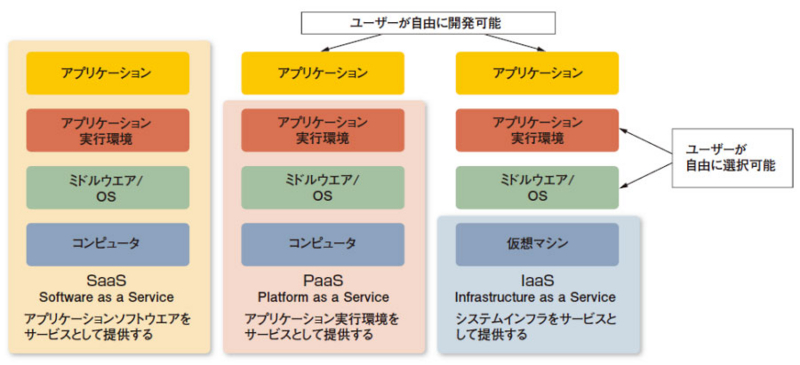
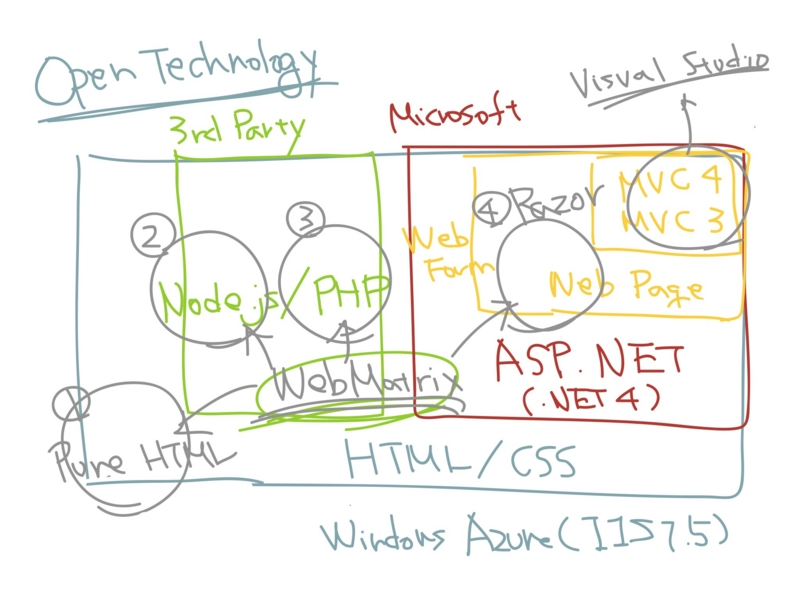

<a href="http://msdn.microsoft.com/ja-jp/windowsazure/jj129528.aspx">Widows Azure &#x30E6;&#x30FC;&#x30B6;&#x30FC; &#x30B3;&#x30DF;&#x30E5;&#x30CB;&#x30C6;&#x30A3; &#x30A4;&#x30D9;&#x30F3;&#x30C8; &ldquo;Go Azure&rdquo; | MSDN</a> 行ってきました！　2日目はいろいろあって……行くつもりで家は出たけど、結局そのまま帰って自宅観戦しました。まぁ、会いたい人には昨日会えたし、オンライン参戦でもいいかなと。

よく考えたら、写真を使っていいのか聞くの忘れたんで<a href="#f1" name="fn1" title="2日目にプレス以外は記録禁止とのお達しを聞いて初めて気付いた。自分は一応一般参加のつもり。">*1</a>、こっそり使っても大丈夫そうなのを1枚だけ掲げておきます。個人的なクライマックスもコレだったかな？（笑　

今までやってみたいとは思っていたのだけど、なんとなく後回しになっていた <a class="keyword" href="http://d.hatena.ne.jp/keyword/Windows%20Azure">Windows Azure</a> ですが、「そろそろ本格的に始めるべきだなぁ」と思わせる内容でした。

（<a href="http://itpro.nikkeibp.co.jp/article/COLUMN/20110204/356917/">&#x30AF;&#x30E9;&#x30A6;&#x30C9;&#x5148;&#x9032;&#x4E8B;&#x4F8B;&#x306B;&#x898B;&#x308B;PaaS/IaaS&#x3092;&#x9078;&#x3093;&#x3060;&#x7406;&#x7531; - &#x81EA;&#x524D;&#x306E;&#x30A2;&#x30D7;&#x30EA;&#x3082;&#x52D5;&#x304F;&#x300C;PaaS&#x578B;&#x300D;&#x300C;IaaS&#x578B;&#x300D;&#x8E8D;&#x9032;&#xFF1A;ITpro</a> より引用）

よくこの業界では <a class="keyword" href="http://d.hatena.ne.jp/keyword/SaaS">SaaS</a> / PaaS / IaaS というそうですけど（この言葉は昔勉強会で @normalian さんに教えてもらった気がします）、 <a class="keyword" href="http://d.hatena.ne.jp/keyword/Windows%20Azure">Windows Azure</a> では PaaS / IaaS という部分を扱うみたいですね。

<ul>
<li><a class="keyword" href="http://d.hatena.ne.jp/keyword/SaaS">SaaS</a>：<a class="keyword" href="http://d.hatena.ne.jp/keyword/Hotmail">Hotmail</a> / <a class="keyword" href="http://d.hatena.ne.jp/keyword/SkyDrive">SkyDrive</a> / Office Web Apps など</li>
<li><b>PaaS</b>：Web サイト（HTML / <a class="keyword" href="http://d.hatena.ne.jp/keyword/ASP.NET">ASP.NET</a> / <a class="keyword" href="http://d.hatena.ne.jp/keyword/PHP">PHP</a> / node.js）</li>
<li><b>IaaS</b>：Vertual Machine（Windows / <a class="keyword" href="http://d.hatena.ne.jp/keyword/Linux">Linux</a>）</li>
</ul>
そのほかにも、 <a class="keyword" href="http://d.hatena.ne.jp/keyword/SQL">SQL</a> データベース、仮想ネットワークなんてのもあるらしい。自社で管理しているサーバー（オンプレミス）と <a class="keyword" href="http://d.hatena.ne.jp/keyword/Windows%20Azure">Windows Azure</a> の境目がどんどんなくなって、違いは実体がどこにあるかというだけ。その点、<a class="keyword" href="http://d.hatena.ne.jp/keyword/%B9%B6%B3%CC%B5%A1%C6%B0%C2%E2">攻殻機動隊</a>みたいだなぁ、などというちょっと斜め上な感想も抱いたり。あとは人間がクラウドに行くだけだ！

それはともかく。

初心者やホビー<a class="keyword" href="http://d.hatena.ne.jp/keyword/%A5%D7%A5%ED%A5%B0%A5%E9%A5%DE">プログラマ</a>ーにおすすめなのは、断然 Web サイト です。すでになじみのある<a class="keyword" href="http://d.hatena.ne.jp/keyword/%A5%EC%A5%F3%A5%BF%A5%EB%A5%B5%A1%BC%A5%D0">レンタルサーバ</a>ーと使い勝手はほぼ一緒で、こと管理ポータルに至っては、それらよりもずっと使いやすい。バックボーンは Microsoft の仮想化技術なので、そんじゃそこらの<a class="keyword" href="http://d.hatena.ne.jp/keyword/%A5%DB%A5%B9%A5%C6%A5%A3%A5%F3%A5%B0">ホスティング</a>サービスには負けない品質がある。そして、その利用をバックアップしてくれる素敵なツール「<a class="keyword" href="http://d.hatena.ne.jp/keyword/WebMatrix">WebMatrix</a> 2」がある。

先ほどの図の PaaS の「アプリケーション」のところを拡大し（てぐちゃぐちゃにし）たと思ってください。辛うじてわかるとおり、「WebMatxix 2」では、大きく分けて4つのテクノロジーが利用できる。

<ol>
<li>Pure HTML</li>
<li>Node.js</li>
<li><a class="keyword" href="http://d.hatena.ne.jp/keyword/PHP">PHP</a></li>
<li>Razor</li>
</ol>
個人的に一番おすすめなのは Pure HTML または Razor （<a class="keyword" href="http://d.hatena.ne.jp/keyword/ASP.NET">ASP.NET</a> Web Pages）かな。 <a class="keyword" href="http://d.hatena.ne.jp/keyword/HTML5">HTML5</a>/CSS3（Pure HTML）で書くところからはじめて、変数とテンプレート、初歩的なデータベースが使いたくなれば Razor へ進めばいい。もっと大規模なWebサイトであれば、 <a class="keyword" href="http://d.hatena.ne.jp/keyword/ASP.NET%20MVC">ASP.NET MVC</a> が利用できるけど、これはちょっと個人用途にはデカすぎる気がした<a href="#f2" name="fn2" title="その中間に、 Ruby で言えば Sinatra とか、軽いフレームワークがあればいいなぁ、と思う">*2</a>。仮想化だのクラウドだのという言葉を忘れて、 HTML ファイルひとつ、ぽつんと Azure Web Sites に置くところから始めてもらえればと。

それでも足りない機能があるならば Vertual Machine で一から環境を作ることもできる。たとえば、今のところ <a class="keyword" href="http://d.hatena.ne.jp/keyword/Ruby%20on%20Rails">Ruby on Rails</a> は Web サイトで提供されていないけれど<a href="#f3" name="fn3" title="ASP.NET上で何とかできるかもしれない">*3</a>、<a class="keyword" href="http://d.hatena.ne.jp/keyword/Linux">Linux</a> + <a class="keyword" href="http://d.hatena.ne.jp/keyword/Apache">Apache</a> + <a class="keyword" href="http://d.hatena.ne.jp/keyword/Ruby">Ruby</a> + DB が使える Vertual Machine を <a class="keyword" href="http://d.hatena.ne.jp/keyword/Windows%20Azure">Windows Azure</a> 上に用意して80番ポートを開けてやれば<a href="#f4" name="fn4" title="Azure ではエンドポイントというらしい">*4</a>使えるはず。まぁ、できるってだけで、一般的な利用であれば Web サイトで十分といった感じ。

<a href="#fn1" name="f1" class="footnote-number">*1</a>:2日目にプレス以外は記録禁止とのお達しを聞いて初めて気付いた。自分は一応一般参加のつもり。

<a href="#fn2" name="f2" class="footnote-number">*2</a>:その中間に、 <a class="keyword" href="http://d.hatena.ne.jp/keyword/Ruby">Ruby</a> で言えば <a class="keyword" href="http://d.hatena.ne.jp/keyword/Sinatra">Sinatra</a> とか、軽い<a class="keyword" href="http://d.hatena.ne.jp/keyword/%A5%D5%A5%EC%A1%BC%A5%E0%A5%EF%A1%BC%A5%AF">フレームワーク</a>があればいいなぁ、と思う

<a href="#fn3" name="f3" class="footnote-number">*3</a>:<a class="keyword" href="http://d.hatena.ne.jp/keyword/ASP.NET">ASP.NET</a>上で何とかできるかもしれない

<a href="#fn4" name="f4" class="footnote-number">*4</a>:Azure ではエンドポイントというらしい

