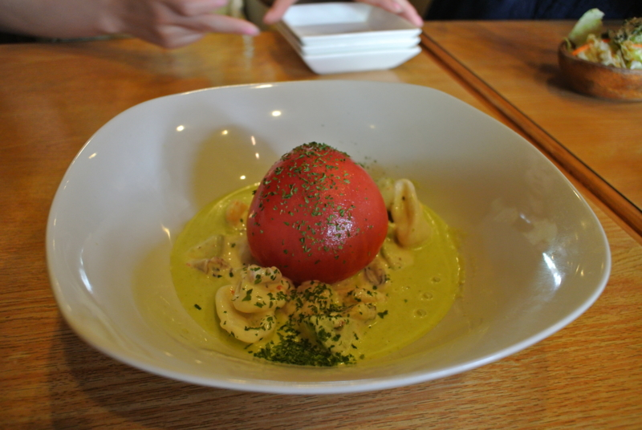
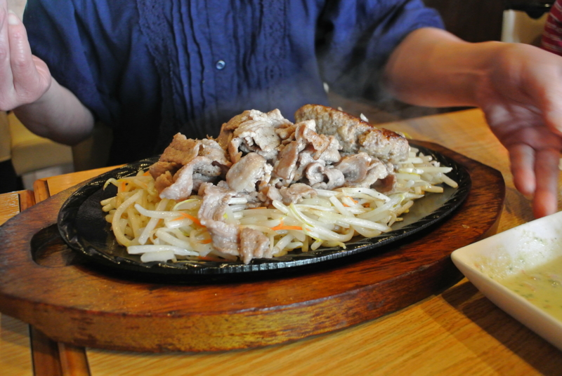
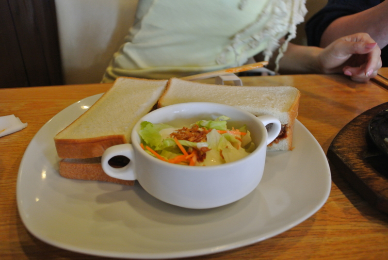
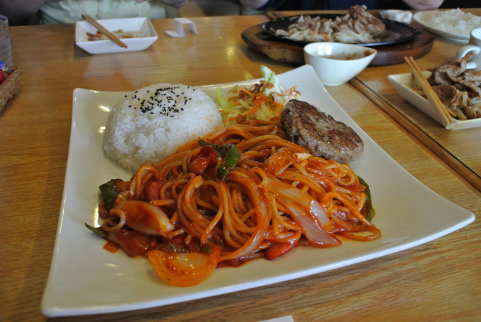

日曜日のお昼は、おかんの機嫌を取るために外でランチ。なぜか妹もついてきた。「ハンバーグ屋」というそのものズバリな名前のハンバーグ屋さん。

おかんは「<a class="keyword" href="http://d.hatena.ne.jp/keyword/%A5%AC%A5%C6%A5%F3">ガテン</a>セット」というのを選択。頼んでから豚が多すぎるといって、僕のほうに2/3ぐらい分けてくれた。<a class="keyword" href="http://d.hatena.ne.jp/keyword/%A5%AC%A5%C6%A5%F3">ガテン</a>系なめ過ぎ。

妹は数回ここに通っているということもあって、適切なメニューをチョイス。ちょっと食べさせてもらったけど、ソースがしみていながらパリッとしたカツがなかなかサンドイッチでした。

自分はパス<a class="keyword" href="http://d.hatena.ne.jp/keyword/%A5%BF%A5%BB%A5%C3%A5%C8">タセット</a>をチョイス。けど、これ……想像していたのと、ナポリタンとハンバーグの分量が逆なんですけど！！　おかんがくれたブタも完食したので、おなかがいっぱいでいっぱいで、危うく死ぬところだった。

でも、ここはリーズナブルでいいな。ハンバーグ屋さんなので、やっぱりハンバーグを頼むのがおすすめ。

