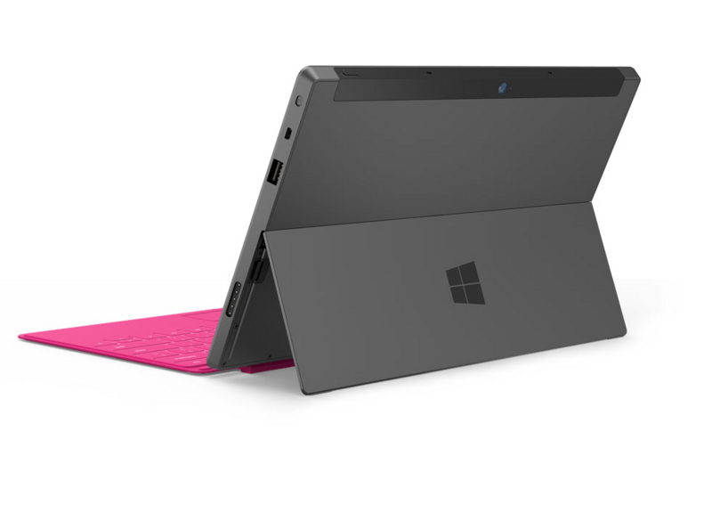
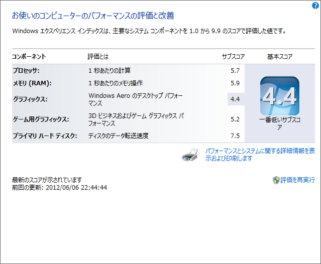
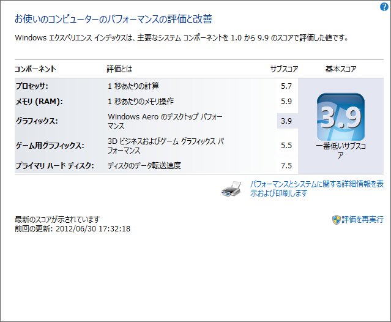

世の中の本命はこれ（<a href="http://japanese.engadget.com/2012/06/18/surface/">&#x901F;&#x5831;&#xFF1A;&#x30DE;&#x30A4;&#x30AF;&#x30ED;&#x30BD;&#x30D5;&#x30C8; Surface &#x30BF;&#x30D6;&#x30EC;&#x30C3;&#x30C8;&#x767A;&#x8868;&#x3001;Windows 8&#x3068;&#x540C;&#x6642;&#x767A;&#x58F2; - Engadget Japanese</a>）だろうけど、どうやら 3G 対応版が手に入るのは来年に持ち越しになるような気配も無きにしも非ず。僕が Samsung Series 7 Slate を買った（<a href="http://daruyanagi.hatenablog.com/entry/2012/06/07/081352">Samsung Series 7 Slate &#x306E;&#x958B;&#x5C01;&#x5F0F; - &#x3060;&#x308B;&#x308D;&#x3050;</a>）のは間違いではないと言い聞かせる毎日です。クレードルまで追加で買っちまったしな（<a href="http://daruyanagi.hatenablog.com/entry/2012/06/19/222214">S7S &#x306E;&#x30AF;&#x30EC;&#x30FC;&#x30C9;&#x30EB;&#x304C; &#xFF77;&#xFF80;&#x2501;&#x2501;&#x2501;&#x2501;(&#xFF9F;&forall;&#xFF9F;)&#x2501;&#x2501;&#x2501;&#x2501;!! - &#x3060;&#x308B;&#x308D;&#x3050;</a>）。

その S7S ですが、現在昇天中のメインPC（<a href="http://daruyanagi.hatenablog.com/entry/2012/06/30/164750">&#x518D;&#x3073;&#x30E1;&#x30A4;&#x30F3;PC&#x306E;&#x96FB;&#x6E90;&#x3001;&#x6B7B;&#x4EA1;&#x3002; - &#x3060;&#x308B;&#x308D;&#x3050;</a>）に代わって大活躍中。メインマシンとしてもそこそこバリバリ使えるので心強い。

ただ、たまにフリーズする。マウスカーソルだけは動くのだが。 OS がまだプレリリースのものだし、ドライバーもそろってないし、それはそれで仕方のないことだけど、とりあえず Intel のベータドライバがアップデートされたみたいなので、それだけは試してみることにした。

 （2012/06/08 15.28.0.64.2770）

オーディオドライバーも同梱されていた。とりあえず、 WEI を確認してみる。

導入前。

導入後。

一瞬えらい数値が下がったなぁと思ったけど、それは Aero グラフィックスの項目だけで、ゲームグラフィックの項目はむしろ上がっている。 Windows 8 のリリース版では Aero が削除されるため（<a href="http://internet.watch.impress.co.jp/docs/news/20120522_534471.html">Microsoft&#x3001;Windows 8&#x306E;&#x30C7;&#x30B9;&#x30AF;&#x30C8;&#x30C3;&#x30D7;&#x3067;&#x306F;&#x300C;Aero&#x300D;&#x3092;&#x5EC3;&#x6B62; -INTERNET Watch</a>）、それにあわせたチューニングがなされているのかもしれない。知らんけど。

ただ、これでもフリーズは治らない。ちょっと困った。

実はこの不具合、海外のサイトでも多少話題になっている（<a href="http://www.withinwindows.com/2012/06/26/more-info-about-the-windows-8-release-preview-freezing-issue/">  More info about the Windows 8 Release Preview freezing issue Within Windows</a>）ようで、より新しいビルドの Windows 8 では修正済みなのだそうな。一般人には手に入らないけれどね。とりあえず本番までにはなおるということで、あと2か月はこれで我慢するほかなさそうだ。

あと、ゲーム（Civilization 4）していると音が割れる。オーディオドライバーもまだまだかなっといった感じ。一般ユーザーにとっては、OSの不具合もドライバーの不具合も全部同じ「Windowsの不具合」なので、OS本体の改良はもちろん、ベンダーに働きかけてドライバーの充実・品質向上の方も頑張ってほしいなぁと思う次第です。

間に合うのかな？

