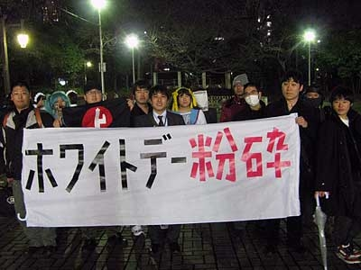

(<a href="http://www.mkimpo.com/diary/2009/anti_whiteday_09-03-14.html">&#x30DB;&#x30EF;&#x30A4;&#x30C8;&#x30C7;&#x30FC;&#x7206;&#x7815;&#x30C7;&#x30E2;</a>より引用)

「手段」として群れるのと、 
「目的」として群れるのと、 
「結果」として群れるのは、同じ群れであっても意味が違う。

個人個人の熟慮の「結果」としてのデモならば賛同するけれど、群れることでプレゼンス高めようと画策したり（手段）、自己陶酔のために群れる（目的）のはあまり好まない。

なにより、そういう不純な意思に自分を従わせるのがイヤだ。人は誰の奴隷でもないのに、ときにすすんで奴隷になろうとする。不思議でならない。

<ul>
<li><a href="http://daruyanagi.hatenablog.com/entry/2012/06/22/230953">&#x30C7;&#x30E2;&#x3088;&#x308A;&#x8EAB;&#x8FD1;&#x306A;&#x3053;&#x3068;&#x304B;&#x3089; - &#x3060;&#x308B;&#x308D;&#x3050;</a></li>
</ul>
ただ、純粋なお祭りは好きだ。

