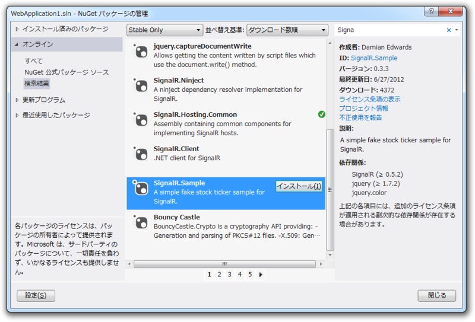
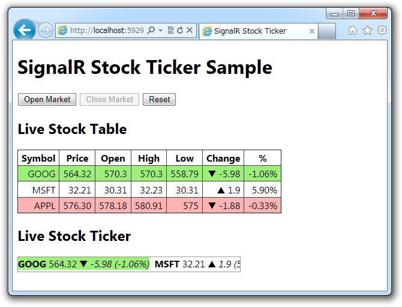
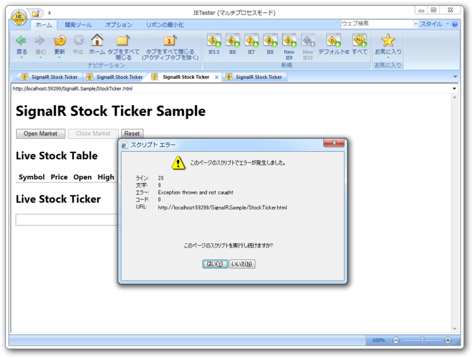
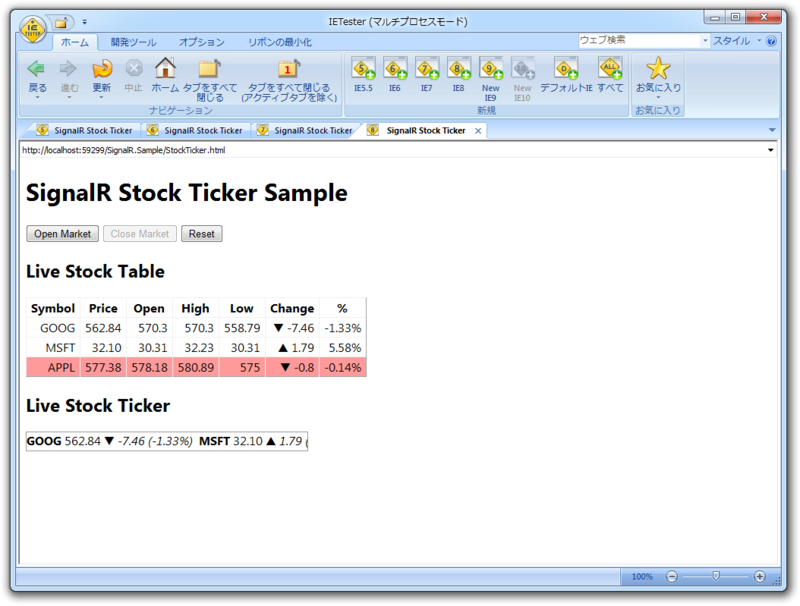
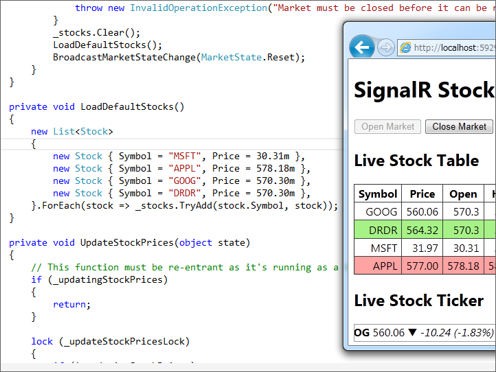

<iframe width="480" height="296" src="http://www.ustream.tv/embed/recorded/23660820" scrolling="no" frameborder="0" style="border: 0px none transparent;">    </iframe> <a href="http://www.ustream.tv/" style="padding: 2px 0px 4px; width: 400px; background: #ffffff; display: block; color: #000000; font-weight: normal; font-size: 10px; text-decoration: underline; text-align: center;" target="_blank">Video streaming by Ustream</a>

<blockquote cite="http://d.hatena.ne.jp/shiba-yan/20120702/1341200408">

イベントの方向とタイトル的に <a class="keyword" href="http://d.hatena.ne.jp/keyword/ASP.NET">ASP.NET</a> 全体を少しずつ喋る形にしたのですが、SignalR だけで 45 分話してもいけたかなという印象を持ちました。

<cite><a href="http://d.hatena.ne.jp/shiba-yan/20120702/1341200408">Go Azure &#x304A;&#x75B2;&#x308C;&#x69D8;&#x3067;&#x3057;&#x305F; - &#x307E;&#x3081;&#x3057;&#x3070;&#x96D1;&#x8A18;</a></cite>
</blockquote>

あんまりまだよくわかってないけど、あのデモは結構興味惹かれたかも。

<blockquote cite="http://blogs.msdn.com/b/tsmatsuz/archive/2012/04/27/signalr-websocket-development-and-cross-browser-compatibility.aspx">

SignalR は、このあと見て行くように、単なる WebSocket 開発のためだけのライブラリーではなく、さらに多くの付加価値を含んだ上位の<a class="keyword" href="http://d.hatena.ne.jp/keyword/%A5%D5%A5%EC%A1%BC%A5%E0%A5%EF%A1%BC%A5%AF">フレームワーク</a>です。抽象度も高く、日本語の<a class="keyword" href="http://d.hatena.ne.jp/keyword/%A5%A8%A5%F3%A5%B3%A1%BC%A5%C9">エンコード</a>など含めプリミティブな処理を開発者が記述する必要はありません。

<cite><a href="http://blogs.msdn.com/b/tsmatsuz/archive/2012/04/27/signalr-websocket-development-and-cross-browser-compatibility.aspx">
WebSocket &#x30B5;&#x30FC;&#x30D0;&#x30FC;&#x958B;&#x767A; : SignalR &#x3068;&#x30AF;&#x30ED;&#x30B9; &#x30D6;&#x30E9;&#x30A6;&#x30B6;&#x30FC;&#x3078;&#x306E;&#x5BFE;&#x5FDC; - &#x677E;&#x5D0E; &#x525B; Blog - Site Home - MSDN Blogs
</a></cite>
</blockquote>

<blockquote cite="http://d.hatena.ne.jp/shiba-yan/20120314/1331650899">

SignalR という非同期でリアルタイムな双方向通信を実現するライブラリが面白そうなので試してみました。作者は <a class="keyword" href="http://d.hatena.ne.jp/keyword/ASP.NET">ASP.NET</a> チームの Damian Edwards 氏と David Fowler 氏です。

<cite><a href="http://d.hatena.ne.jp/shiba-yan/20120314/1331650899">SignalR &#x3092;&#x7C21;&#x5358;&#x306B;&#x4F7F;&#x3063;&#x3066;&#x307F;&#x305F; - &#x307E;&#x3081;&#x3057;&#x3070;&#x96D1;&#x8A18;</a></cite>
</blockquote>

二日目はオンライン参加だったので、セッションが終わってすぐ手元のPCで実際にサンプルを試してみた。

まず、 NuGet で SignalR のサンプルをインストール。依存関係のあるものも自動ででろでろっとダウンロード・インストールされる。

サンプルは株価の上がり下がりを表示するもので、サーバー側からデータが送られてきてクライアント側（Webブラウザー）の表示が更新されるという、要はプッシュ通知のデモになっている。見てるだけでもちょっと楽しい。

SignalR のもう一つのキモは、ブラウザーが対応する技術に応じて Web Socket やフレームを使い分けてくれるところ。これを確かめるために、今回は「IE Tester」というツールを利用してみた。

<a href="http://my-debugbar.com/wiki/IETester/HomePage">My DebugBar | IETester / Browser Compatibility Check for Internet Explorer Versions from 5.5 to 10 </a>

本当は<a class="keyword" href="http://d.hatena.ne.jp/keyword/%B2%BE%C1%DB%A5%DE%A5%B7%A5%F3">仮想マシン</a>環境でも用意すべきなんだろうけど、さすがにそれは面倒だった。ちなみに、 Microsoft では IE の旧バージョンをテストするための仮想環境を用意しているので、空き時間とディスク空き容量が豊富な人は試してみるとよいかもしれない。

<a href="http://www.forest.impress.co.jp/docs/news/20120416_526780.html">&#x7A93;&#x306E;&#x675C; - &#x3010;NEWS&#x3011;Microsoft&#x3001;&#x4E92;&#x63DB;&#x6027;&#x691C;&#x8A3C;&#x3092;&#x76EE;&#x7684;&#x3068;&#x3057;&#x305F;IE6/7/8/9&#x74B0;&#x5883;&#x306E;&#x4EEE;&#x60F3;&#x30DE;&#x30B7;&#x30F3;&#x30A4;&#x30E1;&#x30FC;&#x30B8;&#x3092;&#x66F4;&#x65B0;</a>

残念ながら、 <a class="keyword" href="http://d.hatena.ne.jp/keyword/IE7">IE7</a> 以下の環境では失敗したものの、

Web Socket に対応していない IE8 でも動作した。「IE Tester」が完全に旧バージョンのIEをエミュレートしているとは限らないので、これをもって <a class="keyword" href="http://d.hatena.ne.jp/keyword/IE7">IE7</a> 非対応とは言えないと思うが、まぁ、参考として。

株式会社だるだる を追加して遊んでみた。ふふふ……

