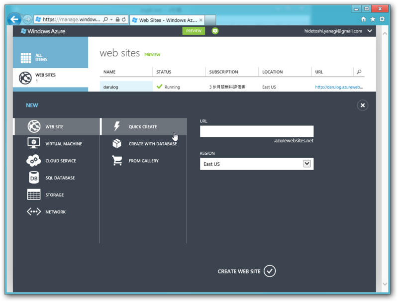
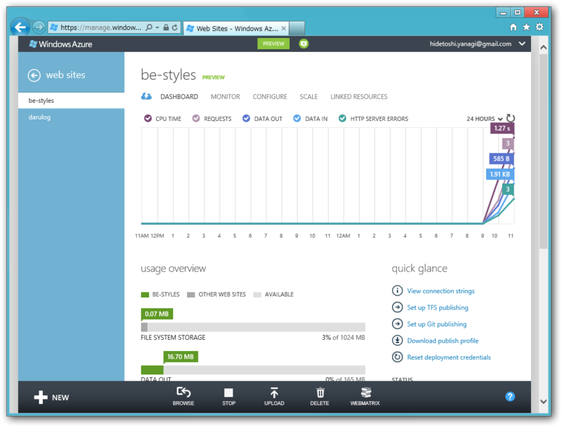
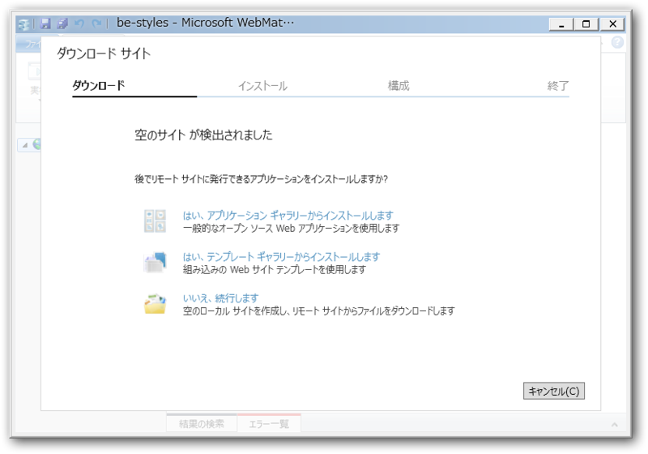
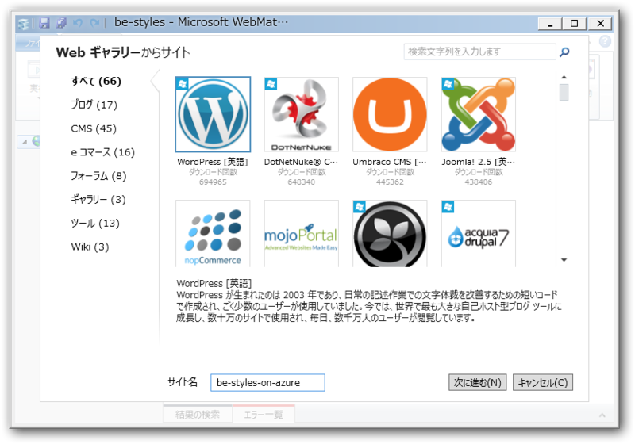
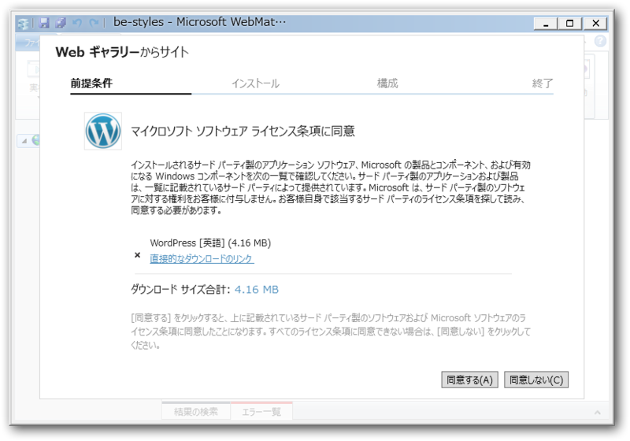
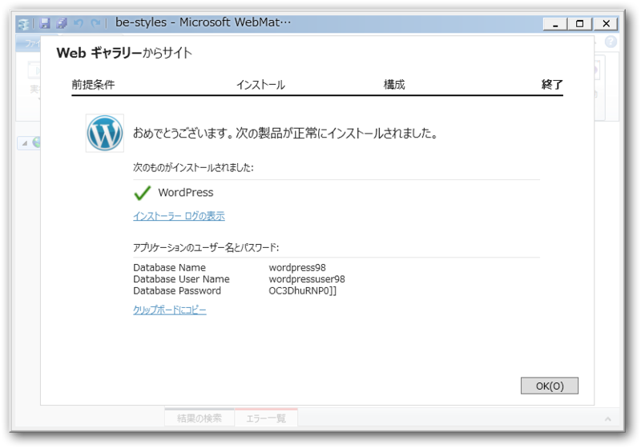
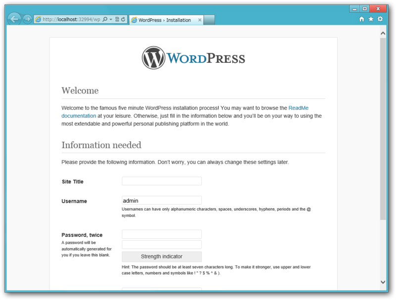
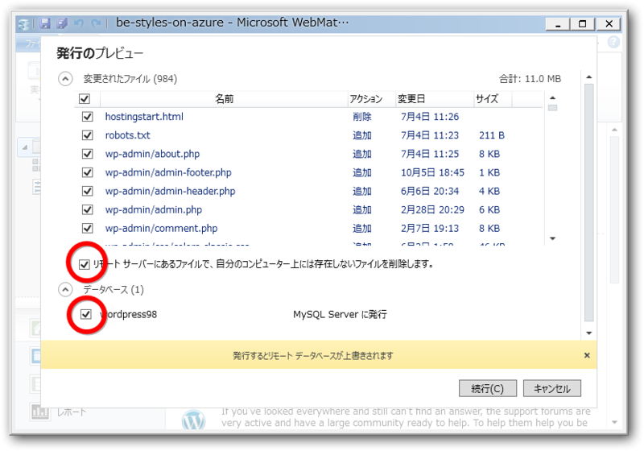
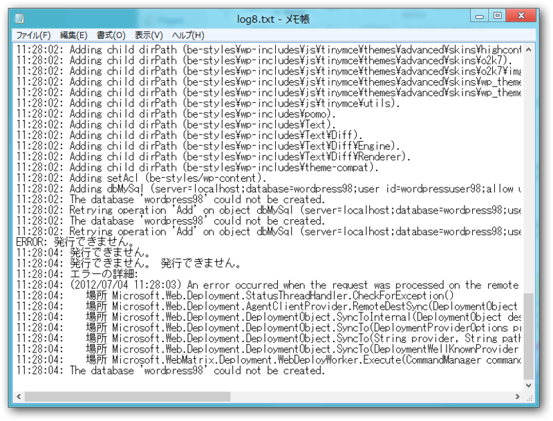
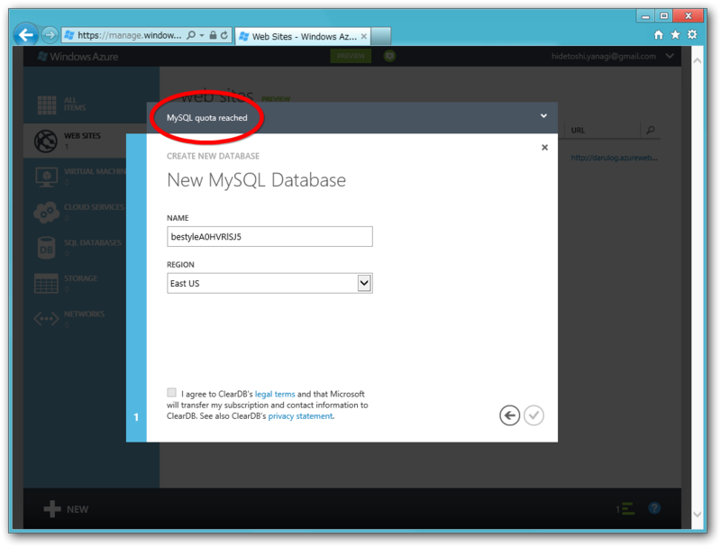

<a href="http://daruyanagi.hatenablog.com/entry/2012/06/27/005203">Windows Azure Web Sites &#x3068; WebMatrix 2 &#x306E;&#x7D44;&#x307F;&#x5408;&#x308F;&#x305B;&#x306F;&#x30DE;&#x30FC;&#x30D9;&#x30E9;&#x30B9;&#xFF01; - &#x3060;&#x308B;&#x308D;&#x3050;</a> では、

<blockquote>

Azure で <a class="keyword" href="http://d.hatena.ne.jp/keyword/WordPress">WordPress</a> を導入した Web サイトを作成 → <a class="keyword" href="http://d.hatena.ne.jp/keyword/WebMatrix">WebMatrix</a> 2 でローカルにダウンロード → ごにょごにょして Azure へデプロイ

</blockquote>

という方法をとったけど、

<blockquote>

Azure で空の Web サイトを作成 → <a class="keyword" href="http://d.hatena.ne.jp/keyword/WebMatrix">WebMatrix</a> 2 でローカルにダウンロード → <a class="keyword" href="http://d.hatena.ne.jp/keyword/WordPress">WordPress</a> をインストールしてごにょごにょして Azure へデプロイ

</blockquote>

ということも可能らしい。 <a href="http://daruyanagi.hatenablog.com/entry/2012/06/30/211729">#GoAzure &#x306B;&#x884C;&#x3063;&#x3066;&#x304D;&#x307E;&#x3057;&#x305F;&#xFF01; - &#x3060;&#x308B;&#x308D;&#x3050;</a> ではそうしてた気がする。

とういうことで、やってみた。

<h3><a class="keyword" href="http://d.hatena.ne.jp/keyword/Windows%20Azure">Windows Azure</a> Web サイトの作成</h3>

Quick Create で新規 Web サイトを作成。

右下にある［<a class="keyword" href="http://d.hatena.ne.jp/keyword/WebMatrix">WebMatrix</a>］ボタンを押すと、「<a class="keyword" href="http://d.hatena.ne.jp/keyword/WebMatrix">WebMatrix</a> 2」が起動して Azure 上の Web サイトがローカルにダウンロードされる。初回はコ<a class="keyword" href="http://d.hatena.ne.jp/keyword/%A5%CD%A5%AF%A5%BF%A1%BC">ネクター</a>アプリをインストールする必要があると思う。

<h3><a class="keyword" href="http://d.hatena.ne.jp/keyword/WebMatrix">WebMatrix</a> 2 で <a class="keyword" href="http://d.hatena.ne.jp/keyword/WordPress">WordPress</a> のインストール</h3>

「空のサイトやで！」と言われるので……

<a class="keyword" href="http://d.hatena.ne.jp/keyword/WordPress">WordPress</a> をインストールする。何回も言わしてもらうけど、めっさ簡単やから。

インストール完了！

一度実行して、初回設定を済ましておこう。ついでに最新版へのアップデートもやっておく。

<h3><a class="keyword" href="http://d.hatena.ne.jp/keyword/Windows%20Azure">Windows Azure</a> Web サイトへデプロイ</h3>

それを次は Azure へ発行！　サーバー上のファイルを削除するオプションと、データベースの内容をアップロードするオプションを有効にしておこう。

結果は……失敗！？　あれ、何がおかしいんだ…… (；´Д｀)

<pre class="code" data-unlink>11:28:02: Adding setAcl (be-styles/wp-content).
11:28:02: Adding dbMySql (server=localhost;database=wordpress98;user id=wordpressuser98;allow user variables=True).
11:28:02: The database &#39;wordpress98&#39; could not be created.
11:28:02: Retrying operation &#39;Add&#39; on object dbMySql (server=localhost;database=wordpress98;user id=wordpressuser98;allow user variables=True). Attempt 1 of 2.
11:28:02: The database &#39;wordpress98&#39; could not be created.
11:28:02: Retrying operation &#39;Add&#39; on object dbMySql (server=localhost;database=wordpress98;user id=wordpressuser98;allow user variables=True). Attempt 2 of 2.
ERROR: 発行できません。
11:28:04: 発行できません。
11:28:04: 発行できません。 発行できません。
11:28:04: エラーの詳細:
11:28:04: (2012/07/04 11:28:03) An error occurred when the request was processed on the remote computer.
11:28:04:    場所 Microsoft.Web.Deployment.StatusThreadHandler.CheckForException()
11:28:04:    場所 Microsoft.Web.Deployment.AgentClientProvider.RemoteDestSync(DeploymentObject sourceObject, DeploymentSyncContext syncContext, Nullable`1 syncPass)
11:28:04:    場所 Microsoft.Web.Deployment.DeploymentObject.SyncToInternal(DeploymentObject destObject, DeploymentSyncOptions syncOptions, PayloadTable payloadTable, ContentRootTable contentRootTable, Nullable`1 syncPassId)
11:28:04:    場所 Microsoft.Web.Deployment.DeploymentObject.SyncTo(DeploymentProviderOptions providerOptions, DeploymentBaseOptions baseOptions, DeploymentSyncOptions syncOptions)
11:28:04:    場所 Microsoft.Web.Deployment.DeploymentObject.SyncTo(String provider, String path, DeploymentBaseOptions baseOptions, DeploymentSyncOptions syncOptions)
11:28:04:    場所 Microsoft.Web.Deployment.DeploymentObject.SyncTo(DeploymentWellKnownProvider provider, String path, DeploymentBaseOptions baseOptions, DeploymentSyncOptions syncOptions)
11:28:04:    場所 Microsoft.WebMatrix.Deployment.WebDeployWorker.Execute(CommandManager commandManager, CertificateValidationService certificateValidationService, Boolean skipHiddenFiles)
11:28:04: The database &#39;wordpress98&#39; could not be created.</pre>
あんまりマーベラスな結果にならなかったけど、まぁ、こんな感じでサクッといけるはずなので……なので……

<h3>追記</h3>

もしかしたらこれが原因か……。もしかしたら［Create With Database］を選択すべきだったのかな？

