
近年どうもサポートに不安のある <a class="keyword" href="http://d.hatena.ne.jp/keyword/CoreServer">CoreServer</a> で運用していた旧ブログを、最新のクラウドプラットフォーム <a class="keyword" href="http://d.hatena.ne.jp/keyword/Windows%20Azure">Windows Azure</a> Websites に引越させたいなぁ、と思っていろいろ画策してみた。

<a class="keyword" href="http://d.hatena.ne.jp/keyword/Windows%20Azure">Windows Azure</a> の細かいところはまだよくわからないので、ここは <a class="keyword" href="http://d.hatena.ne.jp/keyword/WebMatrix">WebMatrix</a> の助けを借りようかと思う。結果的には、最後の最後で躓いちゃったけれど……惜しいところまでいったような気がする。

<h3><a class="keyword" href="http://d.hatena.ne.jp/keyword/XREA">XREA</a>/<a class="keyword" href="http://d.hatena.ne.jp/keyword/CoreServer">CoreServer</a> からデータをバックアップ</h3>

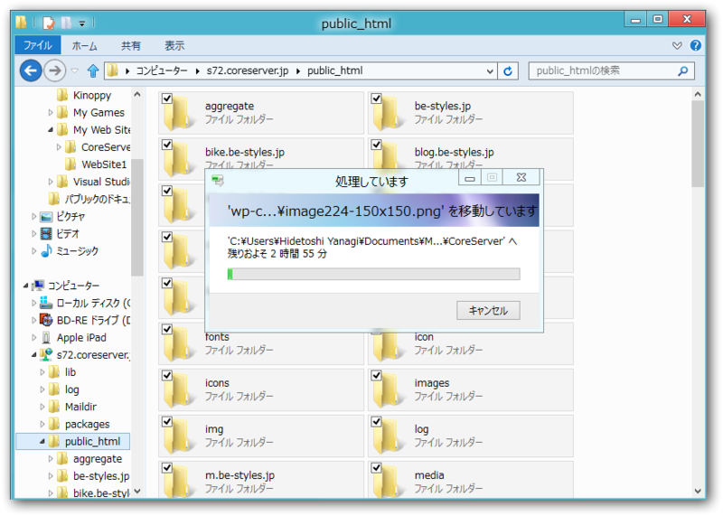

<a class="keyword" href="http://d.hatena.ne.jp/keyword/FTP">FTP</a> 接続でファイルをローカルに保存。

と、そのまえに <a class="keyword" href="http://d.hatena.ne.jp/keyword/MySQL">MySQL</a> データベースのダンプファイルを作成しておく。コントロールパネルのデータベースのところで［複製］ボタンみたいなのを押せば、ルートフォルダにダンプファイルが作成される。

<h3><a class="keyword" href="http://d.hatena.ne.jp/keyword/Windows%20Azure">Windows Azure</a> Websites で <a class="keyword" href="http://d.hatena.ne.jp/keyword/WordPress">WordPress</a> サイトを作成・ダウンロード</h3>

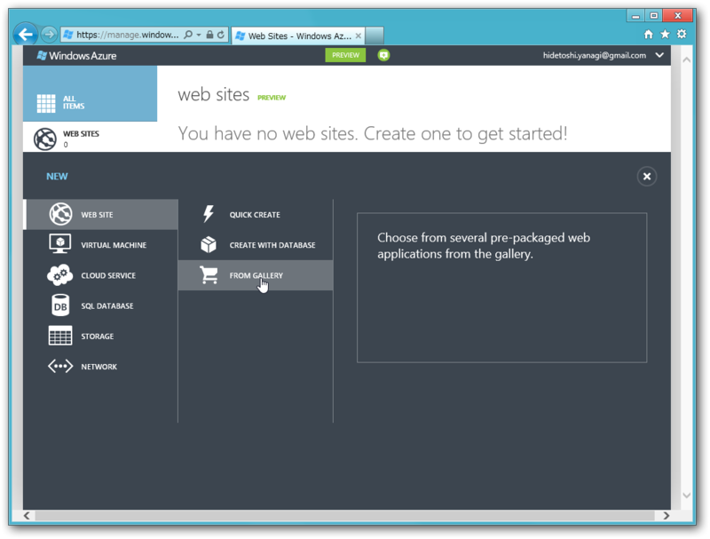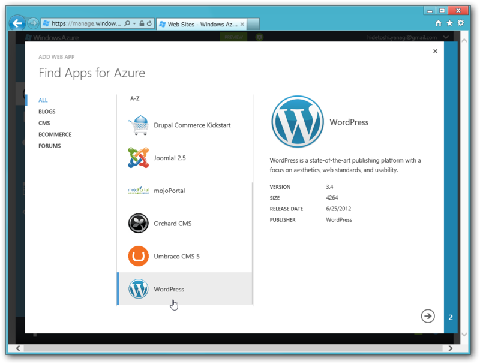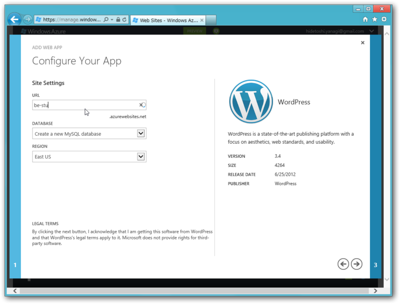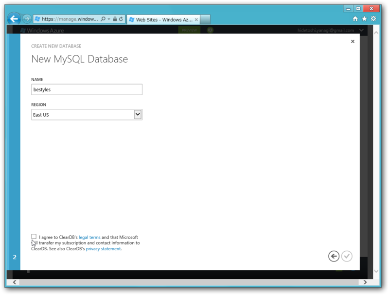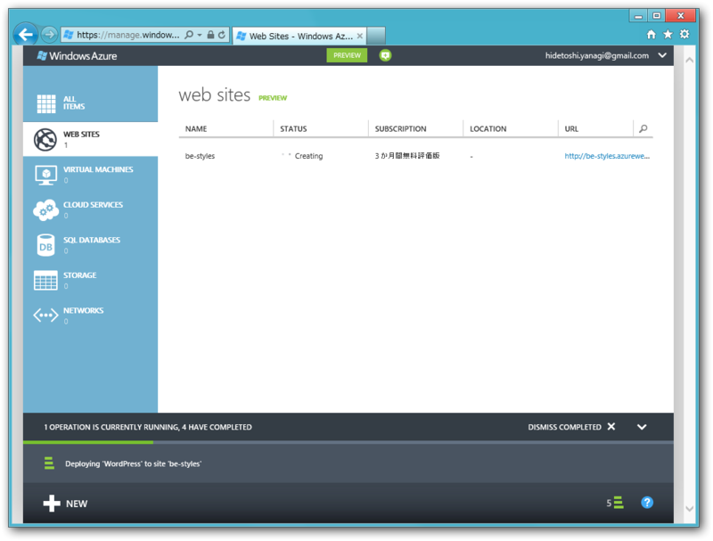

ふつーに <a class="keyword" href="http://d.hatena.ne.jp/keyword/Windows%20Azure">Windows Azure</a> Websites で <a class="keyword" href="http://d.hatena.ne.jp/keyword/WordPress">WordPress</a> サイトを作成する。

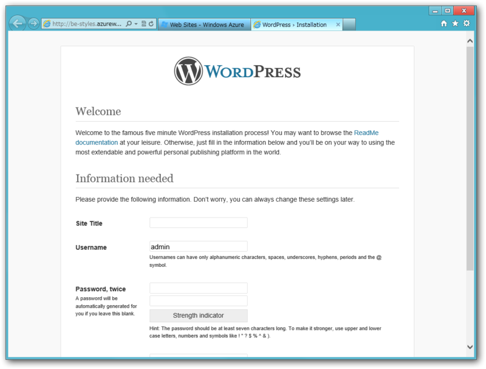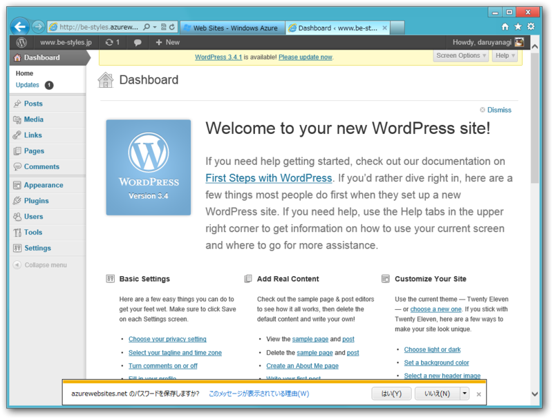

初期設定まで Azure 上でやっておいた。

あとは <a class="keyword" href="http://d.hatena.ne.jp/keyword/WebMatrix">WebMatrix</a> でローカルへダウンロード。 Web サイトのボタンからダウンロードできるはず。これで、 Azure Websites に紐づけられた空の <a class="keyword" href="http://d.hatena.ne.jp/keyword/WordPress">WordPress</a> がローカルで動作する。

<h3>ファイルのコピーとデータベースのインポート、ローカルで <a class="keyword" href="http://d.hatena.ne.jp/keyword/WordPress">WordPress</a> を動作させる</h3>

先ほどバックアップしたファイルを、Documents/Web Sites/site_name へコピー。つぎに、ダンプファイルをデータベースへインポートする。

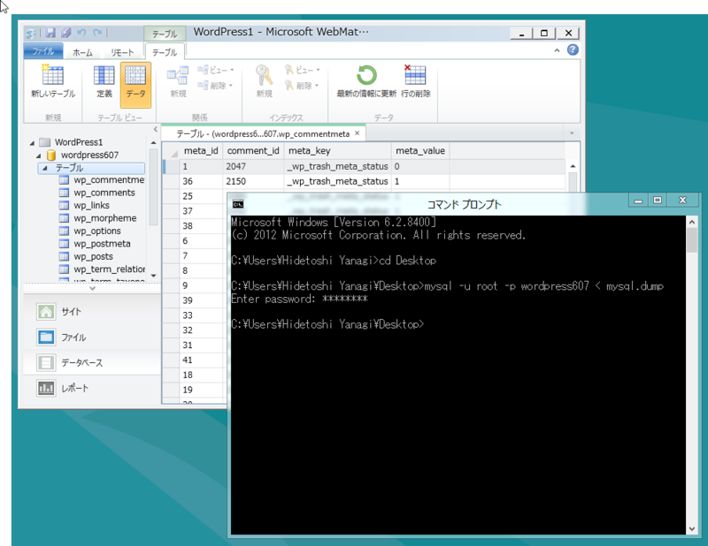

<pre class="code lang-" data-lang="" data-unlink>mysql -u root -p DB_NAME &lt; DUMP_FILE_NAME</pre>
WebMatrix のデータベースを開いて、旧Webサイトのドメインを“<a href="http://localhost:****">http://localhost:****</a>”（テスト環境の<a class="keyword" href="http://d.hatena.ne.jp/keyword/IP%A5%A2%A5%C9%A5%EC%A5%B9">IPアドレス</a>）に書き換えておこう<a href="#f1" name="fn1" title="2、3箇所あったはず">*1</a>。

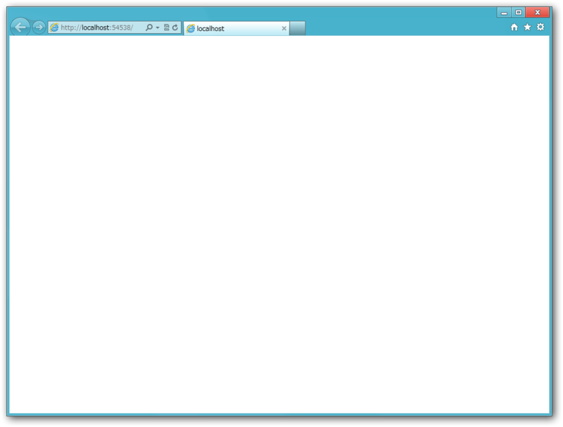

この状態で［実行］してみるが……動かない。焦るなかれ。管理画面（/wp-admin）には入れる。

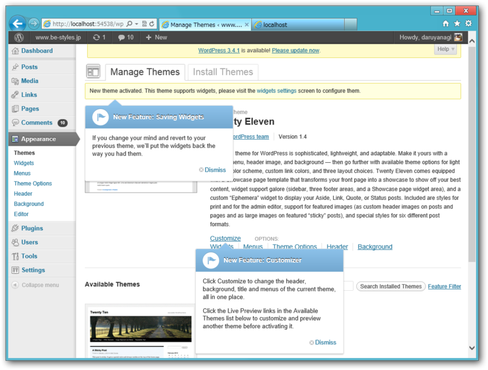

どうやらテーマファイルが認識されていないようだ。デフォルトのテーマを Activate してみる。

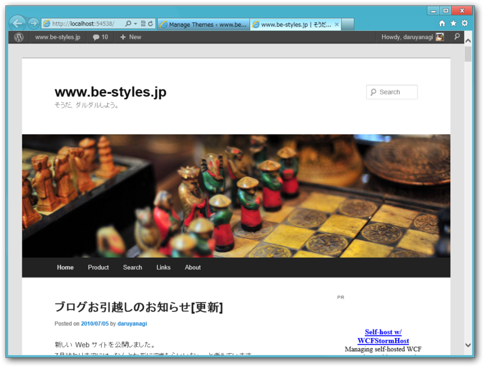

ちゃんと動いた！　<a class="keyword" href="http://d.hatena.ne.jp/keyword/WebMatrix">WebMatrix</a> では URL Rewrite が動かないようで、<a class="keyword" href="http://d.hatena.ne.jp/keyword/%A5%D1%A1%BC%A5%DE%A5%EA%A5%F3%A5%AF">パーマリンク</a>をカスタマイズしている場合、個別ページが見られないが、自分で Web.config を書き換えれば動きそうだ。これに関してはまた稿を改める。

<h3>Azure へ発行……失敗</h3>

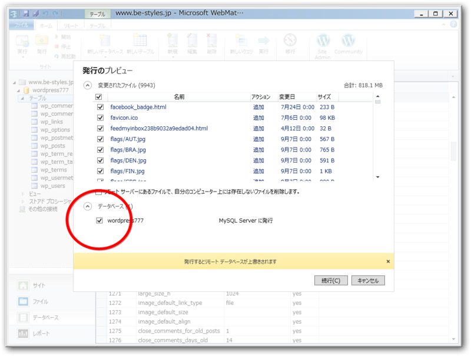

あとは <a class="keyword" href="http://d.hatena.ne.jp/keyword/Windows%20Azure">Windows Azure</a> Websites へもう一度アップロード（発行）してやれば引っ越しは完了！……のはずだが。

<pre class="code lang-" data-lang="" data-unlink>2012/07/05 0:12
0:18:17: Using ID &#39;d4c71007-****&#39; for connections to the remote server.
0:20:12: Updating setAcl (****/wp-content).
0:20:12: Using ID &#39;9e5d8bfc-****&#39; for connections to the remote server.
0:22:30: Updating setAcl (****/wp-content).
0:30:00: Adding child sqlScript (MSDeploy.Continous/dbMySql[@path=&#39;server=us-cdbr-azure-east-a.cloudapp.net;database=bestyles;user id=b7b0e016175271;allow user variables=True&#39;]/sqlScript).
0:30:00: Opening SQL Connection with connection string &#39;server=us-cdbr-azure-east-a.cloudapp.net;database=****;user id=****;allow user variables=True&#39;. The &#39;transacted&#39; setting for this connection is &#39;False&#39;.
ERROR: データベースを発行できません。詳細については、&#34;http://go.microsoft.com/fwlink/?LinkId=205387&#34; を参照してください
0:30:02: データベースを発行できません。詳細については、&#34;http://go.microsoft.com/fwlink/?LinkId=205387&#34; を参照してください
0:30:02: 発行できません。 データベースを発行できません。詳細については、&#34;http://go.microsoft.com/fwlink/?LinkId=205387&#34; を参照してください
0:30:02: エラーの詳細:
0:30:02: An error occurred during execution of the database script. The error occurred between the following lines of the script: &#34;145&#34; and &#34;255&#34;. The verbose log might have more information about the error. The command started with the following:
0:30:02: &#34;--
-- Dumping data for table `wp_morpheme`
--

LOC&#34;
0:30:02:  Packets larger than max_allowed_packet are not allowed. http://go.microsoft.com/fwlink/?LinkId=178587
0:30:02:   Learn more at: http://go.microsoft.com/fwlink/?LinkId=221672#ERROR_SQL_EXECUTION_FAILURE.
：
：</pre>
失敗してしまったみたい。“Packets larger than max_allowed_packet are not allowed”っていうのは、データがデカすぎるっていうことなのかな？

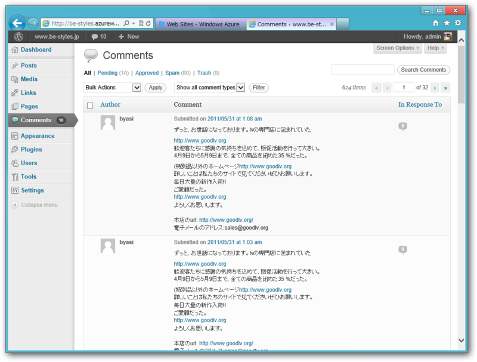

データのインポートは途中まで成功していて、コメントなどは無事インポートされていた<a href="#f2" name="fn2" title="スパムやけどな！">*2</a>。あともう少し！！

<a href="#fn1" name="f1" class="footnote-number">*1</a>:2、3箇所あったはず

<a href="#fn2" name="f2" class="footnote-number">*2</a>:スパムやけどな！

