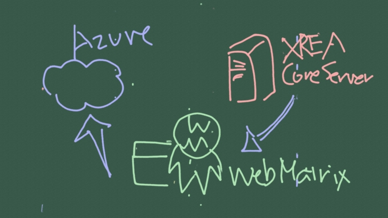
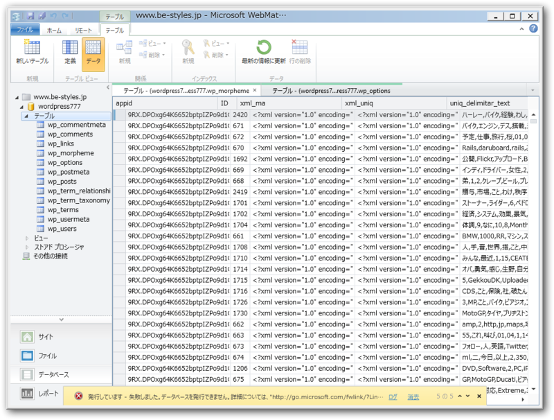
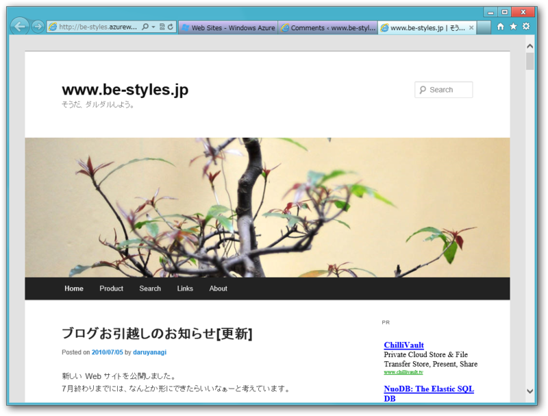
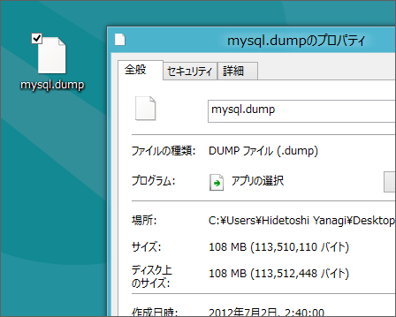

（<a class="keyword" href="http://d.hatena.ne.jp/keyword/Windows%208">Windows 8</a> の Metro アプリ「黒板」で書いてみました<a href="#f1" name="fn1" title="関係ないけど、 Sumsung Series 7 Slate/Windows 8 のタッチパネルドライバーはちょっと不安定で、時間が経過するとタッチした部分以外にも縦一直線に複数ポイント反応することがある。これではお絵かきができない……">*1</a>）

前回（<a href="http://daruyanagi.hatenablog.com/entry/2012/07/05/015015">XREA/CoreServer &#x306E; WordPress &#x3092; Windows Azure Websites &#x306B;&#x79FB;&#x690D;&#x3057;&#x3066;&#x307F;&#x308B; &rarr; &#x3042;&#x3068;&#x4E00;&#x6B69;&#x307E;&#x3067;&#x884C;&#x3051;&#x305F; - &#x3060;&#x308B;&#x308D;&#x3050;</a>）は、<a class="keyword" href="http://d.hatena.ne.jp/keyword/XREA">XREA</a>/<a class="keyword" href="http://d.hatena.ne.jp/keyword/CoreServer">CoreServer</a> の <a class="keyword" href="http://d.hatena.ne.jp/keyword/WordPress">WordPress</a> 環境をローカルに保存して、 <a class="keyword" href="http://d.hatena.ne.jp/keyword/WebMatrix">WebMatrix</a> で動作可能な状態までメンテナンスし、 <a class="keyword" href="http://d.hatena.ne.jp/keyword/Windows%20Azure">Windows Azure</a> Websites へアップロードするというフローで、 <a class="keyword" href="http://d.hatena.ne.jp/keyword/WordPress">WordPress</a> の引っ越しを目論んだ……が最後の最後で失敗した。

そのときのエラーログの一部がこれ。

<pre class="code" data-unlink>0:30:02: エラーの詳細:
0:30:02: An error occurred during execution of the database script. The error occurred between the following lines of the script: &#34;145&#34; and &#34;255&#34;. The verbose log might have more information about the error. The command started with the following:
0:30:02: &#34;--
-- Dumping data for table `wp_morpheme`</pre>
<b>wp_morpheme</b> テーブルってなんだろう。調べてみると、どうやら <a href="http://wordpress.org/extend/plugins/wordpress-23-related-posts-plugin/">WordPress &rsaquo; WordPress Related Posts &laquo; WordPress Plugins</a> というプラグインが作成する<a class="keyword" href="http://d.hatena.ne.jp/keyword/%B7%C1%C2%D6%C1%C7%B2%F2%C0%CF">形態素解析</a>データのテーブルらしい。

すんごくデカくて、 <a class="keyword" href="http://d.hatena.ne.jp/keyword/WebMatrix">WebMatrix</a> で開こうと思ったら固まりかけるぐらい。なんだか無駄に肥大化してるっぽいしそんなに必要ないので、バッサリと削除することに。

成功━━━━(ﾟ∀ﾟ)━━━━!!　

あとは、旧ドメインへのアクセスを cname で Azure のドメインへ飛ばせばいい。その前にもう少しデザインをなんとか改善したいかな。そう、 <a class="keyword" href="http://d.hatena.ne.jp/keyword/WebMatrix">WebMatrix</a> でね！

ちなみにダンプファイルのサイズは 100MB ちょっとでした<a href="#f2" name="fn2" title="すべてテキストなので、かなりの大きさですね。さすが4年間やってきただけのことはある">*2</a>。そのうちどれぐらいを wp_morpheme が占めていたのか……面倒なので調べてないけど。

ふぅ……これで寝られる！

<a href="#fn1" name="f1" class="footnote-number">*1</a>:関係ないけど、 Sumsung Series 7 Slate/<a class="keyword" href="http://d.hatena.ne.jp/keyword/Windows%208">Windows 8</a> のタッチパネルドライバーはちょっと不安定で、時間が経過するとタッチした部分以外にも縦一直線に複数ポイント反応することがある。これではお絵かきができない……

<a href="#fn2" name="f2" class="footnote-number">*2</a>:すべてテキストなので、かなりの大きさですね。さすが4年間やってきただけのことはある

