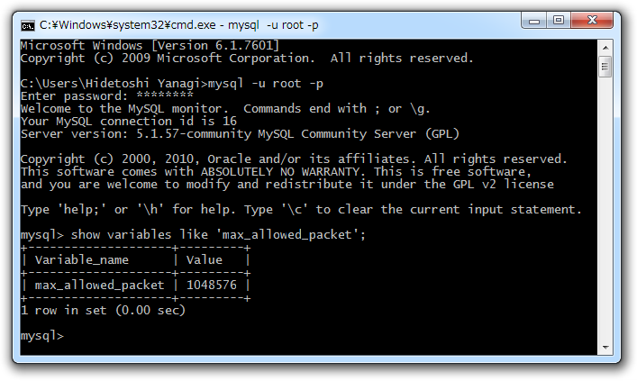

昨日（<a href="http://daruyanagi.hatenablog.com/entry/2012/07/05/015015">XREA/CoreServer &#x306E; WordPress &#x3092; Windows Azure Websites &#x306B;&#x79FB;&#x690D;&#x3057;&#x3066;&#x307F;&#x308B; &rarr; &#x3042;&#x3068;&#x4E00;&#x6B69;&#x307E;&#x3067;&#x884C;&#x3051;&#x305F; - &#x3060;&#x308B;&#x308D;&#x3050;</a>、<a href="http://daruyanagi.hatenablog.com/entry/2012/07/05/022927">XREA/CoreServer &#x306E; WordPress &#x3092; Windows Azure Websites &#x306B;&#x79FB;&#x690D;&#x3057;&#x3066;&#x307F;&#x308B; &rarr; &#x6210;&#x529F;&#xFF01; - &#x3060;&#x308B;&#x308D;&#x3050;</a>）は <a class="keyword" href="http://d.hatena.ne.jp/keyword/XREA">XREA</a> で<a class="keyword" href="http://d.hatena.ne.jp/keyword/%A5%DB%A5%B9%A5%C6%A5%A3%A5%F3%A5%B0">ホスティング</a>していた <a class="keyword" href="http://d.hatena.ne.jp/keyword/WordPress">WordPress</a> を <a class="keyword" href="http://d.hatena.ne.jp/keyword/WebMatrix">WebMatrix</a> で

<blockquote>

（<a class="keyword" href="http://d.hatena.ne.jp/keyword/XREA">XREA</a> → ）<a class="keyword" href="http://d.hatena.ne.jp/keyword/Windows%208">Windows 8</a>（<a class="keyword" href="http://d.hatena.ne.jp/keyword/WebMatrix">WebMatrix</a>） → Azure

</blockquote>

することに成功したので、今日は

<blockquote>

Azure → <a class="keyword" href="http://d.hatena.ne.jp/keyword/Windows%207">Windows 7</a>（<a class="keyword" href="http://d.hatena.ne.jp/keyword/WebMatrix">WebMatrix</a>）

</blockquote>

を試してみることにした。 <a class="keyword" href="http://d.hatena.ne.jp/keyword/Windows%208">Windows 8</a> 環境はよくフリーズするので、あまりサーバーをイジる作業をしたくない。

すると、なんとまた失敗。「Packets larger than max_allowed_packet are not allowed」という見覚えのあるエラーが。

<pre class="code" data-unlink>ERROR: リモート データベースをダウンロードできません。詳細については、&#34;http://go.microsoft.com/fwlink/?LinkId=205387&#34; を参照してください
2:25:59: リモート データベースをダウンロードできません。詳細については、&#34;http://go.microsoft.com/fwlink/?LinkId=205387&#34; を参照してください
2:25:59: 発行済みサイトをダウンロードできません。 リモート データベースをダウンロードできません。詳細については、&#34;http://go.microsoft.com/fwlink/?LinkId=205387&#34; を参照してください
2:25:59: エラーの詳細:
2:25:59: An error occurred during execution of the database script. The error occurred between the following lines of the script: &#34;199&#34; and &#34;211&#34;. The verbose log might have more information about the error. The command started with the following:
2:25:59: &#34;--
-- Dumping data for table `wp_postmeta`
--

LOC&#34;
2:25:59:  Packets larger than max_allowed_packet are not allowed. http://go.microsoft.com/fwlink/?LinkId=178587  Learn more at: http://go.microsoft.com/fwlink/?LinkId=221672#ERROR_SQL_EXECUTION_FAILURE.
:
:</pre>
昨日（<a href="http://daruyanagi.hatenablog.com/entry/2012/07/05/022927">XREA/CoreServer &#x306E; WordPress &#x3092; Windows Azure Websites &#x306B;&#x79FB;&#x690D;&#x3057;&#x3066;&#x307F;&#x308B; &rarr; &#x6210;&#x529F;&#xFF01; - &#x3060;&#x308B;&#x308D;&#x3050;</a>）は不要なテーブルを削除して回避したのだけど、今回はその手が使えない<a href="#f1" name="fn1" title="wp_postmeta を消したらいろいろ吹っ飛びそうだ">*1</a>。

まぁ、今回は Azure → ローカル の話なので、ローカルにある <a class="keyword" href="http://d.hatena.ne.jp/keyword/MySQL">MySQL</a> の設定を直接イジって max_allowed_packet を増やしてあげればよさそうだ。

初期状態では 1MB となっていたので、これを 16MB 程度に増やしてあげる。インストールフォルダにある“my.ini”の [mysqld] セクションに以下のように追記する<a href="#f2" name="fn2" title="設定ファイルのバックアップとっとけよ？">*2</a>。

<pre class="code" data-unlink>[mysqld]
max_allowed_packet=16MB</pre>
んで、 MySQL のサービスを再起動。 WebMatrix で再度 Web サイトをダウンロードしたら……

成功━━━━(ﾟ∀ﾟ)━━━━!!

<a href="#fn1" name="f1" class="footnote-number">*1</a>:wp_postmeta を消したらいろいろ吹っ飛びそうだ

<a href="#fn2" name="f2" class="footnote-number">*2</a>:設定ファイルのバックアップとっとけよ？

