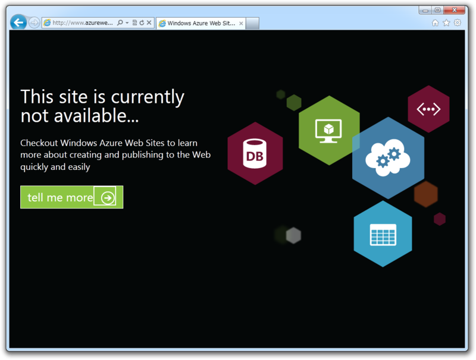
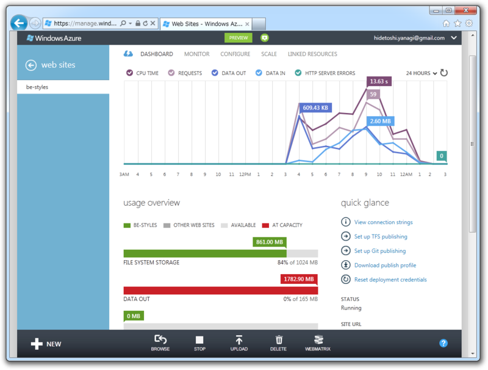

やっとこさ、<a class="keyword" href="http://d.hatena.ne.jp/keyword/WordPress">WordPress</a> の［発行］までこぎつけたんだけど……発行した Web サイトにアクセスできない。

管理ポータルを覗くと、転送量が 1782.90 MB に！ <i>ｶﾞ━━(;ﾟДﾟ)━━ﾝ!!　</i>見事、クォータの上限に達したようでござる。公開時の転送量もカウントされるのね……そりゃそうだな。ファイルもデータベースもデカかったからねぇ……

しっかし、 <a class="keyword" href="http://d.hatena.ne.jp/keyword/Windows%20Azure">Windows Azure</a> って、無償期間が終わったらいくらかかるようになるんだろう……やっぱりちょっと心配になる。激安な ExpressWeb と比べるつもりはないけど、お財布にやさしい値段だったら嬉しいなぁ。

とりあえず、 <a class="keyword" href="http://d.hatena.ne.jp/keyword/Windows%20Azure">Windows Azure</a> は少しお休みにして、明日はゆっくり掃除と洗濯と出張の準備でもしよう。

