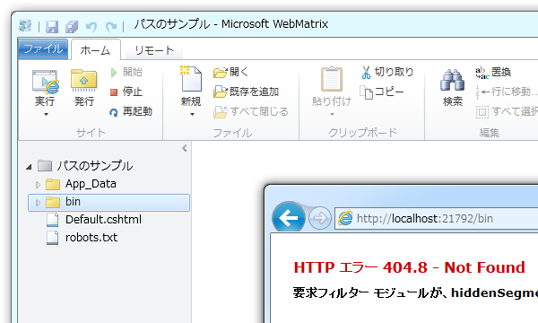
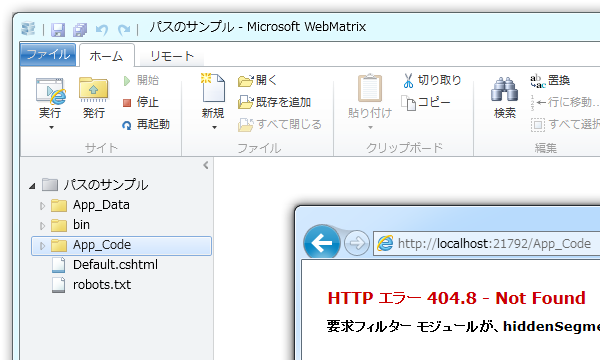
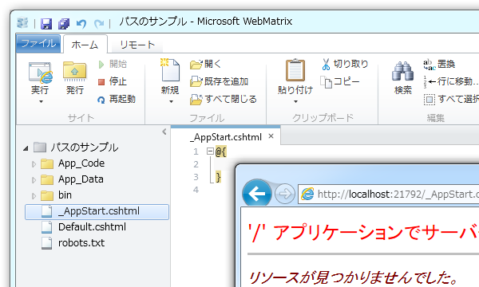
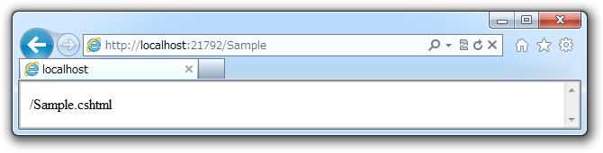
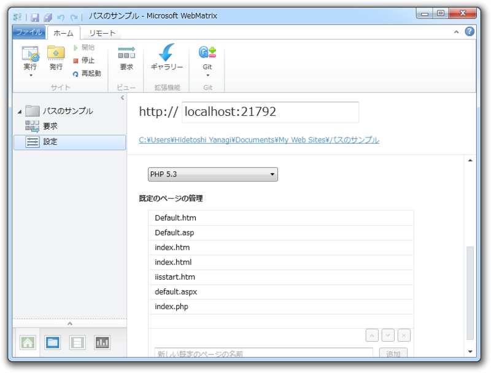
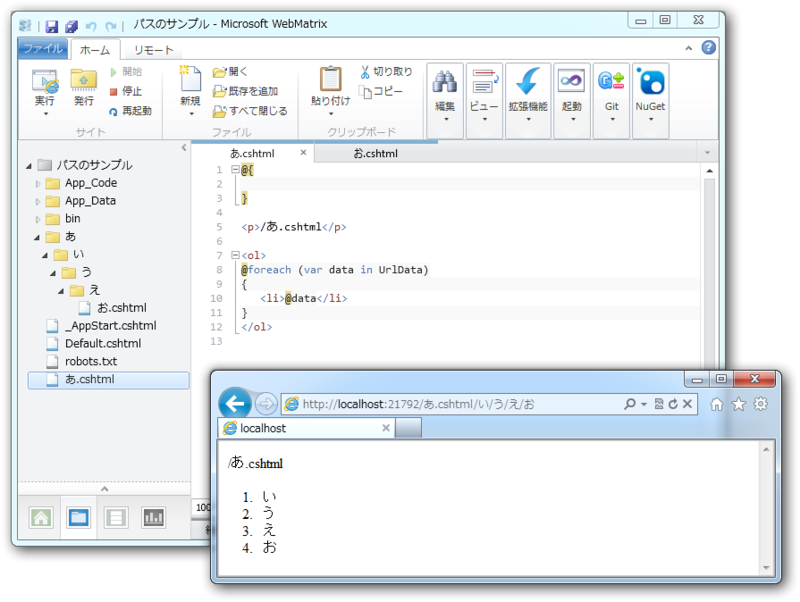
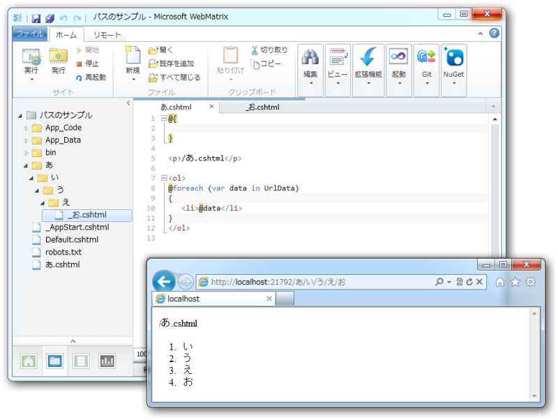

<h3>保護されたファイル・フォルダ</h3>

一部の特殊な意味を持つファイルやフォルダには、Webブラウザーからアクセスできない。逆に言えば、外部からアクセスされては困るファイルやフォルダは、特定のフォルダに格納したり、ファイル名を規約に従ってつければいい。

<h4>bin にはアクセスできない</h4>

bin にはコンパイルされたアセンブリが格納されているので、当然アクセスが禁止されている。

<h4>App_Data / App_Code にはアクセスできない</h4>

<ul>
<li><b>App_Data</b>：アプリケーションのデータを格納（データベースなど）</li>
<li><b>App_Code</b>：アプリケーションの<a class="keyword" href="http://d.hatena.ne.jp/keyword/%A5%BD%A1%BC%A5%B9%A5%B3%A1%BC%A5%C9">ソースコード</a>を格納（ヘルパーなど）</li>
</ul>
外からみえたら困るので、やっぱりアクセスが禁止されている。

<h4>名前が「_」から始まるファイルにはアクセスできない</h4>

<ul>
<li><b>_AppStart.cshcml</b>：アプリケーションが起動するとき一度だけ実行される（<a class="keyword" href="http://d.hatena.ne.jp/keyword/%A5%B0%A5%ED%A1%BC%A5%D0%A5%EB%CA%D1%BF%F4">グローバル変数</a>の初期化、Web サービスの <a class="keyword" href="http://d.hatena.ne.jp/keyword/API">API</a> キー格納など）</li>
<li><b>_PageStart.cshtml</b>：配置されたフォルダ以下にあるページが表示されるごとに実行される（レイアウトの指定やキャッシュコントロール、アクセス制御など）</li>
</ul>
正直なところ _PageStart.cshtml でアクセス制御ができるのは知らなかったかも。今度使っちゃおう。

<pre class="code lang-cs" data-lang="cs" data-unlink>@{
Response.CacheControl = &quot;no-cache&quot;;

if (!WebSecurity.IsAuthenticated) {
Response.Redirect(&quot;~/Account/Login&quot;);
}
}
</pre>
<ul>
<li><a href="http://msdn.microsoft.com/ja-jp/asp.net/hh180208.aspx">&#x7B2C; 18 &#x7AE0; &#x30B5;&#x30A4;&#x30C8;&#x5168;&#x4F53;&#x306E;&#x52D5;&#x4F5C;&#x3092;&#x30AB;&#x30B9;&#x30BF;&#x30DE;&#x30A4;&#x30BA;&#x3059;&#x308B; | Razor &#x69CB;&#x6587;&#x3068; ASP.NET Web &#x30DA;&#x30FC;&#x30B8;</a></li>
</ul>
そのほか、レイアウトファイル（たとえば“_Layout.cshtml”）や部分ビュー（たとえば“_Partial.cshtml”）も、外部に公開する必要はないので名前の先頭に「_」をつけることが多い。また、一時的に Web ページを非公開にする場合にも、リネームだけで対応できるので便利。ちなみに、コードからはちゃんとアクセスできるのでご安心を。

<h3>名前の解決</h3>

いくつかのルールはあるが、あまり難しくはない。工夫次第では URL をクール＆クリーンに保つことができる。

<h4>静的な解決</h4>

まずは、存在するファイル・フォルダへのアクセスの規則を確認する。

<h5>拡張子ありのファイルアクセス</h5>

あまり使わないが CSHTML (Razor <a class="keyword" href="http://d.hatena.ne.jp/keyword/C%23">C#</a>) ファイルも“index.html”のように拡張子まで指定してアクセスできる。

<h5>拡張子なしのファイルアクセス</h5>

CSHTML (Razor <a class="keyword" href="http://d.hatena.ne.jp/keyword/C%23">C#</a>) ファイルは拡張子を省くことも可能<a href="#f1" name="fn1" title="HTML ファイルなどは、拡張子を省くことができないようだ">*1</a>。こっちのほうがモダンかつクールかもしれない。

<h5>ディレクトリへのアクセス</h5>

“index.html”などが表示される。優先順位は［サイト］－［設定］で変更できる。

<h4>動的な解決 ―― UrlData[]</h4>

<pre class="code lang-" data-lang="" data-unlink>/あ.cshtml/い/う/え/お
→ UrlData[] { &#34;い&#34;, &#34;う&#34;, &#34;え&#34;, &#34;お&#34; }</pre>
の「あ.cshtml」以降のパラメータを、 UrlDate[] 配列で受け取ることができる。

さらに、「お.cshtml」をリネームして「/あ/い/う/え/お.cshtml」による名前解決を無効にすれば、「あ.cshtml」の拡張子を省略することも可能。つまり、

<pre class="code lang-" data-lang="" data-unlink>/あ/い/う/え/お
→ UrlData[] { &#34;い&#34;, &#34;う&#34;, &#34;え&#34;, &#34;お&#34; }</pre>
が得られる。これを利用すれば、 WebMatrix でも URL を動的に扱える。ちなみに、クエリ文字列（ /?foo=bar&hoge=hauhau など）は Request.QueryString で受け取ることができる。

<a href="#fn1" name="f1" class="footnote-number">*1</a>:HTML ファイルなどは、拡張子を省くことができないようだ

