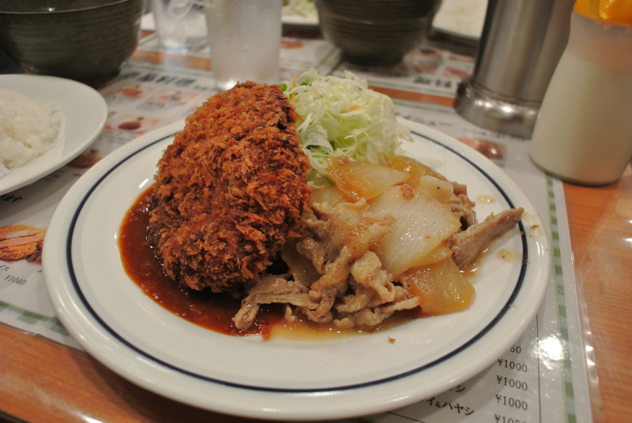
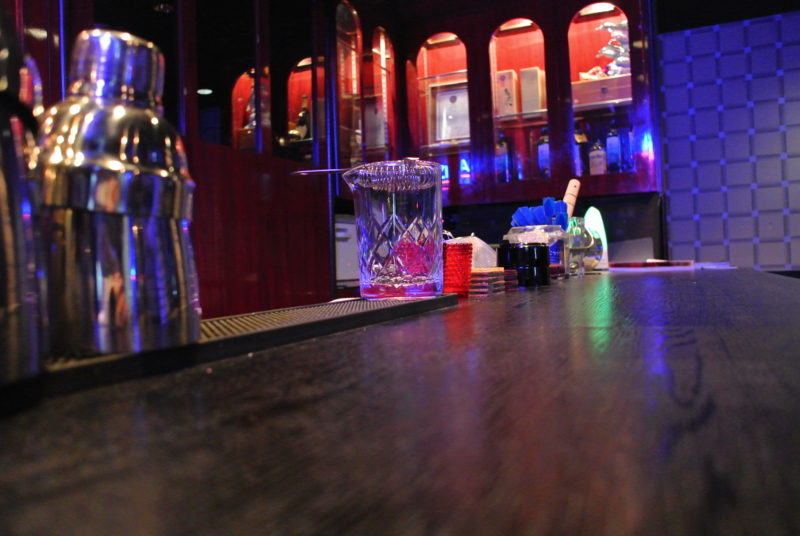
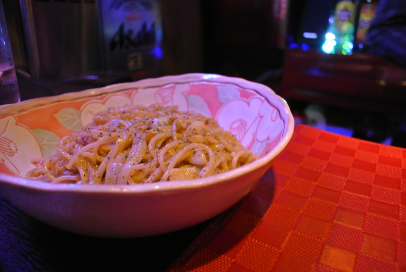
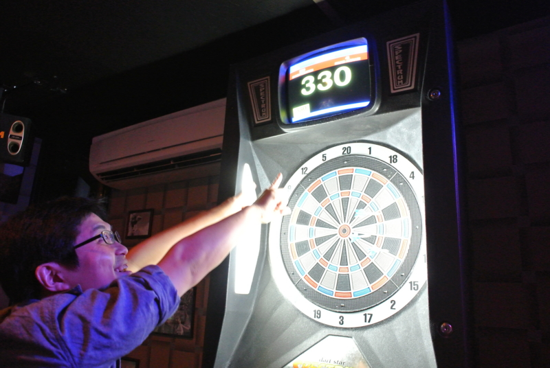

<b>月曜日の夜</b>、 @shibayan に呼び出されてアキバのダーツメイドバーに行きますタ。

ダーツはやったことないので、大勢の前でやるのはちょっと恥ずかしく、ただビールを飲んで<a class="keyword" href="http://d.hatena.ne.jp/keyword/%A5%E1%A5%A4%A5%C9%A4%B5%A4%F3">メイドさん</a>がダーツするのを見ていました。制服かわええ (ﾉ´∀｀*)

と、まぁ、そんなことをしているのも不毛なので、御徒町のもう少し真面目なバーでダーツの練習をすることに。キッチンジローでお腹を満たしていざデッパツ！

向かったのは、文京区湯島の“Bar Anfang”。とりあえず、マスターと @shibayan がパスタを賭けて勝負したのだけど、なんと @shibayan が勝利！　僕も @shibayan の勝利を願ってこっそり念波を送っていたので、戦利品にあずかることができました。

そのあと、僕もダーツ初挑戦。クリケットというのと、カウントアップ（だっけ？）というのを少しやって、あとはひたすら、練習、練習、練習！　たぶん、結構ハマってたと思う。まだまだ思うようなところには投げられないけれど、ちゃんと刺さる。

とりあえずカウントアップでは 330点 をゲット！　ブル（真ん中のところ）にも4回だけ当たりました。もしかして才能あるのかも知らん (*´∀｀*)

ただ、<b>水曜日に</b>筋肉痛になりました。

