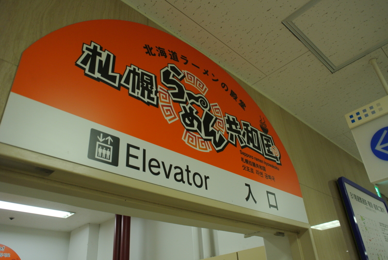
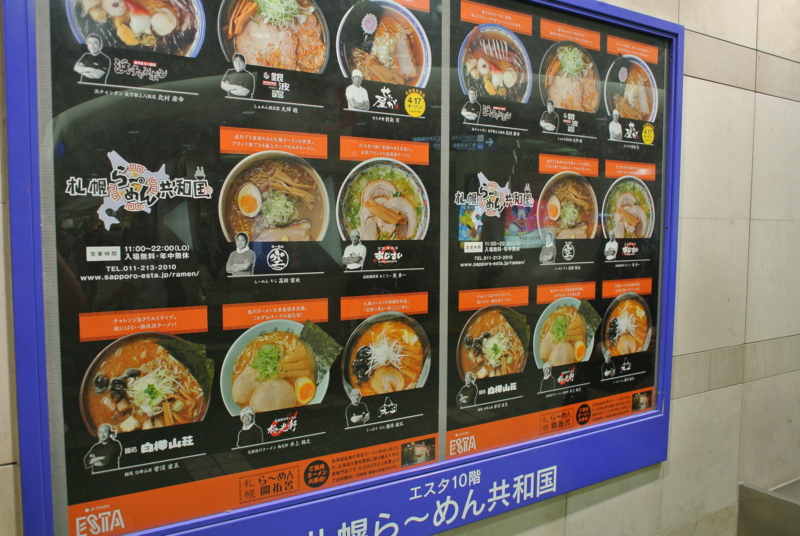
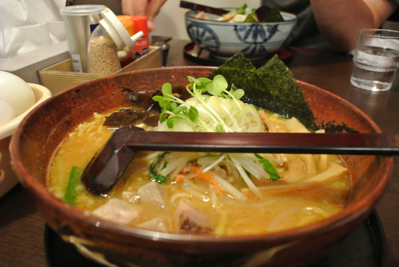
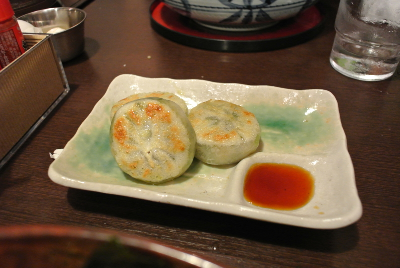
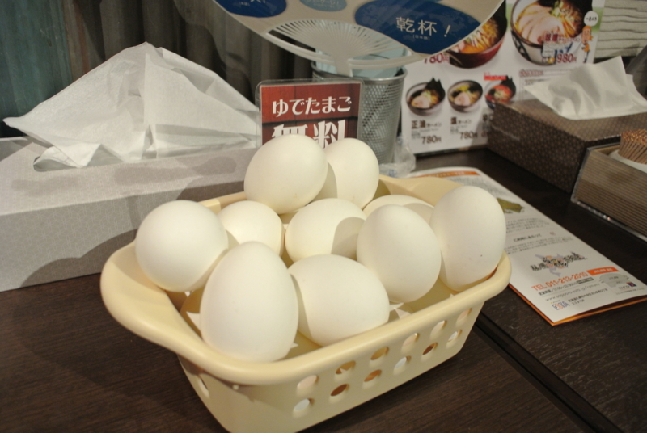

最近は冗談のわからない人が増えたので念の為に言っておくが、 <a href="http://daruyanagi.hatenablog.com/entry/2012/07/09/012205">&#x8A66;&#x3055;&#x308C;&#x308B;&#x5927;&#x5730;&#x30FB;&#x5317;&#x6D77;&#x9053;&#x3078;&#x6F5C;&#x5165; - &#x3060;&#x308B;&#x308D;&#x3050;</a> 、アレはウソだ。ただ、<a class="keyword" href="http://d.hatena.ne.jp/keyword/%A5%A8%A5%A2%A5%DD%A1%BC%A5%C8%B2%F7%C2%AE">エアポート快速</a>で老婆が轢かれかけたのは本当の話。もう少しでスプラッタな光景を特等席で鑑賞するハメになるところだった。踏切無視はよくないよ！　運転士・車掌の対応に感謝だね。

それはそうと、札幌にはラーメン共和国というものがあって、初日のお昼はスタッフみんなで食べに行った。

ココには札幌の美味しいラーメンが集結しているらしい。実はあんまりラーメンは好きではなく、自分で好んでために行くことは少ないのだけれど、これだけ揃っているとさすがにテンションが上がってくる。

<blockquote>

ラーメンの、ラーメンによる、ラーメンのための国家を、この地球上に花開かせるのだ！　それをラーメン共和国という！　ラーメン共和国、何たる美しい響き！！（何たる美しい響き！！

<small>フィル・アッカマン少佐</small>

</blockquote>

なかなかいい所じゃないか！

結局チョイスしたのは「白樺山荘」。なんかTVで名前を聞いたことがあるし、この共和国でも最大勢力を誇っていたようだ。<a class="keyword" href="http://d.hatena.ne.jp/keyword/%C2%D4%A4%C1%B9%D4%CE%F3">待ち行列</a>が一番長い。実際、味もなかなか美味しかった。どう表現していいのかはわからんが、ウザくない味噌ラーメン。

何より嬉しいのは――ゆで卵がただなんだぜ？　ココ。<a class="keyword" href="http://d.hatena.ne.jp/keyword/%C8%C4%C5%EC%B1%D1%C6%F3">板東英二</a>に教えてあげたいよ。

