
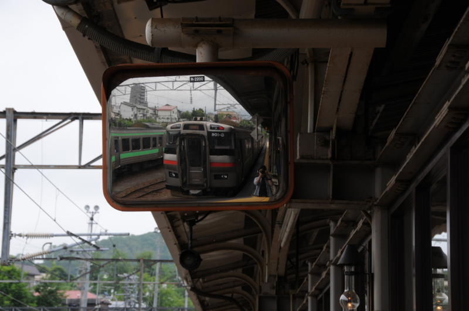

札幌に行くついでに、小樽にも行って来ました。札幌＝小樽間は40分程度。実はそんなに離れていないんだね！

10時に札幌市内のホテルを出て、クラーク像と時計台を見たので、小樽についたのは1時頃。飛行機は6:30発なので、4時間ぐらいしかいられなかった<a href="#f1" name="fn1" title="ちなみに、小樽＝新千歳空港は1時間20分ぐらいです">*1</a>。朝ごはんすら食べていなかったので、まずは腹ごしらえ。タクシーの運転手さんに「運河の近くでお寿司が美味しいところ！」と注文したら、「観光客向けのところばかりだけど、回転寿司でもいいならココが一番美味しい」と紹介してもらったのがココ。

<iframe width="425" height="350" frameborder="0" scrolling="no" marginheight="0" marginwidth="0" src="https://maps.google.co.jp/maps?q=%E3%81%A8%E3%81%A3%E3%81%B4%E3%83%BC+%E5%B0%8F%E6%A8%BD%E9%81%8B%E6%B2%B3%E9%80%9A%E5%BA%97&amp;ie=UTF8&amp;hl=ja&amp;hq=%E3%81%A8%E3%81%A3%E3%81%B4%E3%83%BC+%E5%B0%8F%E6%A8%BD%E9%81%8B%E6%B2%B3%E9%80%9A%E5%BA%97&amp;hnear=&amp;radius=15000&amp;t=m&amp;brcurrent=3,0x5f0ae04dc54363c3:0x1d83df11c697cb25,0&amp;cid=18122689274502051322&amp;ll=43.207616,141.008234&amp;spn=0.021896,0.036478&amp;z=14&amp;iwloc=A&amp;output=embed"></iframe> <small><a href="https://maps.google.co.jp/maps?q=%E3%81%A8%E3%81%A3%E3%81%B4%E3%83%BC+%E5%B0%8F%E6%A8%BD%E9%81%8B%E6%B2%B3%E9%80%9A%E5%BA%97&amp;ie=UTF8&amp;hl=ja&amp;hq=%E3%81%A8%E3%81%A3%E3%81%B4%E3%83%BC+%E5%B0%8F%E6%A8%BD%E9%81%8B%E6%B2%B3%E9%80%9A%E5%BA%97&amp;hnear=&amp;radius=15000&amp;t=m&amp;brcurrent=3,0x5f0ae04dc54363c3:0x1d83df11c697cb25,0&amp;cid=18122689274502051322&amp;ll=43.207616,141.008234&amp;spn=0.021896,0.036478&amp;z=14&amp;iwloc=A&amp;source=embed" style="color:#0000FF;text-align:left">大きな地図で見る</a></small>

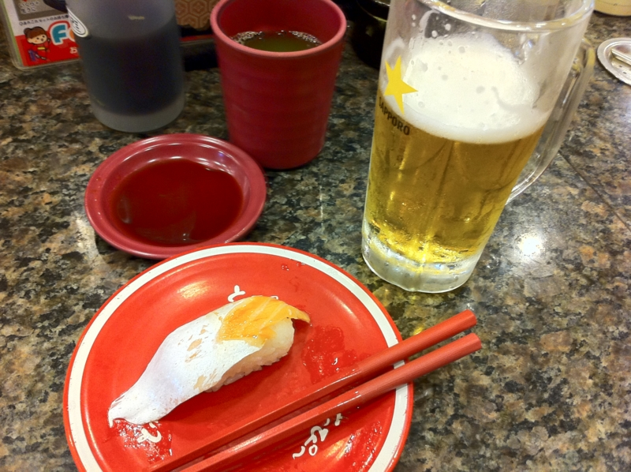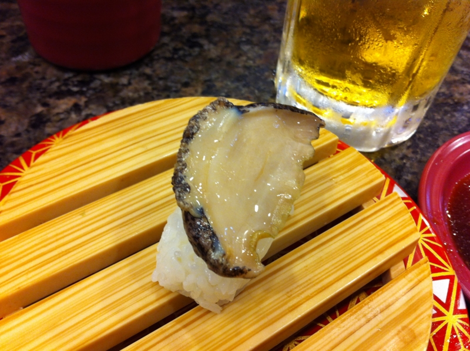

人気店らしくて、すごい混雑。のんびりしたかったし、もうちょっと高いところに行ってもよかったかなぁ、と思ったけど、まぁ、普通に美味しかったのでよし。お会計は3000円弱で、ビールがぶ飲みした割にはお安かった。

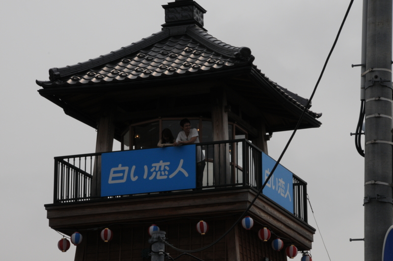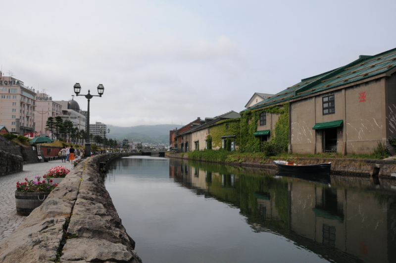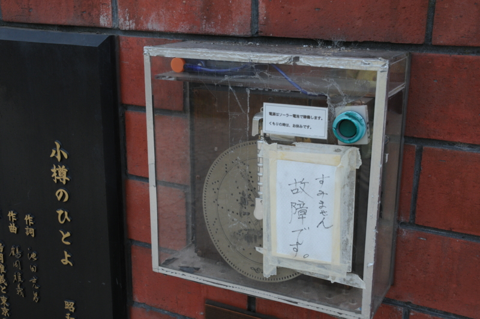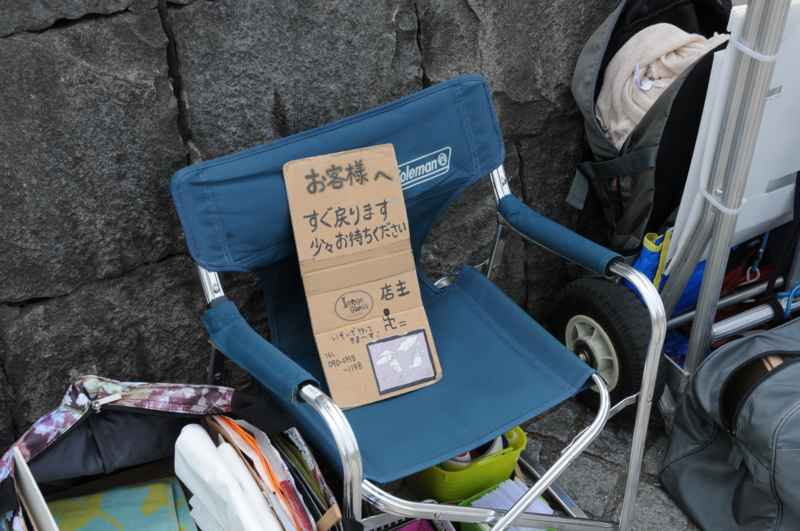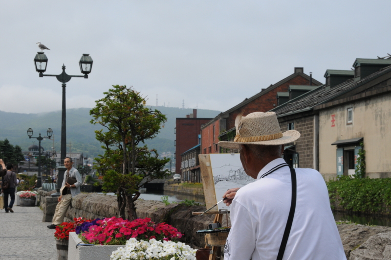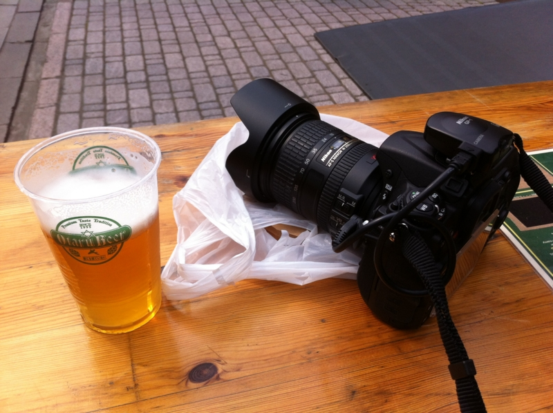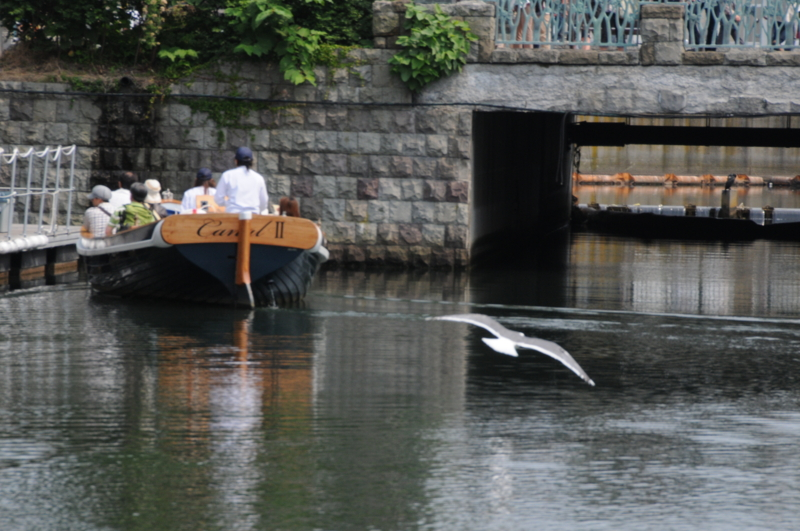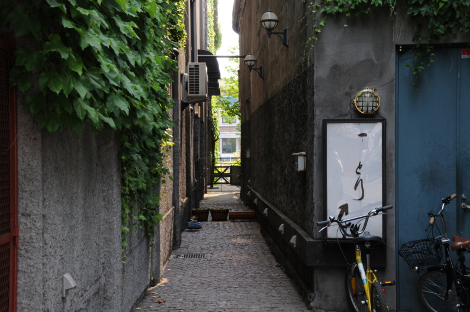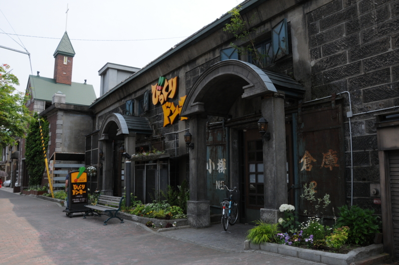

あとは、運河の周りをのんびりのんびり。おみやげに絵を買ったり、かまぼこ買ったりして過ごしました。途中、三時のおやつに小樽ビールを飲んでたら、道行く人にいちいち「みて！　ビール飲んでるよ！」って言われるのだけがちょっと気まずかった。

<a href="#fn1" name="f1" class="footnote-number">*1</a>:ちなみに、小樽＝新千歳空港は1時間20分ぐらいです

