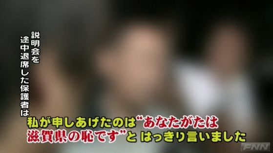

大津のイジメの事件についてはあまり興味がないというか、ドメスティックで個別的な問題だと思うので、自分が口を挟むべきことはないかな、と思っていた。

所詮東京にいる僕には何もできないし、そもそもこの種の問題に対して普遍的な解決策があるとも思えない。だいたいプライバシーの名のもと、第三者には満足な事実すら提供されない。こういう時の判断は誤りやすく、<b>安易に「犯人探し」「私刑」へ加わるのは危険</b>でもある。自分の身近にこういうことがないかもう一度振り返ってみて、何もなければあと僕達がすることはほとんど何もない。

ぶっちゃけ論ずるだけ無駄であり、真相の解明と加害者の反省を期待するだけだ。

「イジメ」というのはある種の“規範”だ。

イジメを個人的な犯罪の集積と規定し、<b>恐喝・傷害・殺人として個別に制裁を与えればよい</b>、という意見も聞かれるが、そんなに単純なものではない。イジメは規範であり関係性であり、イジメる側はイジメ役を、イジメられる側はイジメられっ子を、それぞれ演じている。誰にどの役が割り当てられるかは、刹那的なものだ。些細なキッカケで立場が逆転してしまうし<a href="#f1" name="fn1" title="高度に規範が強化された場合は別だが、いじめ役の男の子がウンコを漏らしてその権威を一夜にして失墜させる……なんてことは珍しくなさそうだ。">*1</a>、イジメ役の「個人」を取り除いても、「規範」が残っていれば代役が立てられるだけの話だ。

<ul>
<li>イジメ役は、イジメられ役へと都落ちしたくないので、ひたすらその権威の維持に務める。</li>
<li>イジメの傍観者は、できれば自分が端役でいる現状を維持したい。彼らは、つぎに役が割り振られるのを戦々恐々と待つ控えでもある。</li>
<li>イジメられ役は、自分がなぜイジメられているのかすら分からず、その役を演じる。</li>
</ul>
だから、イジメ問題の解決は“規範”そのものの破壊にある。

ただ、その方法は一概には言えない。個人を取り除いたり、勉強や運動以外の物差しを設けるだけで解消する脆弱なものなのかもしれない。教師や保護者の介入が必要な場合もあるだろう。もしかしたら、高学年が低学年をいじめる風習が連綿と受け継がれている、親の社会的立場がそのままイジメの構造に反映されているなど、ほかの規範と複合的に連動しているかもしれない。そこまでは、なかなか断片的な情報では見えてこないわけで、「語りえぬことについては沈黙しなければならない」。

あと、ここで忘れてはいけないのは、このような負の“規範”は、とても身近なものということ。

<ul>
<li>嵐が過ぎ去るのを待つ教育関係者・警察関係者。</li>
<li>どこからかパクってきたのか、もっともらしい振る舞いで“無関係性”を主張する保護者連中。</li>
<li>鬼の首を取ったように報道・批判するマスコミ。</li>
<li>その尻馬に乗る世論。</li>
</ul>
こうした“お約束”が身近にあれば、自分でそれを破壊しなければならない。それをできるものだけが石を投げることができる。

<blockquote cite="http://www.jiji.com/jc/c?g=soc_30&k=2012071200242">

　<a class="keyword" href="http://d.hatena.ne.jp/keyword/%C2%E7%C4%C5%BB%D4">大津市</a>で昨年１０月、いじめを受けていた市立中学２年の男子生徒＝当時（１３）＝が自殺した問題に絡み、滋賀県警大津署は１２日、脅迫容疑で、***（６９）を逮捕した。 
県警によると、沢村容疑者は「誰かが天誅（てんちゅう）を下さないとだめだと思いはがきを送った」と述べ、容疑を認めているという。はがきの消印などから同容疑者を特定した。

<cite><a href="http://www.jiji.com/jc/c?g=soc_30&k=2012071200242">&#x6642;&#x4E8B;&#x30C9;&#x30C3;&#x30C8;&#x30B3;&#x30E0;&#xFF1A;&#x77E5;&#x4E8B;&#x306B;&#x8105;&#x8FEB;&#x306F;&#x304C;&#x304D;&#x3001;&#x7537;&#x902E;&#x6355;&#xFF1D;&#x5927;&#x6D25;&#x306E;&#x4E2D;&#xFF12;&#x81EA;&#x6BBA;&#x3067;&minus;&#x6ECB;&#x8CC0;&#x770C;&#x8B66;</a></cite>
</blockquote>

たとえば、こういう人間は“いじめ”構造でさぞ活躍することだろう。戒めとしたいところだ。また、ここまでちゃんと読んで下さったなら、冒頭に掲げた「滋賀県の恥」という保護者の“憤り”も、また味わい深く読めるのだはないだろうか。本当に恥とすべきなのは何なのだろうか。

<a href="#fn1" name="f1" class="footnote-number">*1</a>:高度に規範が強化された場合は別だが、いじめ役の男の子がウンコを漏らしてその権威を一夜にして失墜させる……なんてことは珍しくなさそうだ。

