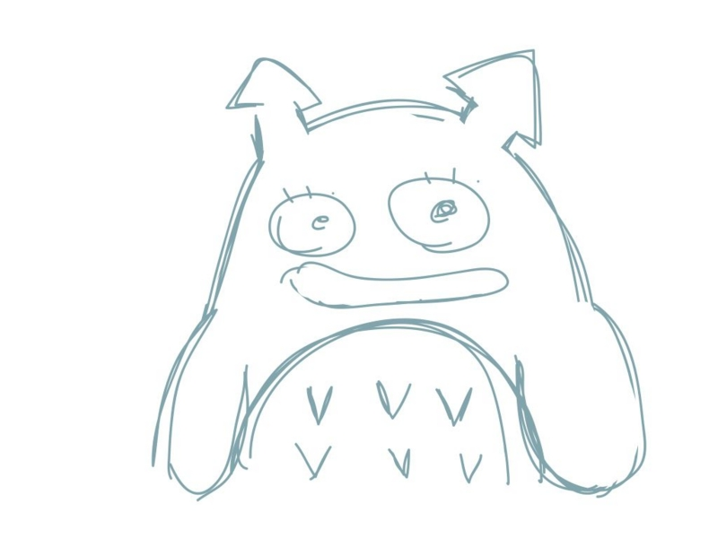
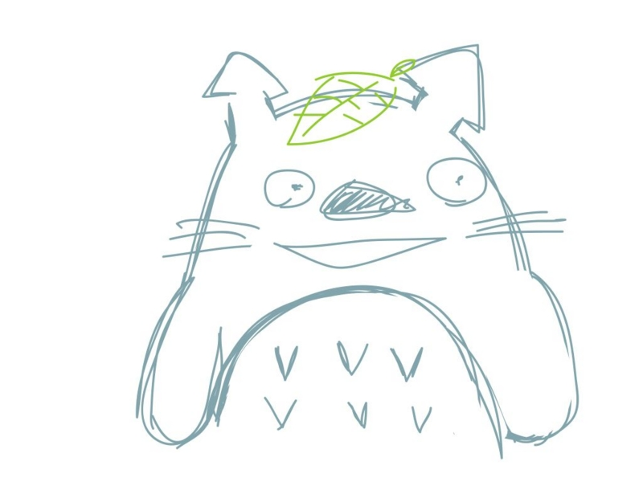

昨日の金曜ロードショーは『<a class="keyword" href="http://d.hatena.ne.jp/keyword/%A4%C8%A4%CA%A4%EA%A4%CE%A5%C8%A5%C8%A5%ED">となりのトトロ</a>』でした。久しぶり観たのだけど、時間が一瞬で過ぎてしまった。昨日は代休をもらって休んでたのだけど、何してたのかって聞かれても胸を張って言えますね。<i>『<a class="keyword" href="http://d.hatena.ne.jp/keyword/%A4%C8%A4%CA%A4%EA%A4%CE%A5%C8%A5%C8%A5%ED">となりのトトロ</a>』を観た、と。</i>それはそうと、 <a class="keyword" href="http://d.hatena.ne.jp/keyword/Twitter">Twitter</a> でみんながやってたのを真似して、記憶を元にトトロの絵を書いてみたのですよ。

それがこれ。<a class="keyword" href="http://d.hatena.ne.jp/keyword/%A5%B3%A5%EC%A5%B8%A5%E3%A5%CA%A5%A4%B4%B6">コレジャナイ感</a>が半端ない。何が違うんだ！

トトロの登場。それを観て CM 中に書きなおしたのがこれ。だいぶマシになったな。

変更点は以下のとおり。

<ul>
<li>目と目の間に鼻を足した</li>
<li>口を大きくした</li>
<li>まつげを消してひげを足した</li>
<li>葉っぱつけたほうが雰囲気が出る</li>
</ul>
お腹の模様は上下逆みたい。実家には巨大トトロのぬいぐるみまであるのに、なかなかどうして、細かいところまで見ていないものだな。

