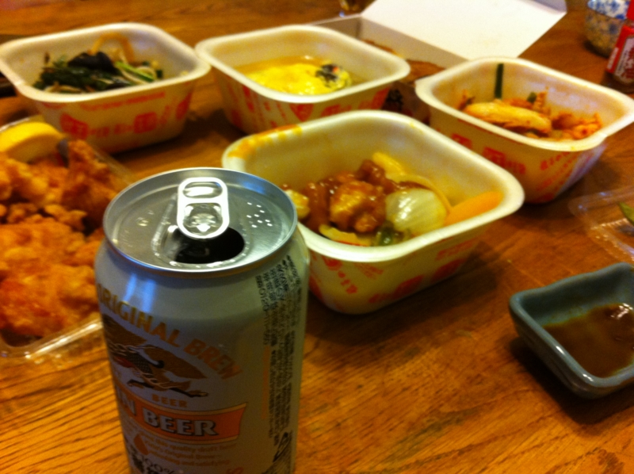
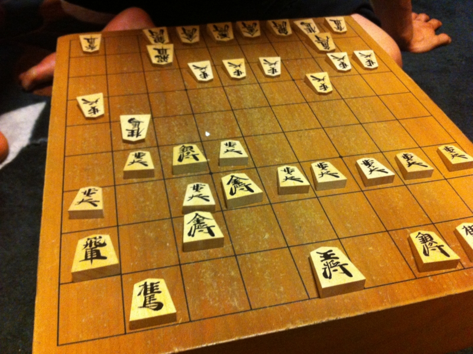

のんびりと4連休の二日目を楽しんでいたところ、いきなり「トイレ貸して！」と叫びながら母ちゃんが家へ来襲。挙句、「たまには顔を出しなさい！」とクルマに押し込まれた。しかも、クルマの鍵をもたされて運転席へ。おれが運転しろというのか。

そんなわけで、昨日は実家に帰って、和室でクーラーかけてゴロゴロしていた。

うちのおかんは最近、王将のテイクアウトにハマっているらしい。けれど、ある程度人数が揃わないと色々なメニューが楽しめない。そこで勝手に“王将フェア”と称して強引に息子・娘を拉致っては、テーブルにたくさん皿を並べてご満悦というわけだ。しかも食い切れないし。今日の帰りしな、おみやげとして余ったチャーハンをもらった。

食後は、同じく被害にあった弟1号と将棋を指した。今回は弟が負けたらプラズマテレビをくれるというので、ハンデとしてこちらが角落ち、角香落ちで二番指した。

結果は、負け・勝ち。どうにも、平手と勝手が違う。初戦は大駒の効きにビビり過ぎて、陣が小ぢんまりとしてしまい、叩き潰された。第二戦はそこを修正して早々に位を取る感じで金銀を速めに進出させたら、相手のミスもありほぼ完勝。駒落ちの将棋は指したことなかったけど、なかなか奥が深いなぁ、と思った。駒が少ない分、手持ちの駒をガッツリ連携させて攻撃態勢を組まないと、なかなかしんどい。持久戦ではそれこそ持ち駒の差が活きてくるしね。

テレビはもらえませんでした。

